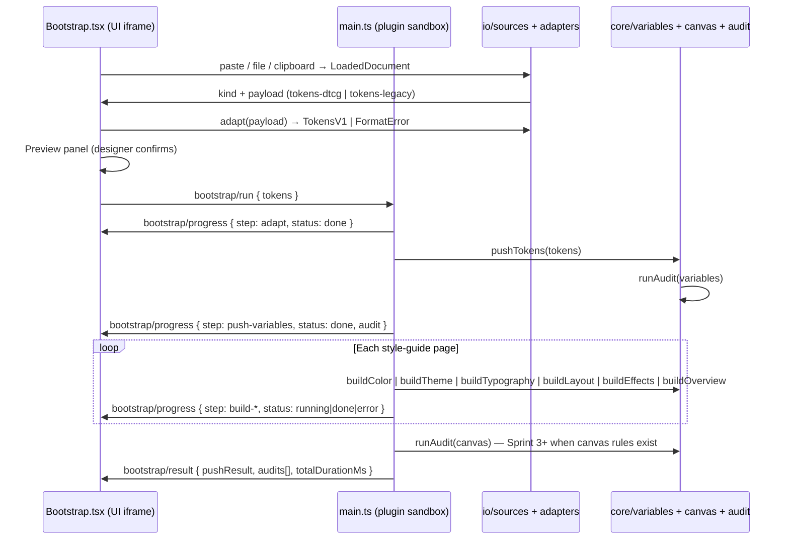

# Bootstrap tab UI — orchestration research (WO-015)

> **Status:** ✅ Research complete — orchestration flow, message contract, dependency order, and exists-vs-greenfield map locked for `/plan`.
> **Date:** 2026-05-27
> **Owner:** WO-015 (Sprint 3)
> **PRD anchors:** §6.1 FR-BOOT-1..8, §6.8 FR-IO-1, §7.1–7.3 (layered shell → ops → core), §8.1 (`ops-program.v1`), §12 Phase 1 exit (G1 full bootstrap), G1 latency (<30 s)
> **Upstream:** WO-006 IO design, WO-007 adapters, WO-008 push engine, WO-010 audit contract, WO-011/012/013 canvas builders (not yet built), WO-014 auto-layout helpers (not yet built)

---

## Summary

WO-015 is the **first end-user-visible integration surface** — it turns the already-built Sprint 2 stack (sources → adapters → variable push → audit) into a Bootstrap tab with one-button orchestration, live progress, and inline audit drill-down. **`src/ui/tabs/Bootstrap.tsx` is greenfield**; **`src/ui/App.tsx` already contains a throwaway integration prototype** that should be refactored, not duplicated.

Seven decisions unblock `/plan`:

1. **Orchestration lives on the main thread** — UI sends one `bootstrap/run` message; main executes steps sequentially and streams `bootstrap/progress` events. Do not attempt canvas work from the UI iframe.
2. **Reuse existing subsystems verbatim** — `LoadedDocument` → `adapt()` (WO-007) → `pushTokens()` (WO-008, includes WO-010 audit) → canvas builders (WO-011/12/13, stubbed until those tickets land).
3. **Progress reporting is a new message union** — extend `src/io/messages/` (or add `src/io/messages/bootstrap.ts`) with step IDs matching PRD bootstrap phases; no progress protocol exists today beyond binary `pushing` boolean in `App.tsx`.
4. **Audit UI reads `AuditReportV1` directly** — summary counts + expandable `results[]` per rule; no markdown renderer until WO-019 (Sprint 4).
5. **Tab shell is greenfield** — introduce `src/ui/tabs/` + minimal tab nav in `App.tsx`; only Bootstrap tab ships in this ticket.
6. **Dependency gate:** WO-006/007/008/010 are **implemented and wired**; WO-011/012/013/014 are **not** (`src/core/canvas/` absent). Plan must either sequence WO-015 after canvas builders or ship a **phase-1 cut** (variables + audit + progress shell; canvas steps noop/stub with clear UX).
7. **G1 bench is achievable** — WO-005 extrapolated 5-collection variable push ≈ **904 ms**; WO-008 recorded UI re-push **490 ms** on 400-var idempotent run. Canvas builders must stay under ~**29 s** combined to meet the **<30 s** full-bootstrap target.

---

## Key Findings

### 1. Current code map — exists vs greenfield

| Area                                | Path                                     | Status               | WO-015 action                                                          |
| ----------------------------------- | ---------------------------------------- | -------------------- | ---------------------------------------------------------------------- |
| Tab shell + nav                     | `src/ui/App.tsx`                         | Single-page, no tabs | Add tab strip; default tab = Bootstrap                                 |
| Bootstrap tab                       | `src/ui/tabs/Bootstrap.tsx`              | **Missing**          | **Create** — primary deliverable                                       |
| Source ports (paste/file/clipboard) | `src/ui/sources/*`, `src/io/sources/*`   | **Built (WO-006)**   | **Move** from `App.tsx` into Bootstrap tab                             |
| Token adapt + preview               | `App.tsx` state + `adapt()`              | **Built (WO-007)**   | **Move**; enhance preview (collection/mode counts, format badge)       |
| Variable push only                  | `push/variables` message                 | **Built (WO-008)**   | Supersede with full `bootstrap/run` (includes push as a step)          |
| Audit payload                       | `PushResultMessage.audit: AuditReportV1` | **Built (WO-010)**   | **Expand** UI from one-line summary → inline panel                     |
| Canvas builders                     | `src/core/canvas/`                       | **Missing**          | **Call** from orchestrator once WO-011/12/13 exist                     |
| Auto-layout helpers                 | `src/core/canvas/helpers/`               | **Missing (WO-014)** | Builders depend on this; orchestrator depends on builders              |
| Ops dispatcher                      | `src/ops/`                               | **Missing**          | Defer formal dispatcher; inline orchestration in `main.ts` for Phase 1 |
| Progress messages                   | —                                        | **Missing**          | **Define** `bootstrap/progress` contract (see §4)                      |
| Bench fixtures                      | `src/ui/benchFixtures.ts`                | Dev helper in App    | Keep behind `flags.devBench` or move to dev-only footer                |

**Prototype to extract from `App.tsx` today:**

- Source section: `ClipboardBanner`, `SourcePasteTextarea`, `SourceFilePicker`, `SourceDropZone`
- Adapt pipeline: `applyLoadedDocument` → `adapt(doc.payload)` → `cachedTokens` / `adaptError`
- Push handler: `parent.postMessage({ type: 'push/variables', tokens })` + `push/result` listener
- Status line: created/updated/skipped + audit pass/fail one-liner

**Greenfield in Bootstrap.tsx:**

- Structured token preview (per-collection token counts, detected wire format, mode list)
- Primary CTA: **"Bootstrap design system"** (not "Push variables")
- Multi-step progress bar + per-step status chips
- Audit results panel: pass/fail/warn counts, expandable rule list, Copy JSON / Dismiss actions
- Empty / error / in-progress states aligned with PRD §11.4 (always preview, never silent-apply)

### 2. End-to-end orchestration flow

PRD UC-1 + FR-BOOT map to this deterministic pipeline:



**Step order (locked for `/plan`):**

| #   | Step ID            | Core call                   | FR           | Notes                                                   |
| --- | ------------------ | --------------------------- | ------------ | ------------------------------------------------------- |
| 1   | `load`             | (UI-only)                   | FR-IO-1      | Already complete before CTA                             |
| 2   | `adapt`            | `adapt()` in UI             | FR-BOOT-1..2 | Fail fast before main-thread work                       |
| 3   | `push-variables`   | `pushTokens()`              | FR-BOOT-3..5 | Includes WO-009 codeSyntax; returns `audit` (variables) |
| 4   | `build-color`      | `buildColorTables()`        | FR-BOOT-7    | WO-011                                                  |
| 5   | `build-theme`      | `buildThemeTables()`        | FR-BOOT-7    | WO-011                                                  |
| 6   | `build-typography` | `buildTypographySpecimen()` | FR-BOOT-7    | WO-012                                                  |
| 7   | `build-layout`     | `buildLayoutTables()`       | FR-BOOT-7    | WO-013                                                  |
| 8   | `build-effects`    | `buildEffectsTables()`      | FR-BOOT-7    | WO-013                                                  |
| 9   | `build-overview`   | `buildTokenOverview()`      | FR-BOOT-7    | WO-012                                                  |
| 10  | `audit-canvas`     | `runAudit('canvas', …)`     | FR-BOOT-8    | Blocked until WO-010 canvas rules + builders exist      |
| 11  | `complete`         | —                           | —            | Emit final result + G1 timing                           |

PRD §8.1 `ops-program.v1` encodes the same op sequence as `{ push-tokens, build-style-guide }`. WO-015 can **construct that program in memory** for future ops-dispatcher compatibility without shipping `src/ops/` in this ticket.

### 3. Message handlers — what exists in `main.ts`

Today (`src/main.ts`):

- Handles `push/variables` → `pushTokens()` → posts `push/result` with embedded `audit: AuditReportV1`
- Ignores `io/loaded` (placeholder for Sprint 4 ops dispatch)
- No bootstrap orchestration, no mid-flight progress

Today (`src/io/messages/push.ts`):

- `PushVariablesMessage`, `PushResultMessage`, `PushErrorMessage`
- Guards: `isPushVariablesMessage`, `isPushResultMessage`, `isPushErrorMessage`

**Gap:** no step-granular progress; UI only toggles `pushing: boolean`.

### 4. Progress reporting UI pattern (recommended contract)

Add `src/io/messages/bootstrap.ts`:

```ts
export type BootstrapStepId =
  | 'adapt'
  | 'push-variables'
  | 'build-color'
  | 'build-theme'
  | 'build-typography'
  | 'build-layout'
  | 'build-effects'
  | 'build-overview'
  | 'audit-canvas'
  | 'complete';

export type BootstrapStepStatus = 'pending' | 'running' | 'done' | 'error' | 'skipped';

/** Main → UI: emitted after each step starts or finishes */
export interface BootstrapProgressMessage {
  type: 'bootstrap/progress';
  step: BootstrapStepId;
  status: BootstrapStepStatus;
  label: string; // designer-facing, e.g. "Pushing variables"
  detail?: string; // optional sub-status ("400 tokens, 5 collections")
  elapsedMs?: number; // step duration when status === 'done' | 'error'
  audit?: AuditReportV1; // attach on push-variables / audit-canvas completion
}

/** UI → main */
export interface BootstrapRunMessage {
  type: 'bootstrap/run';
  tokens: TokensV1;
  pages?: ('color' | 'typography' | 'layout' | 'effects' | 'overview')[]; // default: all five groups
}

/** Main → UI: terminal message */
export interface BootstrapResultMessage {
  type: 'bootstrap/result';
  ok: boolean;
  totalDurationMs: number;
  pushResult: PushResult;
  audits: AuditReportV1[]; // variables now; canvas later
  canvasErrors?: { page: string; message: string }[];
}
```

**UI pattern:**

- Maintain `Record<BootstrapStepId, BootstrapStepStatus>` in React state
- On each `bootstrap/progress`, update the matching row and advance a determinate progress bar (`doneSteps / totalSteps`)
- Use `role="progressbar"` + `aria-valuenow` for a11y
- Keep `console.debug('[ui] bootstrap/progress', …)` per telemetry AC (UI iframe — `console.debug` is fine here per `memory.md`)

**Main-thread pattern:**

- Wrap each step in `try/catch`; on error post `{ step, status: 'error', detail: message }` then `bootstrap/result { ok: false }`
- Call `figma.ui.postMessage` **synchronously** after each step boundary so the UI updates during long canvas builds (Figma main thread is single-flight — no true parallelism)
- Use `pluginLog()` (not `console.debug`) on main thread

### 5. Audit inline display — `AuditReportV1` contract

Contract shape (`@detroitlabs/fighub-contracts`):

| Field                                      | UI use                                                              |
| ------------------------------------------ | ------------------------------------------------------------------- |
| `passed`                                   | Banner color (green/red)                                            |
| `summary.rulesPassed/Failed/Warned`        | Headline counts                                                     |
| `summary.variablesCreated/Updated/Skipped` | Push stats row                                                      |
| `summary.modeCoverage`                     | Optional collapsible table (collection → expected vs missing modes) |
| `summary.codeSyntaxCoverage`               | Optional platform chips (WEB / ANDROID / iOS expected vs missing)   |
| `results[]`                                | Drill-down list: `{ ruleId, pass, diagnostic, severity? }`          |
| `meta.generatedAt`, `meta.operation`       | Footer metadata                                                     |

**Display rules (locked):**

- Show **failed rules first**, then warns, then passed (collapsed by default)
- Each failed row: `ruleId` + `diagnostic` in monospace-friendly text
- Actions: **Copy audit JSON** (`JSON.stringify(audit, null, 2)` to clipboard via textarea/execCommand pattern — same constraint as WO-006 clipboard write), **Dismiss** clears panel but leaves progress result
- Do **not** merge audit diagnostics into push error strings — WO-010 README: push `errors[]` stays operational-only
- Variables audit arrives on `push-variables` step today; canvas audit attaches when WO-010 `scope: 'canvas'` lands

Current `App.tsx` one-liner (`Audit passed (16 rules)`) is insufficient for AC #6 ("drill-down to per-rule diagnostics").

### 6. Source → adapter → preview path (WO-006 + WO-007)

Already wired in `App.tsx`:

1. **Sources** return `LoadedDocument | ValidationError` via `loadFromPaste`, `loadFromFile`, `probeClipboard` / paste event
2. Token kinds: `tokens-dtcg` | `tokens-legacy` (`isTokenDocument`)
3. **`adapt(payload)`** (`src/io/sources/adapters/index.ts`) runs `detectFormat` → `adaptDTCG` | `adaptLegacy` → `TokensV1`
4. Preview state: token count + collection count (extend with mode names from `TokensV1.collections[]`)

**Preview requirements for Bootstrap tab:**

- Show detected port (`paste` / `file` / `clipboard`) and contract kind
- Show adapt outcome before enabling CTA (FR-BOOT-2 preview gate)
- Surface `FormatError.message` + `path` with the existing DTCG top-level hint from `formatAdaptError`

Non-token contracts (`ops-program`, `component-spec`, …) should show a neutral message: "Bootstrap requires a token file" — do not attempt bootstrap on non-token kinds.

### 7. Dependency ordering and blockers

| Ticket | Deliverable           | Code status                                   | Blocks WO-015                          |
| ------ | --------------------- | --------------------------------------------- | -------------------------------------- |
| WO-006 | IO sources            | ✅ `src/io/sources/*`, UI components          | No — ready                             |
| WO-007 | Token adapters        | ✅ `src/io/sources/adapters/*`                | No — ready                             |
| WO-008 | Variable push         | ✅ `src/core/variables/push.ts`, UI push path | No — ready                             |
| WO-009 | codeSyntax            | ✅ integrated in push                         | No — ready                             |
| WO-010 | Audit (variables)     | ✅ 16 rules, hooked in push                   | No for variables audit UI              |
| WO-014 | Auto-layout helpers   | ❌ not started                                | **Yes** — canvas builders depend on it |
| WO-011 | Color + theme canvas  | ❌ not started                                | **Yes** — steps 4–5                    |
| WO-012 | Typography + overview | ❌ not started                                | **Yes** — steps 6, 9                   |
| WO-013 | Layout + effects      | ❌ not started                                | **Yes** — steps 7–8                    |

**Recommended build sequence:**

1. WO-014 → WO-011/012/013 (parallel after 014) → **then** WO-015 `/build` for full AC
2. **Optional early WO-015 `/plan` work:** tab shell + source/preview + progress UI driven by stubbed main-thread steps (canvas steps immediately `skipped` with banner "Canvas builders pending WO-011…")

WO-015 ticket lists WO-011/012/013 as dependencies — treat **full bootstrap AC** as blocked until those complete; **UI shell + variables-only bootstrap** can demo earlier for Sprint 2 regression.

### 8. G1 latency budget (<30 s full bootstrap)

| Phase                                      | Measured / extrapolated                                          | Source                                        |
| ------------------------------------------ | ---------------------------------------------------------------- | --------------------------------------------- |
| Adapt (UI)                                 | <50 ms typical                                                   | synchronous TS                                |
| Variable push (5 collections, ~400 tokens) | **~904 ms** extrapolated; **490 ms** idempotent re-push observed | WO-005 §3.1; WO-008 bench                     |
| Variables audit                            | Included in push duration                                        | WO-010 sync after commit                      |
| Canvas builders (5 page groups)            | **Unmeasured — budget ~29 s**                                    | Greenfield ports from 44–57 KB legacy bundles |
| Canvas audit                               | TBD                                                              | WO-010 canvas scope Sprint 3                  |

**Bench protocol for WO-015 AC:**

- Fixture: `spike-400` via bench loader OR full foundations DTCG with 5 collection roots
- Environment: Plugin Sandbox (`file_key=cVdPraIafWFBRZnzMPhtrW`) per `memory.md`
- Metric: `bootstrap/result.totalDurationMs` from button press to terminal message
- Pass: **<30_000 ms** on fresh file (create path, not idempotent skip)
- Log: append run to `research/bootstrap-bench-result.md` (mirror WO-008 pattern)

Risk: canvas builder ports are the unknown — WO-005 left ~29 s headroom intentionally. Monitor during WO-011/12/13 build; optimize table redraw batching if needed.

### 9. PRD FR-BOOT / FR-IO mapping

| PRD ID       | WO-015 surface                                              |
| ------------ | ----------------------------------------------------------- |
| FR-BOOT-1    | Source picker (paste/file/clipboard) — reuses WO-006        |
| FR-BOOT-2    | Adapt + preview panel before CTA                            |
| FR-BOOT-3..5 | `push-variables` step (WO-008 + WO-009)                     |
| FR-BOOT-7    | Canvas build steps (WO-011/12/13)                           |
| FR-BOOT-8    | Inline audit after push (+ canvas when available)           |
| FR-BOOT-9    | **Out of scope** — ops audit log sink is Sprint 4 (WO-017+) |
| FR-IO-1      | Three input ports only; GitHub OAuth deferred WO-016        |

### 10. Testing implications

- **Vitest (UI):** progress state reducer, audit panel sorting/filtering, preview formatting — mock `postMessage` events
- **Vitest (messages):** guard functions for new bootstrap message types (ES2017-safe like `push.ts`)
- **Integration:** optional test that `BootstrapRunMessage` → stub orchestrator emits ordered progress IDs
- **Manual / VQA:** full paste → bootstrap → audit drill-down in Plugin Sandbox; G1 bench recorded once canvas exists

---

## Recommendations

1. **`/plan` should split Build Agents into Phase 1 (tab shell + messages + variables path) and Phase 2 (canvas orchestration)** — Phase 2 gated on WO-011/12/13 completion.
2. **Extract, don't rewrite** — move existing `App.tsx` source/adapt/push logic into `Bootstrap.tsx`; shrink `App.tsx` to tab chrome + `<Bootstrap />`.
3. **Add `src/io/messages/bootstrap.ts`** with the progress/result union; keep message guards colocated for `main.ts` ES2017 compatibility.
4. **Implement `runBootstrap()` in `src/core/bootstrap/runBootstrap.ts`** (or `src/main/bootstrap.ts`) — sequential step runner calling core functions; keeps `main.ts` thin.
5. **Audit panel component:** `src/ui/components/AuditReportPanel.tsx` — reusable for future Sync/Components tabs.
6. **Defer `src/ops/` dispatcher** — construct an in-memory `OpsProgramV1` for logging/tests only; formal dispatch lands with Sprint 4 ops-protocol ticket.
7. **Design reference:** assign Figma `file_key` during `/plan` (ticket VQA checklist still blank); mirror WO-006 minimal source-picker layout until design file exists.
8. **Remove or hide bench fixture UI** from production Bootstrap tab — keep under dev flag to avoid confusing designers.

---

## Open Questions

1. **Canvas builder API shape** — single `buildStyleGuide({ pages })` vs per-module functions? Resolve during WO-011 `/plan` (WO-015 orchestrator should import whichever WO-011 locks).
2. **Failed canvas step behavior** — abort remaining pages vs continue with partial style guide? PRD §11.4 suggests show failures inline; recommend **continue + aggregate errors** unless push-variables failed (hard abort).
3. **Undo grouping** — should entire bootstrap be one undo group? WO-008 uses `figma.commitUndo()` per push; canvas builders may need a shared undo boundary — confirm with WO-011 implementer.
4. **Figma design file** — Bootstrap tab mock not yet assigned (`file_key` TBD in ticket). `/plan` should either link the FigHub design file or explicitly defer VQA to post-design.
5. **Canvas audit timing** — run once after all pages vs per-page audit? WO-010 research deferred canvas rules to Sprint 3; WO-015 should match whatever WO-011/010 plan locks.
