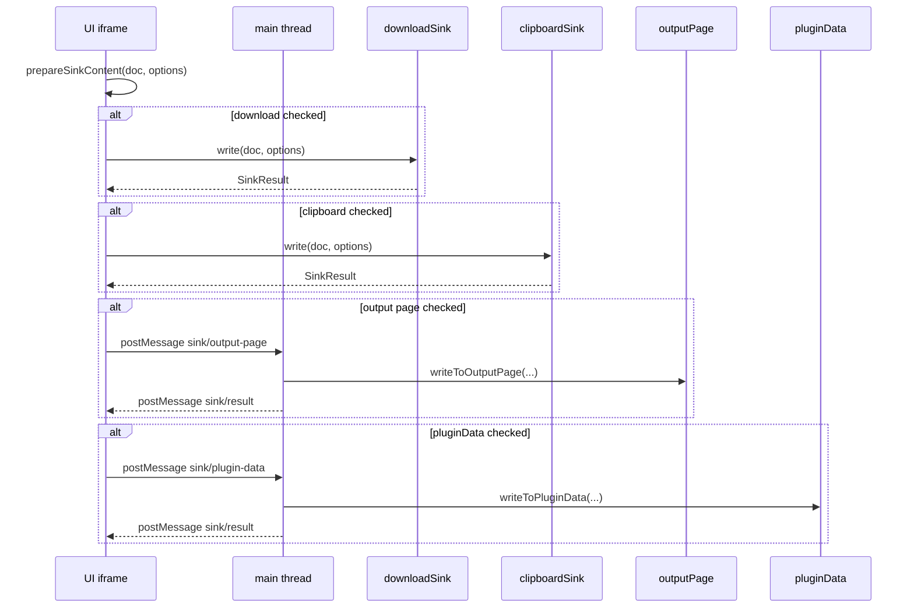

# Output Sinks — Implementation Design (download / clipboard / Output page / pluginData)

> **Status:** ✅ Research complete — Sink interface, thread split, and Vitest strategy locked for `/plan`.
> **Date:** 2026-05-27
> **Owner:** WO-017 (Sprint 4)
> **Author:** Research sub-agent
> **PRD anchors:** §6.8 FR-IO-2, §7.3 (`src/io/sinks/` layout), §10.2 (sinks table), §10.3 (dual-format serialization — consumed, not authored here), §10.4 (unified export sheet — consumer WO-020)
> **Related contracts:** `packages/contracts/src/driftReport.v1.ts`, `src/io/sources/types.ts` (`LoadedDocument`)
> **Upstream research:** [`WO-006 io-subsystem-design.md`](../../Sprint%202/WO-006-io-subsystem-foundation-paste-file-clipboard/research/io-subsystem-design.md) §Q1 (clipboard Permissions-Policy in Figma iframe)
> **Parallel ticket:** WO-019 (`src/io/formats/*`) — serialization; WO-020 wires export sheet → sinks

---

## Summary

Four findings unblock WO-017 build:

1. **Symmetric `Sink` interface** — all four non-GitHub sinks expose `write(doc: LoadedDocument, options: FormatOptions): Promise<SinkResult>`. Serialization is delegated to `format()` from WO-019 inside a shared `prepareSinkContent()` helper so sinks never hand-author markdown. WO-017 ships with a **JSON-only stub serializer** (`JSON.stringify(doc.payload, null, 2)` + placeholder markdown line) until WO-019 lands; tests use the stub or hand-crafted strings — not a blocker for sink plumbing.

2. **UI vs main thread split mirrors bootstrap** — `download.ts` and `clipboard.ts` run entirely in the **UI iframe** (browser APIs). `outputPage.ts` and `pluginData.ts` run on the **main thread** (Figma Plugin API). The UI-side `runSinks()` orchestrator calls UI sinks directly and dispatches canvas sinks via `parent.postMessage({ pluginMessage: … })` with typed messages in `src/io/messages/sinks.ts`, matching the bootstrap `bootstrap/run` ↔ `bootstrap/progress` pattern.

3. **Clipboard write is the inverse of clipboard read** — `navigator.clipboard.readText()` is blocked on plugin open (WO-006 locked). **`writeText()` on an explicit user gesture** (Export button click from WO-020) is the primary copy path; ship **`execCommand('copy')` via a transient off-screen `<textarea>`** as fallback when `writeText` throws `NotAllowedError`. Do not attempt clipboard write outside a click handler.

4. **Output page + pluginData conventions** — Page name **`FigHub Output`** (legacy alias **`DesignOps Output`**). Labeled text nodes use name prefix `fighub/<kind>/…`; **update-by-label** when a node with the same name exists, else append. pluginData keys use namespace prefix **`fighub:`** on the selected node; value is always **JSON** (machine-readable handoff). Snapshot hidden node (`_FigHubSnapshot`) is **WO-028** — reserve the page layout pattern but do not implement snapshot writes here.

---

## 1. Shared `Sink` interface

### 1.1 Public types (`src/io/sinks/types.ts`)

Mirror the sources subsystem: types first, pure helpers, then port implementations, barrel re-export.

```ts
import type { ContractKind, LoadedDocument } from '@/io/sources/types';

/** Matches WO-019 / PRD §10.3 — markdown always derived from JSON payload. */
export type OutputFormat = 'json' | 'md';

export interface FormatOptions {
  /** Which serialized form to emit. `both` → download writes two files; clipboard/pluginData pick `primaryFormat`. */
  format: OutputFormat | 'both';
  /** When `format === 'both'`, clipboard + pluginData use this; download always emits both files. */
  primaryFormat?: OutputFormat;
  /** Base filename without extension, e.g. `drift-report-2026-05-27`. Default derived from `doc.kind` + ISO date. */
  baseName?: string;
  /** Output-page / pluginData label slug; default `fighub/<kind>/<generatedAt from payload or now>`. */
  label?: string;
}

export type SinkId = 'download' | 'clipboard' | 'output-page' | 'plugin-data';

export interface SinkArtifact {
  format: OutputFormat;
  byteLength: number;
  /** download: filename; output-page: text node name; plugin-data: key */
  destination?: string;
}

export interface SinkResult {
  ok: boolean;
  sink: SinkId;
  message: string;
  artifacts?: SinkArtifact[];
  error?: string;
}

export interface Sink {
  readonly id: SinkId;
  write(doc: LoadedDocument, options: FormatOptions): Promise<SinkResult>;
}
```

**`SinkResult` semantics:** `ok: true` when the sink completed its side effect; partial multi-format success (download wrote JSON but MD failed) → `ok: false` with `artifacts` listing what succeeded. WO-020 shows `message` in the export sheet toast.

### 1.2 Serialization boundary (WO-019 dependency)

Sinks must not call `JSON.stringify` on `LoadedDocument` directly in production — only on `doc.payload` via the format layer:

```ts
// src/io/sinks/prepareContent.ts
export interface PreparedContent {
  json: string;
  markdown: string;
  baseName: string;
  label: string;
}

export function prepareSinkContent(
  doc: LoadedDocument,
  options: FormatOptions,
): PreparedContent;
```

| Phase | Implementation |
| ----- | -------------- |
| WO-017 build (WO-019 not merged) | Stub: `json = JSON.stringify(doc.payload, null, 2)`; `markdown = '# ' + doc.kind + '\n\n_(markdown renderer lands in WO-019)_\n\n```json\n' + json + '\n```'`; `baseName` / `label` from options or defaults. |
| After WO-019 | Replace stub body with `import { format } from '@/io/formats'` — single source for GFM tables + drift glyphs. |

Each sink's `write()` calls `prepareSinkContent()` once, then picks `json` and/or `markdown` based on `options.format`.

### 1.3 Default filename + label rules

For sample `DriftReportV1` (`packages/contracts/src/driftReport.v1.ts`):

| Field | Source |
| ----- | ------ |
| `baseName` default | `` `${doc.kind}-${meta.generatedAt.slice(0, 10)}` `` → `drift-report-2026-01-01` |
| `label` default | `` `fighub/${doc.kind}/${meta.generatedAt}` `` → `fighub/drift-report/2026-01-01T00:00:00.000Z` |
| Extension | `.v1.json` / `.v1.md` per PRD §10.3 |

Use `doc.kind` from `LoadedDocument`, not re-parse payload. `rawSnippet` is **not** written to sinks — always canonical serialized output from `payload`.

### 1.4 Registry + orchestrator (`src/io/sinks/index.ts`)

```ts
export const SINKS: Record<SinkId, Sink> = {
  download: downloadSink,
  clipboard: clipboardSink,
  'output-page': outputPageSink,      // UI wrapper → postMessage
  'plugin-data': pluginDataSink,      // UI wrapper → postMessage
};

export async function runSink(
  id: SinkId,
  doc: LoadedDocument,
  options: FormatOptions,
): Promise<SinkResult>;
```

WO-020 calls `runSink` per checked destination; WO-017 does not build the sheet UI.

---

## 2. `download.ts` — Blob + anchor download (UI thread)

**File:** `src/io/sinks/download.ts`  
**Thread:** UI iframe only — no Figma API, no postMessage.

### Algorithm

```ts
function downloadText(filename: string, mimeType: string, text: string): void {
  const blob = new Blob([text], { type: mimeType });
  const url = URL.createObjectURL(blob);
  const anchor = document.createElement('a');
  anchor.href = url;
  anchor.download = filename;
  anchor.style.display = 'none';
  document.body.appendChild(anchor);
  anchor.click();
  document.body.removeChild(anchor);
  URL.revokeObjectURL(url);
}
```

| `options.format` | Behavior |
| ---------------- | -------- |
| `'json'` | One file: `{baseName}.v1.json`, `application/json` |
| `'md'` | One file: `{baseName}.v1.md`, `text/markdown;charset=utf-8` |
| `'both'` | Two sequential downloads (JSON first, then MD) — brief `setTimeout(0)` between clicks if browser coalesces |

### Edge cases

- **User gesture:** Export sheet button click satisfies activation; no extra guard needed if WO-020 only calls on click.
- **Large payloads:** Drift reports can exceed 1 MB; no artificial cap (distinct from `PASTE_MAX` input cap). Log byte length via `console.debug`.
- **Failure:** `URL.createObjectURL` / DOM throws → `SinkResult { ok: false, error: message }`.

---

## 3. `clipboard.ts` — `navigator.clipboard.writeText` (UI thread)

**File:** `src/io/sinks/clipboard.ts`  
**Thread:** UI iframe only.

### Primary path

On Export click handler:

```ts
async function copyToClipboard(text: string): Promise<void> {
  await navigator.clipboard.writeText(text);
}
```

Pick text by `options.primaryFormat ?? options.format` (when `format === 'both'`, default **`md`** per PRD §10.4 export sheet — "Copy markdown to clipboard").

### Fallback path (locked)

When `writeText` rejects with `NotAllowedError` (Permissions-Policy — same class of failure documented in WO-006 §Q1 for read):

```ts
function copyViaExecCommand(text: string): boolean {
  const ta = document.createElement('textarea');
  ta.value = text;
  ta.setAttribute('readonly', '');
  ta.style.position = 'fixed';
  ta.style.left = '-9999px';
  document.body.appendChild(ta);
  ta.select();
  const ok = document.execCommand('copy');
  document.body.removeChild(ta);
  return ok;
}
```

Try `writeText` first; on failure, `execCommand`. If both fail → `SinkResult { ok: false, error: 'Clipboard copy blocked' }`.

### Distinction from sources `clipboard.ts`

| Module | Direction | API |
| ------ | --------- | --- |
| `src/io/sources/clipboard.ts` | Input (read) | `readText` / paste event |
| `src/io/sinks/clipboard.ts` | Output (write) | `writeText` / execCommand copy |

Do not merge — opposite directions, opposite fallback strategies.

---

## 4. `outputPage.ts` — FigHub Output page text nodes (main thread)

**File:** `src/io/sinks/outputPage.ts`  
**Thread:** Main (`code.js`) — Figma Plugin API.

### Page find-or-create

Constants:

```ts
export const FIGHUB_OUTPUT_PAGE_NAME = 'FigHub Output';
export const LEGACY_OUTPUT_PAGE_NAMES = ['DesignOps Output'];
export const FIGHUB_SHARED_NS = 'fighub';
export const FIGHUB_PAGE_ROLE_KEY = 'pageRole';
export const FIGHUB_PAGE_ROLE_OUTPUT = 'output';
```

Resolution order (same pattern as `findStyleGuidePage` in `src/core/canvas/lib/pages.ts`):

1. Page with `getSharedPluginData('fighub', 'pageRole') === 'output'`
2. Exact name `FigHub Output`
3. Exact legacy name `DesignOps Output` (single match only)
4. **Create:** `figma.createPage()`, set name + shared pluginData, append to root

After create, optionally `figma.currentPage = page` so designer sees the write (product choice — **recommend yes** on first create only).

### Content layout

```
FigHub Output (Page)
└── _FigHubOutputContent (Frame, VERTICAL auto-layout, full width ~960)
    ├── fighub/drift-report/2026-01-01T… (TEXT — label heading, Inter Bold 14)
    ├── [body TEXT — serialized content, Inter Regular 11, monospace preferred via Inter]
    └── … (more label groups appended)
```

**Update-by-label (locked):** Before append, scan `_FigHubOutputContent` children for a TEXT node whose `name === label`. If found, update `characters` on the **body** sibling (pair pattern: label frame row containing label + body, OR single text node with name = label and characters = content — **recommend single TEXT node** named `label`, characters = full serialized content for MCP readability).

Simpler locked pattern (build agent):

- One TEXT node per export; `node.name = label`; `node.characters = content`. **No documented TextNode character cap** (Figma API) — large drift reports may slow canvas; log byte length; do **not** conflate with pluginData 100 kB limit.
- If node with same `name` exists under content frame → update `characters`; else create new node and append.

### Font loading

Call `figma.loadFontAsync({ family: 'Inter', style: 'Regular' })` before setting text (pattern from `src/core/canvas/lib/fonts.ts`). Failure → still attempt write; Figma may substitute.

### Format selection

| `options.format` | Text written |
| ---------------- | ------------ |
| `'json'` | `prepared.json` |
| `'md'` | `prepared.markdown` |
| `'both'` | **Markdown** on canvas (human/agent readable per PRD §10.3); JSON available via download/pluginData |

### UI wrapper

`src/io/sinks/outputPageSink.ts` (UI) posts message; main handler calls `writeToOutputPage(prepared, options)` and replies `sink/result`.

---

## 5. `pluginData.ts` — `fighub:` namespace on selected node (main thread)

**File:** `src/io/sinks/pluginData.ts`  
**Thread:** Main.

### Target node

```ts
const selection = figma.currentPage.selection;
if (selection.length !== 1) {
  return { ok: false, error: 'Select exactly one frame or node for pluginData export' };
}
const target = selection[0];
if (!('setPluginData' in target)) {
  return { ok: false, error: 'Selected node does not support pluginData' };
}
```

WO-020 should show helper copy: "Select a frame before exporting to pluginData."

### Key convention (locked)

```ts
export const FIGHUB_PLUGIN_DATA_PREFIX = 'fighub:';

function pluginDataKey(doc: LoadedDocument): string {
  return FIGHUB_PLUGIN_DATA_PREFIX + doc.kind; // e.g. fighub:drift-report
}
```

Optional timestamp suffix **out of scope** — one key per kind on a node; last export wins (matches compact round-trip handoff). WO-028 snapshot uses separate keys on the hidden snapshot node.

### Value

Always **`prepared.json`** string (machine-readable), regardless of `options.format`, unless `options.primaryFormat === 'md'` and caller explicitly requests markdown — **default JSON only** for pluginData sink per PRD §10.2 "Compact machine-readable handoff."

### Size limit

Figma pluginData ~ **100 kB per entry**. If `prepared.json.length > 100_000`, return `{ ok: false, error: '… exceeds pluginData size limit' }` with hint to use download or Output page.

---

## 6. UI vs main thread split (postMessage pattern)

### Message types (`src/io/messages/sinks.ts`)

Follow `src/io/messages/bootstrap.ts` — discriminated union + ES2017-safe type guards for `main.ts`.

**UI → main:**

```ts
interface SinkOutputPageMessage {
  type: 'sink/output-page';
  requestId: string;
  label: string;
  content: string;
  format: OutputFormat;
}

interface SinkPluginDataMessage {
  type: 'sink/plugin-data';
  requestId: string;
  key: string;
  value: string;
}
```

**Main → UI:**

```ts
interface SinkResultMessage {
  type: 'sink/result';
  requestId: string;
  result: SinkResult;
}

interface SinkErrorMessage {
  type: 'sink/error';
  requestId: string;
  message: string;
}
```

### Dispatch flow



### `main.ts` integration

Add handlers beside bootstrap/push/canvas — same `extractErrorMessage`, `pluginLog` (not `console.debug` on main thread per `memory.md`).

```ts
if (isSinkOutputPageMessage(message)) {
  handleSinkOutputPage(message).catch(/* post sink/error */);
  return;
}
if (isSinkPluginDataMessage(message)) {
  handleSinkPluginData(message).catch(/* post sink/error */);
  return;
}
```

Canvas sink **implementations** live in `src/io/sinks/outputPage.ts` + `pluginData.ts` (main-bundle imports). UI bundle imports thin wrappers that postMessage — avoid importing `@/io/sinks/outputPage` in React components directly (would pull Figma typings into UI Vite graph incorrectly). **Split:**

| File | Bundle |
| ---- | ------ |
| `outputPage.ts`, `pluginData.ts` | Main |
| `outputPageClient.ts`, `pluginDataClient.ts` | UI — implements `Sink` via postMessage |
| `download.ts`, `clipboard.ts` | UI |

Vite already dual-builds; enforce via import graph review in `/plan`.

---

## 7. Vitest mocking strategy

**Config:** existing `vitest.config.ts` — `environment: 'jsdom'`, `@/` alias.

### 7.1 File layout

```
tests/
  fixtures/io/sinks/
    drift-report-min.json          # extend tests/fixtures/io/sources/drift-report.json with sample drifts for AC
  unit/io/sinks/
    prepareContent.test.ts
    download.test.ts
    clipboard.test.ts
    outputPage.test.ts             # main-thread logic; mock figma global
    pluginData.test.ts
    messages.test.ts               # type guards
  unit/io/sinks/__mocks__/
    figmaOutputPage.ts             # extend canvas __mocks__/figmaFrames.ts
```

### 7.2 Sample document

Use `DriftReportV1` from `@detroitlabs/fighub-contracts` in tests:

```ts
const doc: LoadedDocument<DriftReportV1> = {
  kind: 'drift-report',
  payload: { v: 1, kind: 'drift-report', meta: { … }, summary: { push: 1, pull: 0, conflict: 0, synced: 0 }, drifts: […] },
  sourceMeta: { port: 'paste', receivedAt: '…', charLength: 0 },
  rawSnippet: '{…}',
};
```

Commit **`tests/fixtures/io/sinks/drift-report-sample.v1.json`** with ≥1 push drift entry for integration-style sink tests.

### 7.3 Per-sink mocks

| Sink | Mock strategy |
| ---- | ------------- |
| **download** | Spy `URL.createObjectURL`, `URL.revokeObjectURL`, `HTMLAnchorElement.prototype.click`, `document.createElement`. Assert filename, mime, blob size. No real file IO. |
| **clipboard** | `vi.spyOn(navigator.clipboard, 'writeText')` — resolve/reject. Separate test forces `writeText` reject → assert `execCommand` path (mock `document.execCommand` return `true`). |
| **outputPage** | Extend `installMockFigmaCanvas()` pattern: add `figma.createPage`, `figma.root.children`, `getSharedPluginData` / `setSharedPluginData` on mock pages, `MockTextNode.characters` mutation. Test find/create, update-by-label, legacy page name. |
| **pluginData** | Mock node `{ setPluginData: vi.fn(), getPluginData: vi.fn() }`; mock `figma.currentPage.selection`. Assert key `fighub:drift-report`, value equals JSON string. Test 0 / 2 selection errors. |

### 7.4 postMessage / client sinks

Test UI client wrappers with:

```ts
const postMessage = vi.fn();
vi.stubGlobal('parent', { postMessage });
```

Assert outgoing `pluginMessage.type` and matching `requestId`; simulate `window.dispatchEvent(new MessageEvent('message', { data: { pluginMessage: { type: 'sink/result', … }}}))`.

Keep **`messages/sinks.test.ts`** type-guard only (mirrors `tests/unit/io/messages/bootstrap.test.ts`).

### 7.5 ES2017 note

Main-thread sink modules must avoid `?.`, `??`, `replaceAll` in shipped code paths (`memory.md`). Test files may use modern syntax.

---

## 8. Recommendations for `/plan`

1. **Build order:** types → prepareContent (stub) → download + clipboard (UI) → messages → outputPage + pluginData (main) → client wrappers → main.ts handlers → tests.
2. **Add WO-019 as soft dependency:** stub serializer in WO-017; plan Step to swap import when WO-019 merges (one-line change in `prepareContent.ts`).
3. **Do not implement GitHub PR sink** — WO-018 extends same `Sink` interface separately.
4. **Manual VQA:** Plugin Sandbox file — export drift-report to all four sinks; verify Output page node visible to Figma MCP read path.
5. **Dev-only hook (optional):** Temporary "Export sample drift-report" buttons on Bootstrap tab (same pattern as bench fixtures) until WO-020 — plan decides; not required by AC.

---

## 9. Open questions

| # | Question | Recommendation |
| - | -------- | -------------- |
| 1 | WO-019 not merged when WO-017 builds — stub OK? | **Yes** — stub `prepareSinkContent`; AC tests use JSON + placeholder MD. |
| 2 | Output page: switch `figma.currentPage` on write? | **Yes on first create**; no switch on update-only. |
| 3 | pluginData: JSON only or respect format toggle? | **JSON only** for pluginData; MD goes to clipboard / Output page / download. |
| 4 | Clipboard write blocked like read? | **Try writeText on click first**; execCommand fallback locked. Spike optional — not blocking. |

---

---

## Validated evidence

### Repo inventory (grep-verified 2026-05-27)

| Path | Status | Role |
| ---- | ------ | ---- |
| `src/io/sources/file.ts` L12–15 | ✅ | `.md` ingest → `unsupported-type`; hint points to WO-019 |
| `src/io/sources/types.ts` | ✅ | `LoadedDocument`, `ContractKind` — sink input type |
| `src/core/canvas/lib/pages.ts` | ✅ | `findStyleGuidePage` pattern for Output page find-or-create |
| `src/core/canvas/lib/fonts.ts` | ✅ | `loadFontAsync` before text writes |
| `src/io/messages/bootstrap.ts` | ✅ | Type guards + message union pattern to mirror in `sinks.ts` |
| `src/ui/tabs/Bootstrap.tsx` | ✅ | `postMessage` + reducer async UX |
| `src/ui/components/AuditPanel.tsx` | ✅ | execCommand copy fallback precedent |
| `src/io/sinks/` | ❌ greenfield | All four sinks + types |
| `tests/unit/io/sinks/` | ❌ greenfield | Vitest layout defined in §7 |

### Platform limits (official)

| Limit | Value | Applies to | Source |
| ----- | ----- | ---------- | ------ |
| pluginData entry size | **100 kB** total (`pluginId` + `key` + `value`) | pluginData sink | [setPluginData](https://developers.figma.com/docs/plugins/api/properties/nodes-setplugindata/) |
| TextNode `characters` | No documented maximum | Output page sink | Figma TextNode API (performance-only risk) |
| Clipboard read (`readText`) | Blocked without `allow="clipboard-read"` | **Not** this ticket — input | WO-006 §Q1 |
| Clipboard write (`writeText`) | Requires user gesture; may throw `NotAllowedError` | clipboard sink | WO-006 forum symmetry + Chromium Permissions-Policy |

### WO-006 cross-validation (clipboard asymmetry)

| Direction | Expected behavior in Figma iframe | WO-017 action |
| --------- | ----------------------------------- | ------------- |
| Read on open | `readText()` → `NotAllowedError` | N/A (sources) |
| Write on Export click | Try `writeText()` first | Primary path |
| Write fallback | `execCommand('copy')` + off-screen textarea | Locked fallback (Figma forum pattern) |

---

## Decision log

| ID | Decision | Rationale | Alternatives rejected |
| -- | -------- | --------- | --------------------- |
| D-017-1 | `Sink.write()` uniform interface | PRD §10.2 symmetry with sources | Per-sink ad hoc functions |
| D-017-2 | download + clipboard in **UI iframe** | Browser APIs unavailable on main | postMessage for Blob download |
| D-017-3 | outputPage + pluginData on **main** | Figma Plugin API | UI-side Figma typings in React bundle |
| D-017-4 | Stub serializer until WO-019 | Unblocks sink plumbing | Block WO-017 on WO-019 merge |
| D-017-5 | pluginData value **JSON only** | Machine-readable handoff | Markdown in pluginData |
| D-017-6 | Output page writes **markdown** when `format: 'both'` | Human/agent readable on canvas | Dual text nodes per export |

---

## Pre-plan spikes

| Spike ID | Procedure | Pass criteria | Status |
| -------- | --------- | ------------- | ------ |
| SPK-017-1 | Export button click → `navigator.clipboard.writeText` in sandbox UI | Success OR execCommand fallback copies drift-report MD | ☐ pending |
| SPK-017-2 | pluginData write with `drift-report-min.json` (>100 kB synthetic) | Sink returns `ok: false` with size hint | ☐ unit test (no Figma) |
| SPK-017-3 | Output page write 50k char markdown | Text node updates; MCP can read | ☐ pending (manual VQA) |
| SPK-017-4 | Download dual files (`both`) from click | Two files saved; no browser block | ☐ pending |

---

## Risk register

| Risk | Sev | Likelihood | Mitigation |
| ---- | --- | ---------- | ---------- |
| Clipboard write blocked like read | Med | Med | execCommand fallback; SPK-017-1 |
| pluginData overflow on handoff | Med | Med | 100 kB guard; hint download/Output page |
| UI bundle imports main sink modules | High | Med | Split client wrappers (§6) |
| WO-019 stub misleads VQA markdown | Low | High | Swap `prepareSinkContent` when WO-019 lands |

---

## References

- PRD §10.2–§10.4 — [`Docs/PRD.md`](../../../../Docs/PRD.md)
- Sprint index: [sprint-4-io-gating-research-index.md](../../research/sprint-4-io-gating-research-index.md)
- Quality bar: [research-quality-bar.md](../../../templates/research-quality-bar.md)
- `LoadedDocument` — [`src/io/sources/types.ts`](../../../../src/io/sources/types.ts)
- `DriftReportV1` — [`packages/contracts/src/driftReport.v1.ts`](../../../../packages/contracts/src/driftReport.v1.ts)
- Bootstrap postMessage — [`src/ui/tabs/Bootstrap.tsx`](../../../../src/ui/tabs/Bootstrap.tsx), [`src/io/messages/bootstrap.ts`](../../../../src/io/messages/bootstrap.ts)
- Page find pattern — [`src/core/canvas/lib/pages.ts`](../../../../src/core/canvas/lib/pages.ts)
- Figma mock baseline — [`tests/unit/core/canvas/__mocks__/figmaFrames.ts`](../../../../tests/unit/core/canvas/__mocks__/figmaFrames.ts)
- Clipboard input research — [WO-006 §Q1](../../Sprint%202/WO-006-io-subsystem-foundation-paste-file-clipboard/research/io-subsystem-design.md)
