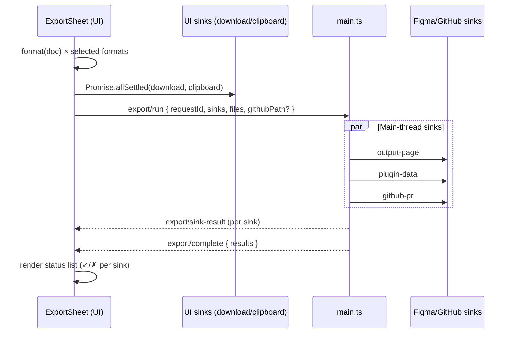

# Export sheet UI patterns — research (WO-020)

> **Status:** ✅ Research complete — component contract, sink split, message protocol, path defaults, and test strategy locked for `/plan`.
> **Date:** 2026-05-27
> **Owner:** WO-020 (Sprint 4)
> **PRD anchors:** §6.8 FR-IO-2..4, §10.2–10.4, §8 (contract kinds)
> **Upstream:** WO-017 (four UI/Figma sinks), WO-018 (GitHub PR sink), WO-019 (dual-format serializer), WO-021 (feature flags)

---

## Summary

WO-020 ships **`src/ui/components/ExportSheet.tsx`** — a reusable modal/sheet panel every emit flow mounts when a designer is ready to route a contract document to one or more output sinks. The component is **greenfield**; sinks and serializers are **dependency tickets** (WO-017/018/019) and must expose stable interfaces before `/build`.

Seven decisions unblock `/plan`:

1. **Props:** `{ document: ContractDocument, defaultSinks?: SinkId[], title?: string, onComplete?: (results: ExportResults) => void }`. `ContractDocument` mirrors `LoadedDocument<T>` but carries **canonical typed payloads** from `@detroitlabs/figmint-contracts` (post-adapt for tokens), not raw wire JSON.
2. **Format UX:** two independent checkboxes (JSON, Markdown); at least one required. Default both checked (FR-IO-3). WO-019 `format(doc, 'json' | 'md')` produces bytes; ExportSheet never authors markdown directly.
3. **Sink UX:** five checkboxes; **`flags.githubOAuth`** hides GitHub PR in Community builds (WO-021). `defaultSinks` pre-checks sinks per flow (e.g. handoff → clipboard, drift Org → GitHub PR + download).
4. **Path input:** shown when GitHub PR and/or download is selected. Base path defaults from **`ContractKind`** table (§4); `{date}` = `YYYY-MM-DD` local; `{slug}` = kebab-case from document name/title when available.
5. **Parallel invocation:** UI-thread sinks (`download`, `clipboard`) run via `Promise.allSettled` in the iframe; Figma/network sinks delegate through **`export/run`** postMessage to main (same split as Bootstrap). Aggregate per-sink status in component state; terminal `export/complete` optional for main-thread batch.
6. **Main-thread sinks:** `output-page`, `plugin-data`, `github-pr` execute in `main.ts` (Figma API + manifest network). UI posts serialized `{ path, content, format }[]` plus sink list; main responds with per-sink `export/sink-result` messages keyed by `requestId`.
7. **Testing:** **No Storybook** in repo — use **Vitest + jsdom component tests** as the “Storybook equivalent” (ticket AC). Prefer extracted reducer/hook + `@testing-library/react` (add devDep in plan) over full iframe integration.

**Figma VQA:** N/A until design frame is assigned (`file_key` TBD in ticket).

---

## Key Findings

### 1. UI conventions — follow Bootstrap tab patterns

Existing plugin UI (`src/ui/App.tsx`, `src/ui/tabs/Bootstrap.tsx`, `src/ui/components/*`) establishes conventions ExportSheet must match:

| Pattern | Convention | ExportSheet use |
| -------- | ----------- | ---------------- |
| Layout | `<main>` column flex, `gap: 12px`, `padding: 16px`, `100vh` | Sheet is a bordered `<section>` inside parent tab/modal, same spacing tokens |
| Typography | Inter stack; `h2` sections `13px`; body `11px`; primary button `12px` / `fontWeight: 600` | Section labels “Format”, “Destinations”; monospace path input |
| Color | Success `#0a6b0a`, error `#b00020`, info `#0a3d6b`, muted `#666`, borders `#ddd` | Per-sink status chips reuse BootstrapStepList icon colors |
| State | `useReducer` for multi-field form + async status (see `bootstrapProgressReducer`) | `exportSheetReducer` for formats, sinks, path, `exporting`, `results` |
| A11y | `aria-label` on sections; `role="status"` / `role="alert"`; `role="progressbar"` on bars | Checkbox groups with `<fieldset>` + `<legend>`; disable Export while `exporting` |
| Clipboard | Textarea + `document.execCommand('copy')` fallback (`AuditPanel`) | Clipboard sink uses same pattern when `navigator.clipboard.writeText` blocked |
| Main comms | `parent.postMessage({ pluginMessage: … }, '*')` + typed guards in `src/io/messages/*` | New `src/io/messages/export.ts` union |

**Do not introduce** Tailwind, CSS modules, or Storybook — out of scope for Sprint 4 scaffold.

### 2. Component API

```ts
import type {
  ComponentSpecV1,
  DriftReportV1,
  HandoffContextV1,
  OpsProgramV1,
  RegistryV1,
  TokensV1,
} from '@detroitlabs/figmint-contracts';
import type { ContractKind } from '@/io/sources/types';

/** Canonical document ready for serialization — output path, not wire ingest. */
export type ContractDocument =
  | { kind: 'ops-program'; payload: OpsProgramV1 }
  | { kind: 'component-spec'; payload: ComponentSpecV1 }
  | { kind: 'drift-report'; payload: DriftReportV1 }
  | { kind: 'handoff-context'; payload: HandoffContextV1 }
  | { kind: 'registry'; payload: RegistryV1 }
  | { kind: 'tokens'; payload: TokensV1 }; // canonical internal model post-adapt

export type SinkId =
  | 'download'
  | 'clipboard'
  | 'output-page'
  | 'plugin-data'
  | 'github-pr';

export type ExportFormat = 'json' | 'md';

export interface ExportSheetProps {
  document: ContractDocument;
  /** Pre-checked sinks; filtered against flags (github-pr dropped when !flags.githubOAuth). */
  defaultSinks?: SinkId[];
  /** Designer-facing title, e.g. "Export drift report". Defaults from kind. */
  title?: string;
  onComplete?: (results: ExportResults) => void;
  onCancel?: () => void;
}

export interface ExportResults {
  requestId: string;
  bySink: Partial<Record<SinkId, { ok: boolean; error?: string }>>;
}
```

**Ticket AC “5 contract document kinds”** maps to the five versioned emit kinds in PRD §8.1–8.6 **excluding token wire shapes** (`tokens-dtcg` / `tokens-legacy` ingest only). ExportSheet still accepts **`kind: 'tokens'`** with canonical `TokensV1` for registry/bootstrap export flows. Vitest fixtures should cover all six `ContractDocument` variants.

**`Sink` interface (WO-017 dependency)** — ExportSheet orchestrates, does not implement:

```ts
export interface SerializedFile {
  path: string;
  content: string;
  format: ExportFormat;
}

export interface SinkContext {
  files: SerializedFile[];
  document: ContractDocument;
  figmaFileKey?: string;
}

export interface Sink {
  id: SinkId;
  label: string;
  /** UI iframe vs main thread — drives orchestration split. */
  runtime: 'ui' | 'main';
  execute(ctx: SinkContext): Promise<{ ok: boolean; error?: string }>;
}
```

WO-020 imports sink **implementations** from `src/io/sinks/*` (WO-017/018) but owns **selection UI + parallel orchestration**.

### 3. Format checkboxes (JSON / Markdown / both)

PRD §10.4 shows both format toggles active. Implementation:

| UI state | `formats` sent to serializer |
| -------- | ----------------------------- |
| JSON ☑, MD ☐ | `['json']` |
| JSON ☐, MD ☑ | `['md']` |
| JSON ☑, MD ☑ | `['json', 'md']` (both) |
| neither | Export button **disabled** |

- WO-019 `format(document.payload, fmt)` returns string content.
- Download sink: one browser download per selected format (two files when both checked).
- Clipboard sink: **Markdown preferred when both selected** (designer paste-to-chat); if JSON-only, copy JSON string. Document in UI helper text.
- GitHub PR sink: commits **all selected formats** as sibling paths (`foo.json` + `foo.md`), sharing basename from path input (see §4).
- Output page / pluginData: write **markdown body** when MD selected, else JSON; if both, write MD to visible text node and JSON to pluginData key suffix `:json` (WO-017 plan detail).

### 4. Sink checkboxes + `flags.githubOAuth`

| Sink | Checkbox label | `runtime` | Community build |
| ---- | -------------- | --------- | ----------------- |
| `download` | Download file(s) | `ui` | ✅ |
| `clipboard` | Copy markdown to clipboard | `ui` | ✅ |
| `output-page` | Write to Figmint Output page | `main` | ✅ |
| `plugin-data` | Write to frame pluginData | `main` | ✅ |
| `github-pr` | Open GitHub PR | `main` | **Hidden** when `!flags.githubOAuth` |

```ts
import { flags } from '@/config/flags';

const ALL_SINKS: SinkId[] = [
  'download',
  'clipboard',
  'output-page',
  'plugin-data',
  ...(flags.githubOAuth ? (['github-pr'] as const) : []),
];
```

`defaultSinks` is intersected with `ALL_SINKS` on mount. At least one sink required to enable Export.

**Path input visibility:** show when `download` or `github-pr` is checked. Clipboard / Output page / pluginData use fixed keys or labels (no path field).

### 5. Default paths per `ContractKind`

PRD §10.4 example: `docs/figmint/drift-{date}.md`. Extend consistently:

| `ContractDocument['kind']` | Default basename (no extension) | Notes |
| -------------------------- | --------------------------------- | ----- |
| `drift-report` | `docs/figmint/drift-{date}` | PRD literal |
| `handoff-context` | `docs/figmint/handoff-{date}` | FR-HAND-5 default sink is clipboard, not path |
| `ops-program` | `docs/figmint/ops-{date}` | Machine-first; default both formats |
| `component-spec` | `docs/figmint/components/{slug}` | `{slug}` = kebab(`payload.name`) |
| `registry` | `.figmint-registry` | Single JSON file; MD checkbox disabled/hidden (registry has no MD renderer in WO-019 scope) |
| `tokens` | `docs/figmint/tokens-{date}` | Canonical export after adapt |

Implementation: `src/ui/export/defaultPaths.ts` pure helper:

```ts
export function defaultExportBasename(kind: ContractDocument['kind'], payload: unknown, now = new Date()): string {
  const date = now.toISOString().slice(0, 10);
  // switch kind → return path without extension
}
```

Path `<input>` stores **basename without extension**; serializer appends `.v1.json` / `.v1.md` or project convention from WO-019 (plan to align extension policy).

When both formats export to download, trigger two saves: `{basename}.json` and `{basename}.md`.

### 6. Parallel sink invocation + per-sink status



**UI-thread pattern:**

```ts
const uiResults = await Promise.allSettled(
  selectedUiSinks.map(function (id) {
    return getSink(id).execute(ctx);
  }),
);
```

**Main-thread message contract** (add `src/io/messages/export.ts`):

```ts
export interface ExportRunMessage {
  type: 'export/run';
  requestId: string;
  sinks: Array<'output-page' | 'plugin-data' | 'github-pr'>;
  files: SerializedFile[];
  /** Required when github-pr ∈ sinks */
  github?: { repoPath: string; branchPrefix?: string };
}

export interface ExportSinkResultMessage {
  type: 'export/sink-result';
  requestId: string;
  sink: SinkId;
  ok: boolean;
  error?: string;
}

export interface ExportCompleteMessage {
  type: 'export/complete';
  requestId: string;
  results: Partial<Record<SinkId, { ok: boolean; error?: string }>>;
}
```

**Status UI:** reuse `BootstrapStepList` visual language — list row per selected sink with `pending → running → done | error`. Partial success is allowed (one sink fails, others succeed). Banner summary: “Exported to 3 of 4 destinations”.

**Telemetry:** `console.debug('[ui] export/run', …)` per Bootstrap convention; main uses `pluginLog`.

### 7. postMessage to main for Figma sinks

Mirror `Bootstrap.tsx` listener pattern:

```ts
useEffect(function () {
  const onPluginMessage = function (event: MessageEvent) {
    const msg = readPluginMessage(event.data);
    if (isExportSinkResultMessage(msg) && msg.requestId === activeRequestId) {
      dispatchExport({ type: 'export/sink-result', ...msg });
    }
    if (isExportCompleteMessage(msg) && msg.requestId === activeRequestId) {
      dispatchExport({ type: 'export/complete', ...msg });
    }
  };
  window.addEventListener('message', onPluginMessage);
  return function () { window.removeEventListener('message', onPluginMessage); };
}, [activeRequestId]);
```

Submit handler:

```ts
parent.postMessage(
  { pluginMessage: { type: 'export/run', requestId, sinks: mainSinks, files, github } },
  '*',
);
```

`main.ts` registers handler alongside `bootstrap/run` and `push/variables`. Figma-only sinks **must not** run in the UI iframe (no `figma.*` API).

### 8. Vitest testing strategy (no Storybook)

| Layer | Path | Coverage |
| ----- | ---- | -------- |
| Pure helpers | `tests/unit/ui/defaultPaths.test.ts` | Basename per kind, date slug, component slug |
| Reducer | `tests/unit/ui/exportSheetReducer.test.ts` | Format/sink toggles, validation, result aggregation |
| Component | `tests/unit/ui/ExportSheet.test.tsx` | Render all contract kinds; github-pr absent when `flags.githubOAuth === false`; multi-sink submit mocks |
| Messages | `tests/unit/io/messages/export.test.ts` | Type guards for export union |
| Integration | `tests/unit/ui/exportSheet.orchestration.test.ts` | Mock `parent.postMessage` + sink modules; assert parallel calls |

**Storybook equivalent AC:** parametrized Vitest `describe.each` over six `ContractDocument` fixtures from `packages/contracts` samples (or committed `tests/fixtures/contracts/*`).

**Dev dependency gap:** repo has `jsdom` but not `@testing-library/react`. `/plan` should add `@testing-library/react` + `@testing-library/user-event` **or** document render-via-`createRoot` + manual DOM queries — prefer testing-library for checkbox interaction tests.

**Vitest config note:** `@/config/flags` aliases to `flags.community.ts` in `vitest.config.ts`. Add org-flag test file with explicit import of `flags.org.ts` (pattern from WO-021 plan).

### 9. Dependency gate

| Ticket | Delivers | WO-020 needs |
| ------ | -------- | ------------- |
| WO-019 | `format(doc, fmt)` | Serialize before any sink |
| WO-017 | download, clipboard, outputPage, pluginData sinks + `Sink` interface | UI + main sink impl |
| WO-018 | githubPR sink | Org PR path |
| WO-021 | `flags.githubOAuth` | Hide GitHub checkbox (can stub flag before WO-021 lands) |

**/build order:** WO-019 + WO-017 interfaces first (or stub sinks), then ExportSheet, then wire real sinks. WO-018 can land after sheet shell if GitHub row is flag-gated.

---

## Recommendations

1. **Extract `exportSheetReducer.ts`** — keeps `ExportSheet.tsx` presentational; mirrors WO-015 bootstrap split.
2. **Shared status component** — either generalize `BootstrapStepList` to accept generic `{ id, label, status, detail? }[]` or add thin `SinkStatusList` with same styling.
3. **Modal vs inline** — PRD ASCII shows dialog with Cancel/Export. Implement as `<dialog>` or fixed overlay section; parent tabs pass `onCancel`. No global modal portal needed in v1.
4. **Registry MD checkbox** — disable Markdown when `kind === 'registry'` (WO-019 lists five MD renderers, registry not included).
5. **Acceptance criteria edit** — replace “Storybook” with “Vitest component tests (see research)” in ticket during this research pass.
6. **Plan WO-017/018 message handler** in same PR series as ExportSheet so `export/run` is not orphaned.

---

## Open Questions

1. **Figma VQA:** Design frame not assigned (`file_key` / `node_id` TBD). Visual QA deferred until design lands; build uses Bootstrap inline-style conventions.
2. **File extension policy:** WO-019 plan must lock `.v1.json` vs `.json` suffix for downloads and PR commits — ExportSheet basename helper depends on it.
3. **pluginData target node:** WO-017 must define selection vs last-scaffolded frame; ExportSheet may show read-only “Target: {frame name}” when plugin-data checked.
4. **GitHub path vs multi-file:** When both formats selected, confirm PR commits two paths derived from one basename input (recommended) vs two path fields (reject — out of scope).
5. **Clipboard when both formats:** Confirm MD-only copy is acceptable default (PRD emphasizes markdown for chat); JSON-only flows unambiguous.

---

## Validated evidence

### Repo inventory (grep-verified 2026-05-27)

| Path | Status | Role |
| ---- | ------ | ---- |
| `src/ui/App.tsx` | ✅ | Tab shell; no ExportSheet yet |
| `src/ui/tabs/Bootstrap.tsx` | ✅ | Reducer + postMessage + component patterns |
| `src/ui/components/BootstrapStepList.tsx` | ✅ | Status list styling to reuse |
| `src/ui/components/AuditPanel.tsx` | ✅ | execCommand copy fallback |
| `src/ui/components/ExportSheet.tsx` | ❌ greenfield | WO-020 deliverable |
| `src/io/messages/export.ts` | ❌ greenfield | Orchestration messages |
| Storybook | ❌ not in repo | Vitest + RTL per ticket AC |

### Message orchestration (aligned with bootstrap)

Pattern from `src/main.ts` L191 `figma.ui.onmessage` + `src/io/messages/bootstrap.ts`:

- UI generates `requestId` (uuid or increment)
- UI posts `{ pluginMessage: { type: 'export/run', requestId, sinks, files } }`
- Main responds with `{ type: 'export/sink-result', requestId, sink, ok, error? }` per sink
- UI aggregates with `Promise.allSettled` for iframe sinks + awaits main replies for canvas/network sinks

### SinkId alignment (cross-ticket)

| WO-017 `SinkId` | WO-020 `SinkId` | Notes |
| --------------- | --------------- | ----- |
| `download` | `download` | UI runtime |
| `clipboard` | `clipboard` | UI runtime |
| `output-page` | `output-page` | main via postMessage |
| `plugin-data` | `plugin-data` | main via postMessage |
| — | `github-pr` | WO-018; gated `flags.githubOAuth` / `githubPRSink` |

**Plan must unify hyphen vs camel** — recommend kebab-case ids everywhere (`github-pr`).

---

## Decision log

| ID | Decision | Rationale | Alternatives rejected |
| -- | -------- | --------- | --------------------- |
| D-020-1 | Vitest component tests, not Storybook | No Storybook in repo | Add Storybook dep |
| D-020-2 | `exportSheetReducer` extracted | Matches bootstrap pattern | Monolithic component state |
| D-020-3 | Parallel sink invocation | Ticket AC / UX latency | Sequential sinks |
| D-020-4 | MD default for clipboard when `both` | PRD §10.4 chat paste | Always JSON |
| D-020-5 | Disable MD checkbox for `registry` | WO-019 five renderers | Generic MD for registry |

---

## Pre-plan spikes

| Spike ID | Procedure | Pass criteria | Status |
| -------- | --------- | ------------- | ------ |
| SPK-020-1 | Vitest: ExportSheet renders five sink checkboxes (org flags mock) | github-pr hidden when `githubOAuth: false` | ☐ at build |
| SPK-020-2 | Stub sinks → parallel export drift fixture | All selected sinks return ok in results map | ☐ at build |
| SPK-020-3 | Manual: Export overlay a11y | fieldset/legend, disabled while exporting | ☐ VQA |

---

## Risk register

| Risk | Sev | Likelihood | Mitigation |
| ---- | --- | ---------- | ---------- |
| WO-017/018 interfaces not ready | High | Med | Stub sinks; dependency gate §9 |
| SinkId / message type drift | Med | Med | Sprint index contract table |
| Path basename vs WO-019 extension | Med | Med | Lock in WO-019 plan first |

---

## References

- Sprint index: [sprint-4-io-gating-research-index.md](../../research/sprint-4-io-gating-research-index.md)
- Quality bar: [research-quality-bar.md](../../../templates/research-quality-bar.md)
