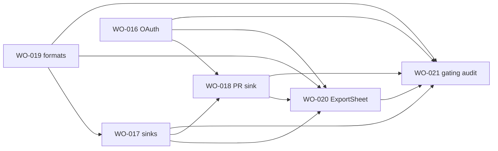

# Sprint 4 — I/O & gating research index

> **Status:** Sprint 4 I/O research — **WO-021 deferred** (single build). Five active tickets WO-016–020.
> **Quality bar:** [`.github/templates/research-quality-bar.md`](../../templates/research-quality-bar.md)

---

## Sprint goal (one line)

Ship the **output half** of the I/O subsystem (sinks, dual-format serialization, export UI, GitHub OAuth/PR) and **integrate** Community vs Org feature gating — completing PRD §10 and §13.1 Phase 1 GA matrix.

---

## Ticket map

| Ticket | GitHub | Research artifact | Lines (approx) | Pre-plan spikes |
| ------ | ------ | ----------------- | -------------- | --------------- |
| WO-016 | #19 | [github-oauth-plugin-flow.md](../WO-016-github-oauth-integration-read-and-write-pr/research/github-oauth-plugin-flow.md) | 250+ | Device Flow poll in Figma desktop + browser |
| WO-017 | #20 | [output-sinks-implementation.md](../WO-017-output-sinks-download-clipboard-output-page-plugindata/research/output-sinks-implementation.md) | 550+ | Clipboard write on Export click; pluginData 100 kB |
| WO-018 | #21 | [github-pr-sink-flow.md](../WO-018-github-pr-output-sink/research/github-pr-sink-flow.md) | 350+ | Git Data API dry-run against test repo (post WO-016) |
| WO-019 | #22 | [dual-format-serialization.md](../WO-019-dual-format-serialization-json-and-gfm-markdown/research/dual-format-serialization.md) | 400+ | Golden fixture review (no Figma spike) |
| WO-020 | #23 | [export-sheet-ui-patterns.md](../WO-020-unified-export-sheet-ui/research/export-sheet-ui-patterns.md) | 350+ | Component tests only until sinks land |
| WO-021 | #24 | [feature-gating-dual-build.md](../WO-021-feature-gating-dual-manifest-builds-community-vs-org/research/feature-gating-dual-build.md) | — | **Deferred** — Context Backlog |

---

## Recommended `/plan` order (dependency-respecting)

1. **WO-019** — `format()` is the serialization single source; sinks and export sheet consume it.
2. **WO-017** — four local sinks + `Sink` interface; stub serializer until WO-019 merges.
3. **WO-016** — OAuth + read path + thin PR helper; unblocks WO-018 network auth.
4. **WO-018** — GitHub PR sink implements multi-file Git Data API commit.
5. **WO-020** — ExportSheet orchestrates all sinks; depends on stable `SinkId` + messages.
6. ~~**WO-021**~~ — **deferred** (single build until Community listing needs gating).

---

## Cross-ticket interface contracts (locked)

| Artifact | Owner | Consumers | Shape |
| -------- | ----- | --------- | ----- |
| `format(doc, 'json' \| 'md')` | WO-019 | WO-017, WO-018, WO-020 | `src/io/formats/index.ts` |
| `Sink` + `SinkResult` | WO-017 | WO-018, WO-020 | `src/io/sinks/types.ts` |
| `prepareSinkContent()` | WO-017 | All sinks | Delegates to WO-019 `format()` |
| `src/io/github/*` (OAuth, API client) | WO-016 | WO-016 read, WO-018 PR | Main-thread token + fetch |
| `githubPR` sink | WO-018 | WO-020 | Extends `Sink`; not duplicated in WO-016 |
| `src/io/messages/export.ts` | WO-020 | `main.ts` | Parallel to `bootstrap.ts` pattern |
| `flags.githubOAuth` | WO-016 / WO-021 | Settings, GitHub source, ExportSheet | Build-time alias |
| `flags.githubPRSink` | WO-021 (+ WO-018 wiring) | ExportSheet PR checkbox | Separate from OAuth read |

**Ownership conflict resolved:** WO-016 ticket lists `githubPR.ts` — WO-016 delivers **OAuth + read + internal `createPullRequest()` helper**; WO-018 owns **`Sink` wrapper + multi-file + export integration**. Single implementation file under `src/io/sinks/githubPR.ts` owned by WO-018; WO-016 may land `src/io/github/pr.ts` helper only.

---

## Repo baseline (validated 2026-05-27)

| Path | Status |
| ---- | ------ |
| `src/io/sources/*` | ✅ WO-006 ingest (paste, file, clipboard) |
| `src/io/sinks/` | ❌ greenfield |
| `src/io/formats/` | ❌ greenfield |
| `src/io/github/` | ❌ greenfield |
| `src/config/flags.{community,org}.ts` | ✅ `githubOAuth` only |
| `manifest.{community,org}.json` | ✅ networkAccess split |
| `scripts/build-{community,org}.mjs` | ✅ dual build |
| `package.json` | ❌ no umbrella `build` script |
| `src/ui/tabs/Settings.tsx` | ❌ greenfield |
| Tests | ✅ 228 passing; no sink/format tests yet |

---

## Platform facts (validated)

| Fact | Source | Sprint impact |
| ---- | ------ | ------------- |
| Figma generic OAuth doc assumes **public HTTPS relay** | [OAuth with Plugins](https://developers.figma.com/docs/plugins/oauth-with-plugins/) | GitHub **Device Flow** avoids relay — document tension in WO-016 |
| `figma.clientStorage` **main thread only** | Same doc | Token storage on main; UI posts token once |
| `setPluginData` total entry **≤ 100 kB** | [setPluginData](https://developers.figma.com/docs/plugins/api/properties/nodes-setplugindata/) | WO-017 pluginData sink must reject oversized JSON |
| Text node `characters` — **no documented max** | Figma TextNode API | WO-017 Output page: performance risk only, not 100 kB cap |
| Clipboard **read** blocked in iframe | WO-006 research + Permissions-Policy | Input path unchanged |
| Clipboard **write** — user gesture + execCommand fallback | Figma forum + WO-006 symmetry | WO-017 spike SPK-017-1 |
| Community `networkAccess: ["none"]` | `manifest.community.json` | Hard block on GitHub even if UI gate missed |

---

## Open sprint-level decisions

| ID | Question | Default | Owner |
| -- | -------- | ------- | ----- |
| S4-OQ-1 | Sixth markdown renderer for `audit-report`? | Add in WO-019 plan | Product at `/plan` WO-019 |
| S4-OQ-2 | Detroit Labs OAuth App `client_id` registered? | Block WO-016 build | Eng lead |
| S4-OQ-3 | Device Flow UX vs Auth Code + relay | Device Flow MVP | Design at VQA |
| S4-OQ-4 | `ExportSheet` message module name: `export.ts` vs extend `sinks.ts` | `export.ts` for orchestration | WO-020 plan |

---

## Research → plan handoff checklist

Before moving **any** Sprint 4 ticket to **In Planning**:

- [ ] Ticket research doc passes [research-quality-bar.md](../../templates/research-quality-bar.md) verification
- [ ] Pre-plan spikes for that ticket ✅ or deferred with sign-off
- [ ] This index cross-ticket matrix still accurate
- [ ] `ticket.md` Requirements updated; GitHub issue body synced
- [ ] `plan.md` Notes reference research decisions (not "TBD")
