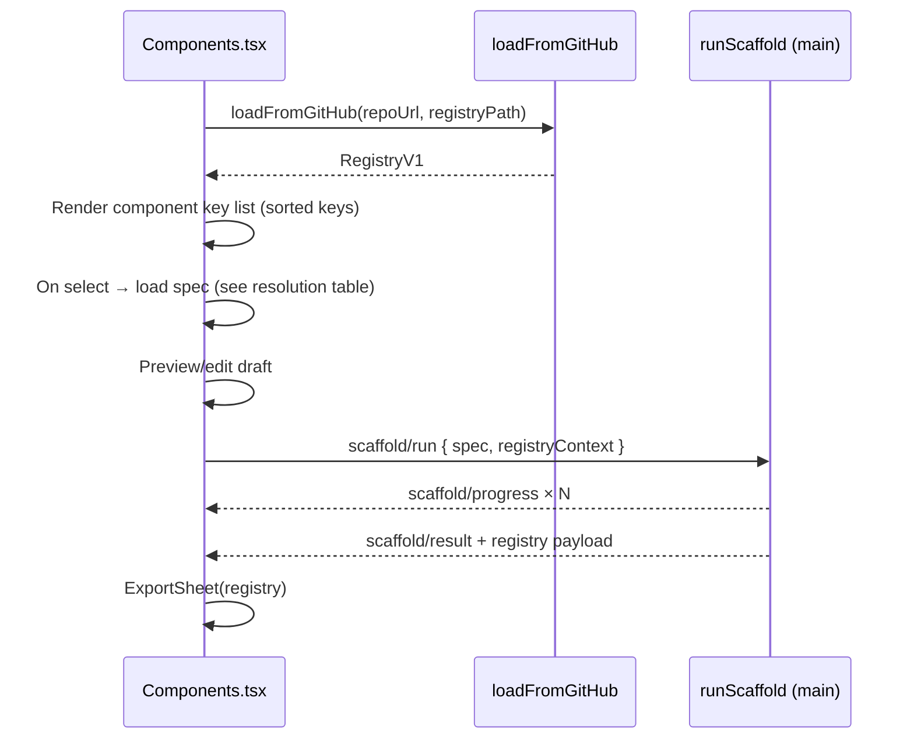

# Components tab UI — forward-scaffold flow (WO-027)

> **Status:** ✅ Research complete — tab shell, dual entry paths, spec preview/edit model, scaffold orchestration message contract, and Phase 2 GA gates locked for `/plan`.
> **Date:** 2026-05-28
> **Owner:** WO-027 (Sprint 5)
> **Topic slug:** `components-tab-forward-flow`
> **PRD anchors:** §5.2 UC-2, §5.3 UC-3, §6.2 FR-SCAF-1..6, §8.3 `component-spec.v1`, §8.6 `registry.v1`, §9 `scaffold-component` op, §12 Phase 2 exit (G2, UC-2/3)
> **Upstream research:** WO-006 IO, WO-015 Bootstrap tab orchestration, WO-022 scaffold engine, WO-023 bindings, WO-024 properties, WO-025 usage frame, WO-026 registry emission, WO-020 export sheet

---

## Summary

WO-027 is the **Phase 2 GA integration surface** — it exposes the forward component-scaffold pipeline (spec → Figma ComponentSet → bindings → properties → usage frame → registry export) in a dedicated **Components** tab. The tab mirrors the proven Bootstrap tab pattern: WO-006 source ports for ingest, a **preview-before-apply** gate (PRD §11.4), one **Scaffold** CTA that runs main-thread orchestration with streamed progress, inline audit drill-down, and a post-success **ExportSheet** for the updated `RegistryV1` document.

**Locked recommendation:**

1. **Extend `App.tsx` tab union** with `'components'` — fourth nav button between Export and Settings (order: Bootstrap → Components → Export → Settings per PRD §7.3 mental model: bootstrap first, then components, then cross-cutting export/settings).
2. **Create `src/ui/tabs/Components.tsx`** — primary deliverable; extract reusable source widgets from Bootstrap (`SourcePasteTextarea`, `SourceFilePicker`, `ClipboardBanner`) rather than duplicating IO logic.
3. **Two entry paths:**
   - **Registry pick (UC-2):** `loadFromGitHub(repoUrl, registryPath)` → `RegistryV1` → designer selects a component key → resolve bundled or repo-side `component-spec.v1.json` (see §3).
   - **Paste/load spec (UC-3):** WO-006 `loadFromPaste` / file / clipboard → `detectContract()` must yield `component-spec` (not tokens).
4. **Spec preview + edit** — UI-local draft state (`ComponentSpecDraft`) cloned from loaded spec; editable fields: `variantMatrix`, `props[]`, `bindings[]` (JSON textarea or structured sub-panels — `/plan` picks UX depth; minimum: monospace JSON editor with schema validation).
5. **Orchestration on main thread** — new `scaffold/*` message union (§6); `runScaffoldComponent()` in `src/core/components/scaffold/runScaffold.ts` sequences WO-022..026 calls; UI never touches Plugin API directly.
6. **Post-scaffold export** — auto-open `ExportSheet` with `{ kind: 'registry', payload: RegistryV1 }` from WO-026 merge result; default sinks: `download` (Community), `github-pr` when OAuth connected (Org).
7. **G2 latency** — measure wall time from `scaffold/run` ack to `scaffold/result`; target p50 < 5s on Plugin Sandbox after variables bootstrapped (SPK-027-1 deferred to combined VQA with WO-022..026).

**Out of scope (ticket + PRD):** import-from-repo (Sprint 8 / WO-044), Code Connect PR (Sprint 8), bulk scaffold, formal `src/ops/` dispatcher (inline orchestrator acceptable for Phase 2; ops-program compatibility via in-memory `ScaffoldComponentOp` construction for logging only).

---

## Key Findings

### 1. Tab shell — mirror `App.tsx` + Bootstrap, add Components route

**Evidence:** `src/ui/App.tsx` L10–14 — `type AppTab = 'bootstrap' | 'settings' | 'export'`; nav renders three buttons; conditional render switches tab bodies.

**PRD §7.3** lists `Components.tsx` under `src/ui/tabs/` alongside Bootstrap — file is **greenfield** (grep: no `Components.tsx` exists).

**Locked tab integration:**

```ts
type AppTab = 'bootstrap' | 'components' | 'export' | 'settings';
```

| Tab          | Component             | Registers listeners                                    |
| ------------ | --------------------- | ------------------------------------------------------ |
| `bootstrap`  | `Bootstrap.tsx`       | bootstrap progress (in-tab `useEffect`)                |
| `components` | `Components.tsx`      | scaffold progress (in-tab `useEffect`)                 |
| `export`     | inline Export sandbox | `registerExportMessageListener()` (App-level, already) |
| `settings`   | `Settings.tsx`        | GitHub OAuth (via `useGitHubConnect`)                  |

**Shared App-level effects (keep):** `registerSinkMessageListener()`, `registerExportMessageListener()` — Components tab uses ExportSheet which depends on export listener.

**Visual parity:** Reuse Bootstrap inline styles (11px Inter, `#f0f0f0` active tab, `1px solid #ccc` borders, `16px` padding) until a dedicated design-token pass (no WO-027 requirement for variable-bound UI chrome).

### 2. WO-006 component-spec ingest — already built; Components tab filters on kind

**Evidence:**

| Module                                     | Role                                                                   |
| ------------------------------------------ | ---------------------------------------------------------------------- |
| `src/io/sources/detect.ts`                 | `component-spec` discriminator: `v === 1 && kind === 'component-spec'` |
| `src/io/sources/paste.ts`                  | `loadFromPaste(text)` → `parseTextToDocument`                          |
| `src/io/sources/file.ts`                   | `loadFromFile(file)`                                                   |
| `src/io/sources/clipboard.ts`              | probe + paste-event path                                               |
| `src/io/sources/types.ts`                  | `ContractKind` includes `'component-spec'`                             |
| `src/io/formats/markdown/componentSpec.ts` | MD renderer (export only, not ingest)                                  |

**Bootstrap today** (`src/ui/tabs/Bootstrap.tsx` L99–103): non-token documents clear `cachedTokens` and return early — **no error UX for component-spec**. Components tab **owns** `component-spec` + `registry` kinds.

**Locked ingest handler:**

```ts
function applyLoadedDocument(doc: LoadedDocument) {
  if (doc.kind === 'component-spec') {
    setDraft(cloneSpec(doc.payload as ComponentSpecV1));
    setSourceLabel(`Loaded component-spec via ${doc.sourceMeta.port}`);
    return;
  }
  if (doc.kind === 'registry') {
    setRegistry(doc.payload as RegistryV1);
    setSourceLabel(`Loaded registry via ${doc.sourceMeta.port}`);
    return;
  }
  setIngestError(`Expected component-spec or registry, got ${doc.kind}.`);
}
```

**Fixture drift:** `src/io/formats/__fixtures__/component-spec-button.json` uses **invalid** selectors (`.button`) and collection-prefixed variables (`Theme/color/...`) per WO-023 research. Components tab **must not** use this fixture for scaffold VQA. `/plan` should add `tests/fixtures/component-spec-button-canonical.json` with locked selector grammar (`root.fill`, `color/primary/default`).

**Validation gate before Scaffold CTA:**

- Run `@detroitlabs/fighub-contracts` JSON Schema validate (`componentSpec.v1.schema.json`) on draft in UI (async import schema or precompiled AJV in Vitest only — `/plan` decides bundle cost).
- Block scaffold if `bindings[]` empty when `confidence.bindings !== 'high'` is optional warn, not hard block (PRD preview culture).

### 3. Registry pick path (UC-2) — GitHub read + key selection + spec resolution

**Evidence:**

| Artifact                                               | Fact                                                                          |
| ------------------------------------------------------ | ----------------------------------------------------------------------------- |
| `RegistryV1` (`packages/contracts/src/registry.v1.ts`) | `components: Record<string, RegistryComponentEntry>` — key is component slug  |
| `RegistryComponentEntry`                               | `nodeId`, `key`, `pageName`, `publishedAt`, `version`, optional `cvaHash`     |
| `loadFromGitHub` (`src/io/github.ts`)                  | Already used in Settings for `tokensPath`; same bridge for registry path      |
| PRD UC-2                                               | Designer picks known shadcn component; registry updated via PR after scaffold |

**Gap:** Settings stores `tokensPath` only (`StoredGitHubConfig` in `src/io/github/storage.ts`) — **no `registryPath` yet**.

**Locked registry path default:** `.fighub-registry.json` at repo root (matches WO-020 `defaultPaths.ts` basename `.fighub-registry` → `.fighub-registry.json`).

**Locked UC-2 flow:**



**Spec resolution table (locked default; `/plan` implements):**

| Priority | Source             | Procedure                                                                                                                  |
| -------- | ------------------ | -------------------------------------------------------------------------------------------------------------------------- |
| 1        | Repo file          | `design/components/{key}.component-spec.v1.json` (convention — document in plan; align with DesignOps shadcn-props layout) |
| 2        | Repo file          | `design/component-specs/{key}.v1.json` (fallback path)                                                                     |
| 3        | Bundled fixture    | `tests/fixtures/component-spec-{key}.json` for VQA/demo when GitHub read misses (dev-only flag)                            |
| 4        | Registry-only stub | If only `RegistryComponentEntry` exists, show blocking error: "No component-spec on disk for {key}" — do not invent spec   |

**Registry pick without GitHub:** Disable registry section when `!github.connected`; show hint linking to Settings tab (same pattern as Export tab GitHub PR guard in `runExport.ts` L244).

**Sub-component / composed specs:** WO-022 requires optional `registry?: RegistryV1` passed to `scaffold()` for composed archetypes — Components tab **must** pass loaded registry into `scaffold/run` message.

### 4. Spec preview + edit — draft model before destructive scaffold

**Evidence:** PRD FR-IMP-7 (import path) mandates preview; forward path inherits **always preview, never silent-apply** (memory.md, PRD §11.4). Ticket requirement #3: variant matrix, prop list, binding overrides.

**Locked `ComponentSpecDraft` fields (editable in v1 UI):**

| Field                                   | Editor UX (minimum)                    | Notes                                                   |
| --------------------------------------- | -------------------------------------- | ------------------------------------------------------- |
| `name`                                  | Read-only label                        | Shown in preview header                                 |
| `variantMatrix`                         | JSON sub-object textarea OR axis table | Re-run cross-product count badge ("12 variants")        |
| `props[]`                               | JSON array textarea                    | WO-024 consumes normalized props                        |
| `bindings[]`                            | JSON array textarea                    | WO-023 selector grammar enforced at validate time       |
| `archetype`, `layout`, archetype config | Read-only in v1                        | Edit via paste new spec; structured editors = follow-on |

**Preview panel contents (locked):**

- Detected kind + `framework` + `archetype`
- Variant count = ∏ axis lengths (client-side `expandVariantMatrix` preview — duplicate WO-022 algorithm in UI module `src/ui/components/variantMatrixPreview.ts` pure TS, no Figma)
- Bindings count + first 3 selectors
- Warnings: fixture drift hints if CSS-like selectors detected (`selector.startsWith('.')`)

**Scaffold CTA enablement:** `draft !== null && validation.ok && !progress.running`

### 5. Pipeline orchestration — WO-022 → WO-023 → WO-024 → WO-025 → WO-026

**Evidence — locked pipeline order from upstream research:**

| Step | Owner  | Function                                                                    | FR                   |
| ---- | ------ | --------------------------------------------------------------------------- | -------------------- |
| 1    | WO-022 | `scaffold(spec, targetPage, { registry })` → `ScaffoldResult`               | FR-SCAF-2, FR-SCAF-7 |
| 2    | WO-023 | `applyBindings(spec, componentSet)` → `ApplyBindingsResult`                 | FR-SCAF-3            |
| 3    | WO-024 | `applyProperties(spec, componentSet)` → `ApplyPropertiesResult`             | FR-SCAF-4            |
| 4    | WO-025 | `buildUsageFrame(componentSet, spec)` → `FrameNode`                         | FR-SCAF-5            |
| 5    | WO-026 | `mergeRegistryEntry(spec, scaffoldResult, existingRegistry)` → `RegistryV1` | FR-SCAF-6            |

**Target page (locked):** Find or create page named `Components` (or `FigHub / Components`) — mirror Bootstrap style-guide page discovery in `ensureStyleGuideScaffold.ts` pattern; idempotent `figma.root.findOne` by name.

**Do not** call export sinks inside main-thread loop — UI opens ExportSheet **after** `scaffold/result` with staged `RegistryV1` (WO-026 returns document; WO-020 sheet handles sinks).

**Ops-program alignment:** Construct in-memory op sequence for audit logging:

```json
{
  "type": "scaffold-component",
  "spec": {
    /* ComponentSpecV1 */
  }
}
```

Full `OpsProgramV1` emission optional; WO-027 does not require ops paste path in tab v1.

### 6. Progress + audit display — clone Bootstrap reducer pattern

**Evidence:** `src/ui/bootstrap/bootstrapProgressReducer.ts` + `BootstrapStepList.tsx` + `AuditPanel.tsx` — proven UX for multi-step main-thread work.

**Locked UI components for WO-027:**

| New module                                              | Pattern source                                |
| ------------------------------------------------------- | --------------------------------------------- |
| `src/ui/components/scaffold/scaffoldProgressReducer.ts` | `bootstrapProgressReducer.ts`                 |
| `src/ui/components/scaffold/ScaffoldStepList.tsx`       | `BootstrapStepList.tsx`                       |
| Reuse `AuditPanel.tsx`                                  | Feed `AuditReportV1[]` from `scaffold/result` |

**Progress steps (designer-facing labels):**

| Step ID             | Label                       | Emits audit?                                           |
| ------------------- | --------------------------- | ------------------------------------------------------ |
| `scaffold-geometry` | Building variant matrix     | WO-022 inline rows                                     |
| `apply-bindings`    | Applying variable bindings  | WO-023 `ApplyBindingsResult` → audit scope `component` |
| `apply-properties`  | Adding component properties | WO-024 result                                          |
| `build-usage-frame` | Creating usage examples     | WO-025 pass/fail                                       |
| `update-registry`   | Updating registry document  | N/A (data merge)                                       |
| `audit-component`   | Running component audit     | Combined report                                        |
| `complete`          | Done                        | —                                                      |

On any step `error`, abort pipeline, post `scaffold/error`, preserve partial canvas (no auto-rollback — designer re-scaffolds with idempotent WO-022 replace semantics).

### 7. Registry export sheet — WO-020 integration

**Evidence:**

| Module                              | Fact                                                                  |
| ----------------------------------- | --------------------------------------------------------------------- |
| `src/ui/components/ExportSheet.tsx` | Accepts `ContractDocument`; `registry` kind → title "Export registry" |
| `src/ui/export/defaultPaths.ts`     | `registry` → basename `.fighub-registry`                              |
| `src/ui/export/runExport.ts`        | GitHub PR requires connected OAuth                                    |
| WO-026 ticket                       | Merge produces updated `RegistryV1`; output via export sheet          |

**Locked post-scaffold UX:**

1. `scaffold/result.ok === true` → set `showRegistryExport = true`
2. Render `<ExportSheet document={{ kind: 'registry', payload: result.registry }} defaultSinks={...} />` inline below progress (or modal overlay — `/plan` picks; inline matches Export tab sandbox)
3. Pre-fill export path `.fighub-registry.json` (editable)
4. Default sinks: `['download', 'github-pr']` when `github.connected`, else `['download']`

**FR-SCAF-6 trace:** Designer confirms export (never silent PR) — sheet is the confirmation gate.

### 8. Phase 2 GA / G2 — acceptance mapping

| AC                           | Research gate                                                                                |
| ---------------------------- | -------------------------------------------------------------------------------------------- |
| Registry pick Button < 5s    | SPK-027-1 bench on sandbox after bootstrap-complete fixture                                  |
| Paste custom spec + scaffold | Use canonical `component-spec` fixture + Vitest UI test for ingest                           |
| G2 p50 < 5s                  | Log `totalDurationMs` in `scaffold/result`; WO-022 SPK-022-4 defers live proof to WO-027 VQA |

**Phase 2 exit (PRD §12):** WO-027 is the **last** Phase 2 ticket — depends on WO-022..026 builds being merge-ready. `/build` gate: refuse if any dependency plan is stub.

**UC-2 / UC-3:** Both converge on same `scaffold/run` path after draft is ready — only ingest differs.

### 9. Figma VQA — Components tab mock vs Plugin Sandbox execution

**Evidence:** Ticket design reference: "Components tab UI mock lives in the FigHub design file" — **no `file_key` / `node_id` in repo today**.

**Locked VQA strategy for `/plan` + `/vqa`:**

| Field         | Value                                                                                                                                   |
| ------------- | --------------------------------------------------------------------------------------------------------------------------------------- |
| `file_key`    | `cVdPraIafWFBRZnzMPhtrW` (Plugin Sandbox — memory.md locked)                                                                            |
| `node_id`     | TBD during `/plan` when mock frame is identified in file, OR `**N/A — compare implemented plugin panel only**` until design file linked |
| Frame / scope | FigHub plugin window — **Components** tab (not Bootstrap)                                                                               |
| Precondition  | Run Bootstrap with `bootstrap-complete` fixture first so variables exist for bindings                                                   |

**Research note for ticket.md:** VQA compares **plugin panel layout** (tab nav, entry sections, preview, Scaffold CTA, progress list, export sheet) — not canvas ComponentSet geometry (that is WO-022..025 subsystem VQA). Split assertions: rows 1–8 panel chrome; canvas spot-check optional row 11 "ComponentSet exists on Components page".

---

## Validated evidence

### Repo inventory

| Exists today                 | Path                                                                               | Role                           |
| ---------------------------- | ---------------------------------------------------------------------------------- | ------------------------------ |
| Tab shell (3 tabs)           | `src/ui/App.tsx`                                                                   | Extend with `components`       |
| Bootstrap tab + source ports | `src/ui/tabs/Bootstrap.tsx`, `src/ui/sources/*`                                    | Pattern to mirror              |
| Settings + GitHub read       | `src/ui/tabs/Settings.tsx`, `src/io/sources/github.ts`                             | Registry path read             |
| IO detect + paste            | `src/io/sources/detect.ts`, `paste.ts`                                             | component-spec ingest          |
| Export sheet                 | `src/ui/components/ExportSheet.tsx`, `src/ui/export/*`                             | Post-scaffold registry export  |
| Bootstrap messages           | `src/io/messages/bootstrap.ts`                                                     | Template for scaffold messages |
| Contracts                    | `packages/contracts/src/componentSpec.v1.ts`, `registry.v1.ts`, `opsProgram.v1.ts` | Wire types                     |
| Main dispatch                | `src/main.ts`                                                                      | Add `scaffold/run` handler     |
| Audit panel                  | `src/ui/components/AuditPanel.tsx`                                                 | Reuse                          |

| Does not exist (greenfield)    | Path                                                       |
| ------------------------------ | ---------------------------------------------------------- |
| Components tab                 | `src/ui/tabs/Components.tsx`                               |
| Scaffold orchestrator          | `src/core/components/scaffold/runScaffold.ts`              |
| Scaffold messages              | `src/io/messages/scaffold.ts`                              |
| Scaffold progress UI           | `src/ui/components/scaffold/*`                             |
| Registry path in GitHub config | `StoredGitHubConfig.registryPath` (optional field)         |
| Core scaffold modules          | `src/core/components/scaffold/index.ts` etc. (WO-022..026) |

### Official API / platform facts

| Topic               | Fact                                                                | Source                                                                                                                                  |
| ------------------- | ------------------------------------------------------------------- | --------------------------------------------------------------------------------------------------------------------------------------- |
| UI ↔ main messaging | `parent.postMessage({ pluginMessage }, '*')` / `figma.ui.onmessage` | [Figma Plugin API — postMessage](https://developers.figma.com/docs/plugins/api/properties/figma-ui-postmessage/) (retrieved 2026-05-28) |
| Main-thread work    | All canvas mutation in plugin sandbox; UI is iframe                 | [How Plugins Run](https://developers.figma.com/docs/plugins/how-plugins-run/) (retrieved 2026-05-28)                                    |
| Registry file       | JSON on GitHub Contents API via existing WO-016 relay               | WO-016 research — relay mandatory                                                                                                       |
| pluginData          | 100 kB per key — scaffold id on ComponentSet (WO-022)               | Figma node pluginData docs                                                                                                              |

### Cross-ticket matrix

| Ticket | Interface / artifact                                | WO-027 consumes or produces                        |
| ------ | --------------------------------------------------- | -------------------------------------------------- |
| WO-006 | `LoadedDocument`, `loadFromPaste`, `detectContract` | **Consumes** — paste/file/clipboard ingest         |
| WO-016 | GitHub OAuth + contents fetch                       | **Consumes** — registry + spec file read           |
| WO-020 | `ExportSheet`, `runExport`                          | **Consumes** — post-scaffold registry export       |
| WO-022 | `scaffold()`, `ScaffoldResult`                      | **Consumes** — step 1                              |
| WO-023 | `applyBindings()`, `ApplyBindingsResult`            | **Consumes** — step 2                              |
| WO-024 | `applyProperties()`, `ApplyPropertiesResult`        | **Consumes** — step 3                              |
| WO-025 | `buildUsageFrame()`                                 | **Consumes** — step 4                              |
| WO-026 | `mergeRegistryEntry()` → `RegistryV1`               | **Consumes** — step 5; **Produces** export payload |
| WO-010 | `AuditReportV1`, `scope: 'component'`               | **Consumes** — display in tab                      |
| WO-044 | Import tab UI                                       | **Blocks on** WO-027 tab shell existing            |

---

## Decision log

| ID  | Decision                                                        | Rationale                                                   | Alternatives rejected                                   |
| --- | --------------------------------------------------------------- | ----------------------------------------------------------- | ------------------------------------------------------- |
| D1  | Main-thread `runScaffoldComponent()` with `scaffold/*` messages | Matches Bootstrap; Figma forbids canvas ops in UI           | Run scaffold from UI via `use_figma` MCP                |
| D2  | Clone Bootstrap source widgets into Components tab              | DRY via shared props; avoids coupling Bootstrap token state | Duplicate paste logic inline                            |
| D3  | `AppTab` includes `'components'` between Bootstrap and Export   | PRD §7.3 tab order; Phase 2 feature visible                 | Hide behind feature flag (unnecessary — flags all true) |
| D4  | Spec draft editable as JSON for matrix/props/bindings           | Fastest path to GA; satisfies ticket #3                     | Full form builder per axis (over-engineered for v1)     |
| D5  | Registry path default `.fighub-registry.json`                   | WO-020 basename + PRD §8.6                                  | Only under `design/` subfolder (deferred to config)     |
| D6  | Auto-open ExportSheet on success; no silent PR                  | FR-SCAF-6 + §11.4 preview                                   | Auto-open PR without confirmation                       |
| D7  | Reject non-`component-spec`/`registry` ingest in Components tab | Clear designer feedback                                     | Silently ignore like Bootstrap                          |
| D8  | Pass `RegistryV1` into scaffold for composed archetypes         | WO-022 research §10                                         | Require manual instance setup                           |
| D9  | VQA on Plugin Sandbox; mock frame TBD                           | memory.md locked sandbox                                    | Block VQA until design file linked                      |

---

## Pre-plan spikes

| Spike ID  | Procedure                                                                                                                         | Pass criteria             | Status                                                 |
| --------- | --------------------------------------------------------------------------------------------------------------------------------- | ------------------------- | ------------------------------------------------------ |
| SPK-027-1 | Sandbox: Bootstrap complete → Components tab → registry pick Button (or canonical fixture) → Scaffold → measure `totalDurationMs` | < 5000 ms p50 over 3 runs | ☐ deferred — requires WO-022..026 built; run at `/vqa` |
| SPK-027-2 | Desktop: paste canonical `component-spec.v1.json` in Components textarea → preview shows 12 variants                              | Count matches matrix      | ☐ deferred — UI unit test acceptable for `/plan`       |
| SPK-027-3 | GitHub connected: scaffold success → ExportSheet → download `.fighub-registry.json`                                               | Valid `RegistryV1` schema | ☐ deferred — depends WO-026                            |

**Research-complete gate:** All spikes deferred to build/VQA with explicit owners — no architectural unknowns remain.

---

## Risk register

| Risk                                         | Severity | Likelihood | Mitigation                                                                                                    |
| -------------------------------------------- | -------- | ---------- | ------------------------------------------------------------------------------------------------------------- |
| WO-022..026 not merged before WO-027 build   | High     | Med        | `/build` refuses stub plans; stub orchestrator returns `scaffold/error` "dependency not implemented" per step |
| Registry pick without on-disk component-spec | Med      | High       | Resolution table + clear error; bundled VQA fixture                                                           |
| Invalid fixture selectors if used for demo   | Med      | Med        | Canonical fixture; validate draft before scaffold                                                             |
| G2 miss on large variant matrices            | Med      | Low        | Curated VQA spec (12 variants not 48); log timing                                                             |
| GitHub not connected blocks UC-2             | Low      | High       | Settings link; paste path still works (UC-3)                                                                  |
| Composed archetype missing registry children | Med      | Med        | Pass registry; surface WO-022 error in audit panel                                                            |

---

## Recommendations (for `/plan`)

1. **Step 0 — Dependencies:** Confirm WO-022..026 `plan.md` non-stub; list exported function signatures in WO-027 plan verbatim.
2. **Add `src/io/messages/scaffold.ts`** — full contract in §6 below; wire `main.ts` dispatch before UI.
3. **Implement `runScaffold.ts`** — thin sequencer calling dependency functions; post progress after each boundary.
4. **Build `Components.tsx`** — sections: Entry (registry | paste), Preview, Actions (Scaffold), Progress, Audit, Export sheet.
5. **Extend `StoredGitHubConfig`** with optional `registryPath?: string` (default `.fighub-registry.json`); Settings field optional in WO-027 or follow-up.
6. **Add canonical fixture** `tests/fixtures/component-spec-button-canonical.json` for Vitest + VQA.
7. **Vitest:** UI reducer tests + message guard tests; integration mock `runScaffold` via message listener.
8. **Figma VQA checklist:** Pre-fill sandbox `file_key`; add row 11 canvas spot-check; note mock frame TBD.

---

## Orchestration message contract (handoff artifact)

> **Canonical for `/plan` and `/code-build`.** ES2017-safe guards required (no `?.` in `src/main.ts`).

### UI → main

```ts
export interface ScaffoldRunMessage {
  type: 'scaffold/run';
  spec: ComponentSpecV1;
  options?: {
    /** Existing registry from GitHub or prior load — required for composed specs */
    registry?: RegistryV1;
    /** Skip usage frame (dev only) */
    skipUsageFrame?: boolean;
    /** Skip registry merge (dev only) */
    skipRegistry?: boolean;
  };
}
```

### Main → UI (progress)

```ts
export type ScaffoldStepId =
  | 'scaffold-geometry'
  | 'apply-bindings'
  | 'apply-properties'
  | 'build-usage-frame'
  | 'update-registry'
  | 'audit-component'
  | 'complete';

export type ScaffoldStepStatus = 'pending' | 'running' | 'done' | 'error' | 'skipped';

export interface ScaffoldProgressMessage {
  type: 'scaffold/progress';
  step: ScaffoldStepId;
  status: ScaffoldStepStatus;
  label: string;
  detail?: string;
  elapsedMs?: number;
  audit?: AuditReportV1;
}
```

### Main → UI (terminal)

```ts
export interface ScaffoldResultMessage {
  type: 'scaffold/result';
  ok: boolean;
  totalDurationMs: number;
  componentSetId: string;
  componentSetName: string;
  registry: RegistryV1;
  audits: AuditReportV1[];
  scaffold: ScaffoldResult; // from WO-022
  bindings?: ApplyBindingsResult;
  properties?: ApplyPropertiesResult;
}

export interface ScaffoldErrorMessage {
  type: 'scaffold/error';
  message: string;
  failedStep?: ScaffoldStepId;
}

export type ScaffoldUiMessage =
  | ScaffoldProgressMessage
  | ScaffoldResultMessage
  | ScaffoldErrorMessage;
```

### Dispatch guards (pattern)

Mirror `isBootstrapRunMessage` — `message.type === 'scaffold/run'`, validate `spec.v === 1 && spec.kind === 'component-spec'`, `Array.isArray(spec.props)`, `Array.isArray(spec.bindings)`.

### UI listener pattern

```ts
useEffect(() => {
  function onMessage(event: MessageEvent) {
    const msg = (event.data as { pluginMessage?: unknown }).pluginMessage;
    if (isScaffoldProgressMessage(msg)) dispatchProgress(msg);
    if (isScaffoldResultMessage(msg)) {
      /* show export, audit */
    }
    if (isScaffoldErrorMessage(msg)) {
      /* surface error */
    }
  }
  window.addEventListener('message', onMessage);
  return () => window.removeEventListener('message', onMessage);
}, []);
```

### Scaffold invocation from UI

```ts
parent.postMessage(
  { pluginMessage: { type: 'scaffold/run', spec: draft, options: { registry } } },
  '*',
);
```

---

## Open questions

1. **Design file mock node** — which Figma file holds Components tab mock? **Default for VQA:** Plugin Sandbox panel-only assertions until design link added. **Owner:** designer / `/plan`.
2. **Repo component-spec path convention** — `design/components/{key}.component-spec.v1.json` vs other? **RESOLVED for planning:** `/plan` Step 1 documents convention + Documents in README; WO-027 tries ordered list in §3 table.
3. **Structured vs JSON editors** for preview edit? **Default:** JSON textareas v1; structured follow-on CTX if needed.

---

## References

- `Docs/PRD.md` §5.2–5.3, §6.2, §8.3, §8.6, §9, §12 Phase 2
- `src/ui/App.tsx`, `src/ui/tabs/Bootstrap.tsx`, `src/ui/tabs/Settings.tsx`
- `src/io/sources/*`, `packages/contracts/src/componentSpec.v1.ts`, `registry.v1.ts`
- `.github/Sprint 2/WO-006-…/research/io-subsystem-design.md`
- `.github/Sprint 3/WO-015-…/research/bootstrap-tab-ui-orchestration.md`
- `.github/Sprint 5/WO-022-…/research/component-scaffold-engine.md`
- `.github/Sprint 5/WO-023-…/research/variable-bindings-application.md`
- `.github/Sprint 5/WO-024-…/research/component-property-definitions.md`
- `.github/Sprint 5/WO-025-usage-frame-generator/ticket.md`
- `.github/Sprint 5/WO-026-registry-update-emission/ticket.md`
- `.github/Sprint 4/WO-020-…/research/export-sheet-ui-patterns.md`
- `memory.md` — Plugin Sandbox `file_key`, clipboard policy, G2 target
