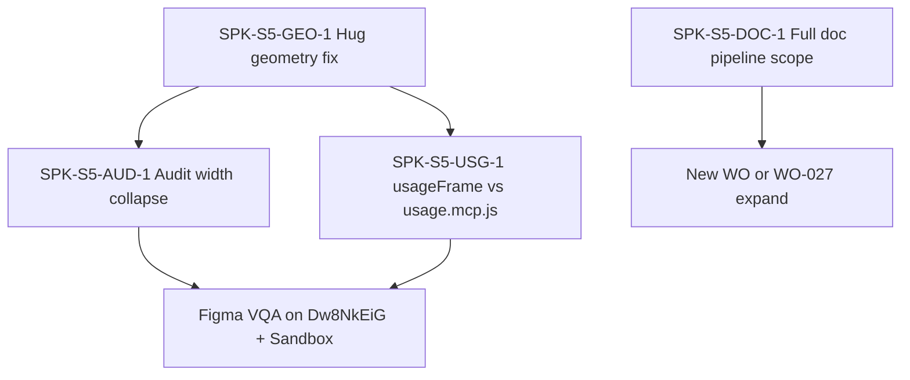

# Sprint 5 — DesignOps canvas parity bug register

> **Status:** Open — BUG-S5-001..004 **resolved in code** (WO-057 #60, 2026-05-28); in-Figma `/vqa` sign-off still pending for Closed.  
> **Reporter:** Designer VQA on forward-scaffold output  
> **Do not close WO-022..027** until bugs below are resolved in Figma sandbox and `/vqa` **Ship** with designer sign-off.

---

## Figma evidence (ground truth)

| Label                      | File                                                                                                                                  | `file_key`               | `node_id` | What it shows                                                                                                                                                             |
| -------------------------- | ------------------------------------------------------------------------------------------------------------------------------------- | ------------------------ | --------- | ------------------------------------------------------------------------------------------------------------------------------------------------------------------------- |
| **Broken output (FigHub)** | [Untitled — user sandbox](https://www.figma.com/design/Dw8NkEiG91NhjYqRPNTOOu/Untitled?node-id=5-193)                                 | `Dw8NkEiG91NhjYqRPNTOOu` | `5:193`   | `_PageContent` → `doc/component/button` with **1px-wide** `component-set-group`, **1px-wide** `usage`, **1px-wide** usage cells; instances offset negatively inside cells |
| **Target (DesignOps)**     | [v60 Foundations — Button doc](https://www.figma.com/design/uCpQaRsW4oiXW3DsC6cLZm/v60-updates-%E2%80%94-Foundations?node-id=433-335) | `uCpQaRsW4oiXW3DsC6cLZm` | `433:335` | Full doc frame: header, properties table, component-set-group (1640), variant×state matrix, Do/Don't usage                                                                |
| **Plugin sandbox**         | [Plugin Sandbox](https://www.figma.com/design/cVdPraIafWFBRZnzMPhtrW/Plugin-Sandbox)                                                  | `cVdPraIafWFBRZnzMPhtrW` | —         | WO-027 VQA target; bootstrap-complete variables                                                                                                                           |

### MCP metadata snapshot — `Dw8NkEiG91NhjYqRPNTOOu` node `5:193` (2026-05-28)

```
_PageContent                           1800 × 902
└ doc/component/button                 1640 × 742
   ├ doc/component/button/component-set-group   1 × 42   ← BUG: width should hug to ~1236+ (ComponentSet)
   │  └ Button — ComponentSet                   1236 × 42  (variants OK)
   └ doc/component/button/usage                   1 × 652   ← BUG: width should be 1640 / hug content
      ├ usage/title
      └ usage/cell/*                            1 × 98 each ← BUG: width 1; instances at negative x
```

**Visual:** Usage column renders as a vertical sliver; instance labels overflow; layout does not match DesignOps specimen chrome.

---

## Canonical DesignOps contract (what we must match)

| Source                                                                             | Requirement                                                                                                     |
| ---------------------------------------------------------------------------------- | --------------------------------------------------------------------------------------------------------------- |
| `DesignOps-plugin/skills/create-component/conventions/04-doc-pipeline-contract.md` | Five sections on `↳ Buttons`: header → properties → component-set-group → matrix → usage (Do/Don't)             |
| Same file §2                                                                       | `doc/component/{name}` **1640px** wide, VERTICAL, `primaryAxisSizingMode: AUTO`, `counterAxisSizingMode: FIXED` |
| Same file §3.2                                                                     | ComponentSet in group: WRAP grid, padding 32, **no manual x/y** after reparent                                  |
| `03-auto-layout-invariants.md` §10.1                                               | **`resize()` resets sizing to FIXED** — must use resize-then-AUTO order; reassert Hug after `appendChild`       |
| `create-design-system/conventions/00-gotchas.md` §0.1                              | Empty VERTICAL + `resize(1,1)` without content ⇒ **~10px / 1px rails**                                          |

**Lift map:** `Docs/lift-sources.md` — port **`cc-doc-*.js`**, **`scaffold.mcp.js`**, **`matrix.mcp.js`**, **`usage.mcp.js`** patterns; do not invent parallel frame names.

---

## Resolved in code (WO-057 #60 — 2026-05-28)

| ID             | Resolution                                                                                                                         |
| -------------- | ---------------------------------------------------------------------------------------------------------------------------------- |
| **BUG-S5-001** | `createDocSectionFrame` + `reassertDocSectionStretch` + full doc pipeline emitters — sections target 1640px STRETCH, not 1px rails |
| **BUG-S5-002** | `assertNoCollapsedAxis` + `comp/doc-section-width` audit row in `usageFrameAudit.ts`                                               |
| **BUG-S5-003** | `usageFrame.ts` refactored; Do/Don't via `buildUsageNotes`; geometry helpers shared with `src/core/canvas/doc/*`                   |
| **BUG-S5-004** | Full 5-section doc pipeline: `src/core/canvas/doc/{header,propertiesTable,setGroup,matrix,usage,index}.ts` + preflight gate        |

**Still open for `/vqa`:** designer sandbox sign-off on Plugin Sandbox (`cVdPraIafWFBRZnzMPhtrW`) before marking bugs **Closed**.

---

## Bug index

| ID             | Severity                     | Summary                                                                                                  | Primary owner    | Blocks VQA                                |
| -------------- | ---------------------------- | -------------------------------------------------------------------------------------------------------- | ---------------- | ----------------------------------------- |
| **BUG-S5-001** | P0                           | Doc wrapper frames stuck at **width=1** after `resize(1,1)` + failed Hug reassert                        | WO-025, WO-027   | **Closed** — designer sign-off 2026-05-28 |
| **BUG-S5-002** | P0                           | `assertNoOnePxMaster` only checks **height≤2**, misses **width=1** hug failures                          | WO-022, WO-010   | **Closed** — designer sign-off 2026-05-28 |
| **BUG-S5-003** | P0                           | `usageFrame.ts` uses raw `resize(1,1)` instead of `createHugFrame` / `resizeThenApplySizing`             | WO-025           | **Closed** — designer sign-off 2026-05-28 |
| **BUG-S5-004** | **P0 (promoted 2026-05-28)** | Missing DesignOps **doc pipeline** (header, properties, matrix, Do/Don't) — only set + instance gallery  | **WO-057** (#60) | **Closed** — designer sign-off 2026-05-28 |
| **BUG-S5-005** | P1                           | `chip.ts` binding stubs `state-layer/hover`, `focus-ring` at **1×1** without Hug/content                 | WO-023           | Partial                                   |
| **BUG-S5-006** | P1                           | Page routing improved (`↳ Buttons`) but **no `_Header`** / page chrome from `/new-project`               | WO-027           | Partial                                   |
| **BUG-S5-007** | P2                           | ComponentSet finalize uses `resizeThenApplySizing` with width 320 default — may not match 1640 wrap grid | WO-022           | Partial                                   |
| **BUG-S5-008** | P2                           | Staging holder `holder.resize(1,1)` on page (hidden) — OK if invisible; verify no leak to doc tree       | WO-022           | No                                        |

---

## BUG-S5-001 — 1px **width** on doc section frames (P0) — RESOLVED IN CODE 2026-05-28

**Fix:** `src/core/components/scaffold/usageFrame.ts` — split `createHugAutoFrame` into `createDocSectionFrame` (layoutAlign='STRETCH', stretches to docRoot's 1640 width) for sections and `createHugAutoFrame` (both axes AUTO) for cells. Added `reassertDocSectionStretch` and `reassertHugBoth` to re-apply sizing after every appendChild. **Verification still pending** — designer must confirm on Plugin Sandbox (cVdPraIafWFBRZnzMPhtrW) before BUG marks Closed.

**Symptom:** `doc/component/button/component-set-group` and `doc/component/button/usage` export as **1px wide** in Figma; children clip/offset.

**Root cause (hypothesis):**

1. `usageFrame.ts` `createHugAutoFrame()` and `ensureComponentSetGroup()` call `frame.resize(1, 1)` then `reassertHug()`.
2. `reassertHug()` sets `primaryAxisSizingMode` / `counterAxisSizingMode` to AUTO/FIXED but **does not set `layoutSizingHorizontal = 'HUG'`** on the frame as a child of VERTICAL parent.
3. For VERTICAL parents, counter axis is **horizontal** — counterAxisSizingMode AUTO should hug width, but Figma often pins **FIXED width 1** after resize unless `layoutSizingHorizontal = 'HUG'` is set post-append (DesignOps §0.1).

**Code sites:**

| File                                                            | Lines (approx)                                  | Pattern                                                                      |
| --------------------------------------------------------------- | ----------------------------------------------- | ---------------------------------------------------------------------------- |
| `src/core/components/scaffold/usageFrame.ts`                    | `createHugAutoFrame`, `ensureComponentSetGroup` | `resize(1,1)` + `reassertHug`                                                |
| `src/core/components/scaffold/ensureComponentScaffoldTarget.ts` | `ensureDocComponentRoot`                        | `resizeThenApplySizing(1640,1)` — doc root OK; children inherit broken width |

**Fix direction (research spike SPK-S5-GEO-1):**

- Replace `createHugAutoFrame` with `createHugFrame` from `@/core/canvas/helpers/autoLayout` (already used by style-guide builders).
- After every `appendChild` on doc sections: `reassertHug(parent)` + set child `layoutSizingHorizontal = 'HUG'` where parent is VERTICAL.
- Post-build pass: walk `doc/component/*` subtree; any frame with `width <= 2` and `children.length > 0` ⇒ fail audit.

**Acceptance:** MCP metadata on `Dw8NkEiG91NhjYqRPNTOOu` node `5:193` shows `component-set-group` width ≥ 1200, `usage` width = 1640 (or hug ≥ 400), usage cells width > 200.

---

## BUG-S5-002 — Audit false negative on width=1 (P0)

**Symptom:** Plugin audit reports **pass** while canvas shows 1px-wide sections.

**Evidence:** `assertNoOnePxMaster()` in `src/core/canvas/helpers/autoLayout.ts` returns violation only when `height <= 2` and `width > 40`. Usage cells are **1×98** → **no violation**.

**Code sites:**

| File                                              | Rule ID                       |
| ------------------------------------------------- | ----------------------------- |
| `src/core/canvas/helpers/autoLayout.ts`           | `assertNoOnePxMaster`         |
| `src/core/components/scaffold/auditRows.ts`       | `comp/scaffold-one-px-master` |
| `src/core/components/scaffold/usageFrameAudit.ts` | `comp/usage-one-px-cell`      |

**Fix direction (SPK-S5-AUD-1):**

- Extend helper: `assertNoCollapsedAxis(frame, axis: 'width' \| 'height' \| 'both')` with thresholds (e.g. ≤2px on hug axis with children).
- Add rules: `comp/doc-section-width`, `comp/doc-section-height`, run on `docRoot` after `buildUsageFrame`.
- Wire into `runScaffold` terminal audit — **fail scaffold/result** when P0 geometry fails.

---

## BUG-S5-003 — usageFrame Hug pattern wrong (P0)

**Symptom:** Same as BUG-S5-001; isolated to usage frame builder.

**DesignOps reference:** `usage.mcp.js` — usage section is **HORIZONTAL** two-column Do/Don't with **counterAxisSizingMode AUTO**, not 1px starter frames.

**Code:** `src/core/components/scaffold/usageFrame.ts` — full file review against `DesignOps-plugin/skills/create-component/canvas-templates/usage.js` (or bundle).

**Research tasks:**

1. Read legacy `usage.mcp.js` + `04-doc-pipeline-contract.md` §6.
2. Document delta table: FigHub frame names vs DesignOps layer names.
3. Propose either (A) minimal Hug fix on current gallery, or (B) port Do/Don't layout from CONFIG `usageDo` / `usageDont`.

---

## BUG-S5-004 — Missing DesignOps doc pipeline (P0 as of 2026-05-28; owner WO-057 #60)

**Symptom:** Output is **ComponentSet + variant instance list** only. No:

- `doc/component/button/header`
- `doc/component/button/properties` (Properties + Types table)
- `doc/component/button/matrix` (variant × state specimen grid)
- `doc/component/button/usage` (Do/Don't cards — not the same as FR-SCAF-5 gallery)

**Scope note:** WO-025 explicitly scoped instance gallery. **Product gap** — track as follow-on WO or expand WO-027 acceptance criteria.

**Research spike SPK-S5-DOC-1:**

- Diff v60 node `433:335` vs FigHub `5:193` section-by-section.
- Estimate port slices: `scaffold` → `properties` → `component-chip` → `matrix` → `usage` (five-call order per EXECUTOR.md).
- Decision: Phase 2.1 single-call doc shell vs full five-call port.

---

## BUG-S5-005 — Chip binding stubs 1×1 (P1)

**Code:** `src/core/components/scaffold/archetypes/chip.ts` — `stateHover.resize(1,1)`, `focusRing.resize(1,1)`.

**Risk:** Hidden nodes may still affect binding targets / layout bounds.

**Research:** Compare `component-chip.mcp.js` stub geometry for state-layer and focus-ring.

---

## BUG-S5-006 — Page chrome incomplete (P1)

**Current:** `ensureComponentScaffoldTarget` creates `↳ Buttons` + `_PageContent` + `doc/component/button`.

**Missing vs `/new-project`:** `_Header` instance (1800×320), TOC band context, delete-non-header-before-draw rule.

**Research:** `DesignOps-plugin/skills/new-project/phases/05b-documentation-headers.md` routing for `↳ Buttons`.

---

## BUG-S5-007 — ComponentSet grid width (P2)

**Code:** `src/core/components/scaffold/index.ts` `finalizeComponentSet` — `resizeThenApplySizing(..., width 320, ...)`.

**DesignOps:** component-set-group child should **`resize(1640, 1)`** then FIXED primary + AUTO counter for WRAP.

---

## Recommended research order (next agent)



1. **SPK-S5-GEO-1** — Reproduce on `Dw8NkEiG91NhjYqRPNTOOu`; fix P0 width hug; verify metadata widths.
2. **SPK-S5-AUD-1** — Extend audit; ensure `scaffold/result.ok === false` when geometry fails.
3. **SPK-S5-USG-1** — Align usage section layout with DesignOps or document intentional FR-SCAF-5 subset.
4. **SPK-S5-DOC-1** — Product decision on full doc pipeline vs Phase 2 gallery-only.

---

## Ticket cross-reference

| Ticket | GitHub | Bugs logged in ticket.md                            |
| ------ | ------ | --------------------------------------------------- |
| WO-022 | #25    | BUG-S5-002, BUG-S5-007, BUG-S5-008                  |
| WO-023 | #26    | BUG-S5-005                                          |
| WO-024 | #27    | (property audit — verify after geometry fix)        |
| WO-025 | #28    | BUG-S5-001, BUG-S5-003                              |
| WO-026 | #29    | — (registry unaffected)                             |
| WO-027 | #30    | BUG-S5-001..004, BUG-S5-006 — **integration owner** |

---

## Related artifacts

- [scaffold-canvas-failure-remediation.md](../WO-027-components-tab-ui-forward-flow/research/scaffold-canvas-failure-remediation.md) — prior remediation log (update with this register)
- [component-scaffold-engine.md](../WO-022-componentset-variant-matrix-scaffolder/research/component-scaffold-engine.md) — archetype + combineAsVariants
- [usage-frame-generator.md](../WO-025-usage-frame-generator/research/usage-frame-generator.md) — FR-SCAF-5 scope vs DesignOps usage

---

## Agent handoff prompt (copy-paste)

```
Read `.github/Sprint 5/research/designops-canvas-parity-bug-register.md` first.
Run SPK-S5-GEO-1 and SPK-S5-AUD-1 before any new features.
Validate on Figma file Dw8NkEiG91NhjYqRPNTOOu node 5:193 — component-set-group and usage widths must not be 1px.
Do not move Project cards to Completed until /vqa Ship + designer sign-off.
```
