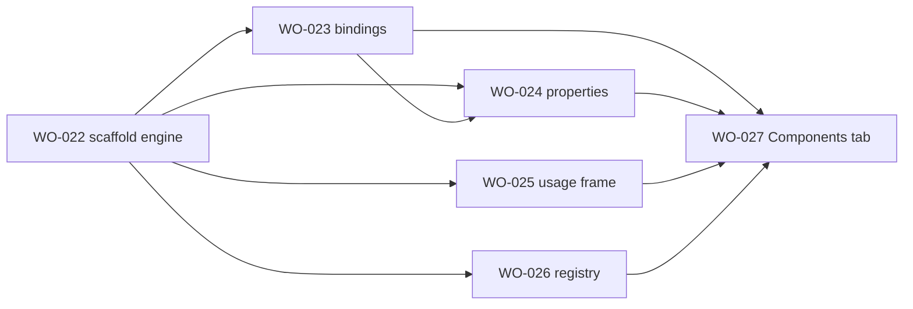

# Sprint 5 — Component scaffold (forward path) research index

> **Status:** All six tickets **In Research** (2026-05-28). Research complete — ready for `/plan` in dependency order.
> **Quality bar:** [`.github/templates/research-quality-bar.md`](../../templates/research-quality-bar.md)

---

## Sprint goal (one line)

Ship the **forward scaffold path** (ComponentSpec → Figma ComponentSet + bindings + props + usage frame + registry emission) and the **Components tab** UI — PRD §6.2 FR-SCAF-1..6, Phase 2 exit (G2 latency).

---

## Ticket map

| Ticket | GitHub | Research artifact | Lines | Pre-plan spikes |
| ------ | ------ | ----------------- | ----- | --------------- |
| WO-022 | #25 | [component-scaffold-engine.md](../WO-022-componentset-variant-matrix-scaffolder/research/component-scaffold-engine.md) | 295 | SPK-022-1 combineAsVariants; SPK-022-2 chip minimal |
| WO-023 | #26 | [variable-bindings-application.md](../WO-023-variable-bindings-application/research/variable-bindings-application.md) | 419 | SPK-023-3 after WO-022 scaffold |
| WO-024 | #27 | [component-property-definitions.md](../WO-024-component-property-definitions/research/component-property-definitions.md) | 377 | SPK-024-3 after WO-022+023 |
| WO-025 | #28 | [usage-frame-generator.md](../WO-025-usage-frame-generator/research/usage-frame-generator.md) | 326 | SPK-025-1 instance gallery on sandbox |
| WO-026 | #29 | [registry-update-emission.md](../WO-026-registry-update-emission/research/registry-update-emission.md) | 328 | SPK-026-1 merge + ExportSheet staging |
| WO-027 | #30 | [components-tab-forward-flow.md](../WO-027-components-tab-ui-forward-flow/research/components-tab-forward-flow.md) | 497 | SPK-027-1 end-to-end Button <5s |

**Total research:** ~2,242 lines across 6 artifacts.

---

## Recommended `/plan` order

1. **WO-022** — core scaffold + variant matrix (blocks all others)
2. **WO-023, WO-024, WO-025, WO-026** — parallel after WO-022 plan/build Phase 1 lands (or parallel `/plan` now)
3. **WO-027** — UI orchestration last (consumes all pipeline stages + ExportSheet)

---

## Cross-cutting locked decisions

| # | Decision | Owner ticket |
| - | -------- | ------------ |
| 1 | Single `scaffold()` call — no legacy 5-call MCP doc pipeline | WO-022 |
| 2 | VARIANT props from `combineAsVariants` (WO-022); BOOLEAN/TEXT/INSTANCE_SWAP from WO-024 | WO-024 |
| 3 | Layer naming locked for bindings (`text/label`, `icon-slot/*`) | WO-022 + WO-023 |
| 4 | Usage frame = curated instance gallery (max 6), not full cross-product | WO-025 |
| 5 | Registry upsert by `spec.name`; emission via WO-020 ExportSheet | WO-026 |
| 6 | `scaffold/run` message orchestration in main; Components tab in UI | WO-027 |

---

## Upstream dependencies (prior sprints)

| Sprint | Tickets | Interface |
| ------ | ------- | --------- |
| Sprint 1 | WO-003 | `ComponentSpecV1`, `RegistryV1` contracts |
| Sprint 2 | WO-008, WO-014 | Variables pushed; auto-layout helpers |
| Sprint 4 | WO-006, WO-020 | Ingest + ExportSheet for registry emission |

---

## Lift source discipline

Read **`Docs/lift-sources.md`** before opening any `component-*.mcp.js` bundle. Prefer **`cc-arch-*.js`** modular sources over 45–65 KB bundles. **Do not** port MCP transport or `canvas-bundle-runner`.
