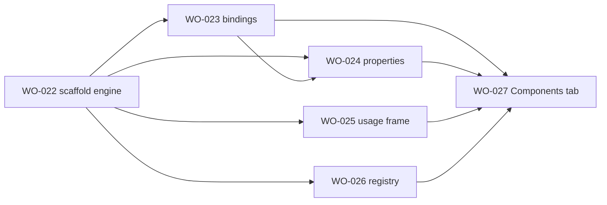

# Sprint 5 — Component scaffold (forward path) research index

> **Status:** WO-022..027 **In Build** (2026-05-28). Forward scaffold runs but **DesignOps canvas parity fails** — see **[designops-canvas-parity-bug-register.md](./designops-canvas-parity-bug-register.md)** before `/vqa` or Completed.
> **Quality bar:** [`.github/templates/research-quality-bar.md`](../../templates/research-quality-bar.md)

---

## Sprint goal (one line)

Ship the **forward scaffold path** (ComponentSpec → Figma ComponentSet + bindings + props + usage frame + registry emission) and the **Components tab** UI — PRD §6.2 FR-SCAF-1..6, Phase 2 exit (G2 latency).

---

## Ticket map

| Ticket | GitHub | Research artifact                                                                                                                                                                                                                                                                                                                                                                                                             | Lines                  | Pre-plan spikes                                                                         |
| ------ | ------ | ----------------------------------------------------------------------------------------------------------------------------------------------------------------------------------------------------------------------------------------------------------------------------------------------------------------------------------------------------------------------------------------------------------------------------- | ---------------------- | --------------------------------------------------------------------------------------- |
| WO-022 | #25    | [component-scaffold-engine.md](../WO-022-componentset-variant-matrix-scaffolder/research/component-scaffold-engine.md)                                                                                                                                                                                                                                                                                                        | 295                    | SPK-022-1 combineAsVariants; SPK-022-2 chip minimal                                     |
| WO-023 | #26    | [variable-bindings-application.md](../WO-023-variable-bindings-application/research/variable-bindings-application.md)                                                                                                                                                                                                                                                                                                         | 419                    | SPK-023-3 after WO-022 scaffold                                                         |
| WO-024 | #27    | [component-property-definitions.md](../WO-024-component-property-definitions/research/component-property-definitions.md)                                                                                                                                                                                                                                                                                                      | 377                    | SPK-024-3 after WO-022+023                                                              |
| WO-025 | #28    | [usage-frame-generator.md](../WO-025-usage-frame-generator/research/usage-frame-generator.md)                                                                                                                                                                                                                                                                                                                                 | 326                    | SPK-025-1 instance gallery on sandbox                                                   |
| WO-026 | #29    | [registry-update-emission.md](../WO-026-registry-update-emission/research/registry-update-emission.md)                                                                                                                                                                                                                                                                                                                        | 328                    | SPK-026-1 merge + ExportSheet staging                                                   |
| WO-027 | #30    | [components-tab-forward-flow.md](../WO-027-components-tab-ui-forward-flow/research/components-tab-forward-flow.md)                                                                                                                                                                                                                                                                                                            | 497                    | SPK-027-1 end-to-end Button <5s                                                         |
| WO-057 | #60    | [doc-pipeline-lift-map.md](../WO-057-designops-doc-pipeline-parity/research/doc-pipeline-lift-map.md) + [section-contract-trace.md](../WO-057-designops-doc-pipeline-parity/research/section-contract-trace.md) + [audit-gate-spec.md](../WO-057-designops-doc-pipeline-parity/research/audit-gate-spec.md) + [bootstrap-text-styles-spec.md](../WO-057-designops-doc-pipeline-parity/research/bootstrap-text-styles-spec.md) | 287+489+354+205 = 1335 | SPK-S5-DOC-1.A..F (preflight gate, 5-section emit, 96-instance matrix, opacity overlay) |

**Total research:** ~3,577 lines across 10 artifacts (Sprint 5 with WO-057).

---

## Recommended `/plan` order

1. **WO-022** — core scaffold + variant matrix (blocks all others)
2. **WO-023, WO-024, WO-025, WO-026** — parallel after WO-022 plan/build Phase 1 lands (or parallel `/plan` now)
3. **WO-027** — UI orchestration last (consumes all pipeline stages + ExportSheet)

---

## Open bugs (P0 — blocks VQA)

| Register                                                                             | Figma repro                                                                                                                | DesignOps target                                                                                                              |
| ------------------------------------------------------------------------------------ | -------------------------------------------------------------------------------------------------------------------------- | ----------------------------------------------------------------------------------------------------------------------------- |
| [designops-canvas-parity-bug-register.md](./designops-canvas-parity-bug-register.md) | [Untitled `5:193`](https://www.figma.com/design/Dw8NkEiG91NhjYqRPNTOOu/Untitled?node-id=5-193) — **1px-wide** doc sections | [v60 Button `433:335`](https://www.figma.com/design/uCpQaRsW4oiXW3DsC6cLZm/v60-updates-%E2%80%94-Foundations?node-id=433-335) |

**Headline:** `resize(1,1)` + incomplete `reassertHug` leaves `component-set-group`, `usage`, and usage cells at **width=1**; plugin audit does not fail. Not following `04-doc-pipeline-contract.md` five-section doc layout.

**Next agent spikes:** SPK-S5-GEO-1 (Hug fix) → SPK-S5-AUD-1 (width collapse audit) → SPK-S5-USG-1 (usage vs DesignOps) → SPK-S5-DOC-1 (full doc pipeline scope).

---

## Cross-cutting locked decisions

| #   | Decision                                                                                | Owner ticket    |
| --- | --------------------------------------------------------------------------------------- | --------------- |
| 1   | Single `scaffold()` call — no legacy 5-call MCP doc pipeline                            | WO-022          |
| 2   | VARIANT props from `combineAsVariants` (WO-022); BOOLEAN/TEXT/INSTANCE_SWAP from WO-024 | WO-024          |
| 3   | Layer naming locked for bindings (`text/label`, `icon-slot/*`)                          | WO-022 + WO-023 |
| 4   | Usage frame = curated instance gallery (max 6), not full cross-product                  | WO-025          |
| 5   | Registry upsert by `spec.name`; emission via WO-020 ExportSheet                         | WO-026          |
| 6   | `scaffold/run` message orchestration in main; Components tab in UI                      | WO-027          |

---

## Upstream dependencies (prior sprints)

| Sprint   | Tickets        | Interface                                  |
| -------- | -------------- | ------------------------------------------ |
| Sprint 1 | WO-003         | `ComponentSpecV1`, `RegistryV1` contracts  |
| Sprint 2 | WO-008, WO-014 | Variables pushed; auto-layout helpers      |
| Sprint 4 | WO-006, WO-020 | Ingest + ExportSheet for registry emission |

---

## Lift source discipline

Read **`Docs/lift-sources.md`** before opening any `component-*.mcp.js` bundle. Prefer **`cc-arch-*.js`** modular sources over 45–65 KB bundles. **Do not** port MCP transport or `canvas-bundle-runner`.
