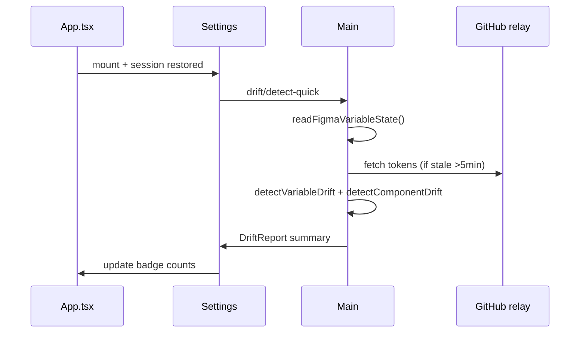

# WO-033 — Sync tab UI + on-open badge (absorbed)

> **Ticket status:** Closed 2026-05-28 — **absorbed by WO-058**. Sync tab nav + on-open badge UX is delivered via Settings GitHub-Desktop repo card. This research captures FR-DRIFT-5 requirements for WO-058 `/plan` and WO-032 integration.

---

## Summary

Original scope: dedicated **Sync tab** with on-open lightweight drift detection and nav badge `Sync · N↑ M↓ ·K⚠` (PRD FR-DRIFT-5), hosting WO-032 resolution UI.

**Locked recommendation (2026-05-28):** Do **not** add a fifth nav tab. Instead:

1. **Settings repo card** (WO-058) shows Fetch/Pull/Push + **drift summary badge** on the card header
2. **Expandable drift panel** below card hosts WO-032 components
3. **On plugin mount:** if GitHub connected + repo configured, run cached lightweight detect (or defer until first Fetch to avoid blocking Bootstrap tab)
4. Optional: small badge dot on **Settings** nav tab when conflicts > 0

---

## Key Findings

### 1. Why absorbed

WO-058 vision: GitHub Desktop-style — sync is not a separate mode, it's part of repo connection. Separate Sync tab duplicated Settings + added nav clutter.

Memory.md (2026-05-28): "Settings tab collapses to GitHub-Desktop-style repo card; Components tab drops Load sync registry; sync is implicit."

### 2. FR-DRIFT-5 requirements preserved

| Requirement | Absorbed implementation |
| ----------- | ------------------------ |
| Lightweight compare on open | `useEffect` in Settings or App-level hook after session restore |
| Badge `N↑ M↓` | Repo card subtitle: `4 pushes · 2 pulls` |
| `·K⚠` conflicts | Red conflict segment + Settings nav dot |
| <2s detect | Cache repo tokens on Fetch; detect is in-memory (WO-029 bench <100ms) |
| Re-detect button | "Refresh drift" on repo card (replaces "Detect drift" on Sync tab) |
| Resolution UI | WO-032 DriftPanel under card |

### 3. On-open detect flow



**Optimization:** Skip component spec fetches on quick detect — use snapshot registry hashes only; full spec fetch when user expands DriftPanel.

### 4. Nav badge pattern

Extend `App.tsx` tab buttons:

```tsx
<button ...>
  Settings
  {conflictCount > 0 && <span aria-label={`${conflictCount} conflicts`}>⚠</span>}
</button>
```

Store counts in React context `DriftSummaryContext` to avoid prop drilling.

### 5. Continuous detection — out of scope

Figma plugins cannot background. On-open + manual refresh only (ticket confirmed).

### 6. Design reference

Ticket cites "Sync tab + badge design lives in FigHub design file" — **translate to repo card mock** during WO-058 `/plan`. No Figma VQA node IDs filled yet.

---

## Validated evidence

### Repo inventory

| Exists | Path | Role |
| ------ | ---- | ---- |
| ✅ | `src/ui/App.tsx:13-20` | Tab enum — no sync |
| ✅ | `src/ui/tabs/Settings.tsx` | Host for absorbed UX |
| ✅ | `src/ui/github/useGitHubSession.ts` | Session restore hook point |
| ❌ | `src/ui/tabs/Sync.tsx` | **Do not create** |
| ❌ | On-open detect hook | Greenfield in Settings |

### Cross-ticket matrix

| Ticket | Role |
| ------ | ---- |
| WO-058 | Repo card + Fetch/Pull/Push owner |
| WO-029/030 | Detectors |
| WO-032 | Resolution panel content |
| WO-031 | Full report for expand view |

---

## Decision log

| ID | Decision | Rationale | Rejected |
| -- | -------- | --------- | -------- |
| D-033-1 | No Sync tab | WO-058 lock | Fifth tab |
| D-033-2 | Quick detect uses hashes for components | <2s budget | Full spec fetch on open |
| D-033-3 | Badge on Settings tab for conflicts | Visibility | Global app header badge |
| D-033-4 | Defer detect if no GitHub session | Avoid error noise | Detect with empty repo |

---

## Pre-plan spikes

| Spike ID | Procedure | Pass criteria | Status |
| -------- | --------- | ------------- | ------ |
| SPK-033-1 | Open plugin with 4 push + 2 pull fixture | Badge within 2s | ☐ deferred to WO-058 VQA |
| SPK-033-2 | Manual edit → refresh | Counts update | ☐ deferred |
| SPK-033-3 | Expand panel → full WO-032 UI | Populated list | ☐ WO-032 |

---

## Risk register

| Risk | Sev | Lik | Mitigation |
| ---- | --- | --- | ---------- |
| On-open detect blocks UI | Med | Med | Async + loading skeleton |
| Stale counts mislead | Low | Med | Show `last detected` timestamp |
| No GitHub connected | Low | High | Hide badge; show connect CTA |

---

## Recommendations

1. Close WO-033; track acceptance in WO-058 + WO-032 VQA checklists.
2. WO-058 `/plan`: include repo card badge wireframe + detect hook.
3. Add `DriftSummaryContext` in `src/ui/drift/DriftSummaryContext.tsx`.
4. Document designer copy: "Refresh drift" not "Detect drift" (designer vocabulary).

---

## Open questions

| ID | Question | Status |
| -- | -------- | ------ |
| OQ-033-1 | Detect on every App mount vs Settings tab focus only? | **RESOLVED:** Settings mount + after Fetch/Pull (avoid slowing Bootstrap) |
