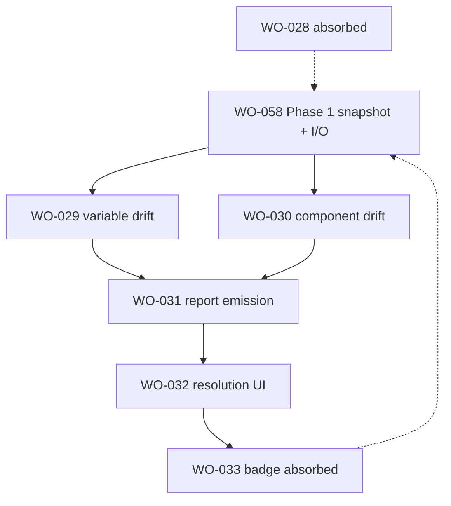

# Sprint 6 — Drift detection & sync research index

> **Status:** `/research` complete (2026-05-28). **`/plan` complete** on WO-029..032 (2026-05-28). WO-058 Phase 1 **built**. Sprint 6 **`/build`** unblocked — run WO-029 ∥ WO-030 first.
> **Quality bar:** [`.github/templates/research-quality-bar.md`](../../templates/research-quality-bar.md)

---

## Sprint goal (one line)

Ship **3-way drift detection** (Figma ↔ repo ↔ snapshot), **`drift-report.v1` emission**, and **resolution UX** — PRD §6.4 FR-DRIFT-1..6, §6.5 FR-RES-1..5, Phase 3 exit (G3).

---

## Architectural lock (2026-05-28) — read before planning

| Ticket | Status | Notes |
| ------ | ------ | ----- |
| **WO-028** (#31) | **Closed — absorbed by WO-058** | Snapshot mechanism = WO-058 Phase 1; research retained for detector contracts |
| **WO-033** (#36) | **Closed — absorbed by WO-058** | Sync tab → Settings GitHub-Desktop card; badge = follow-up on that card |
| **WO-026** (#29, Sprint 5) | **Superseded by WO-058** | `.fighub-registry.json` deleted; registry SSOT = canvas pluginData snapshot |

**Build order:** WO-058 Phase 1 (snapshot + `fighub.json` + Settings card) → WO-029 ∥ WO-030 → WO-031 → WO-032 → badge follow-up (was WO-033 tail).

WO-058 is **unblocked** (WO-057 shipped 2026-05-28). Run `/research` + `/plan` on WO-058 before Sprint 6 `/build`.

---

## Ticket map

| Ticket | GitHub | Status | Research artifact | Lines | Pre-plan spikes |
| ------ | ------ | ------ | ----------------- | ----- | --------------- |
| WO-028 | #31 | Absorbed → WO-058 | [snapshot-mechanism-canvas-plugindata.md](../WO-028-snapshot-mechanism-canvas-plugindata/research/snapshot-mechanism-canvas-plugindata.md) | ~420 | SPK-028-1 pluginData 100KB budget; SPK-028-2 hidden node on sandbox |
| WO-029 | #32 | Active | [variable-drift-detector-3-way.md](../WO-029-variable-drift-detector-3-way/research/variable-drift-detector-3-way.md) | ~380 | SPK-029-1 400-var classify bench |
| WO-030 | #33 | Active | [component-drift-detector-3-way.md](../WO-030-component-drift-detector-3-way/research/component-drift-detector-3-way.md) | ~360 | SPK-030-1 Button loading variant delta |
| WO-031 | #34 | Active | [drift-report-v1-emission.md](../WO-031-push-pull-conflict-classification-drift-report-v1-emission/research/drift-report-v1-emission.md) | ~280 | SPK-031-1 E2E fixture → JSON + MD + PR preview |
| WO-032 | #35 | Active | [resolution-ui-per-drift-bulk-conflict-resolver.md](../WO-032-resolution-ui-per-drift-bulk-conflict-resolver/research/resolution-ui-per-drift-bulk-conflict-resolver.md) | ~340 | SPK-032-1 10-drift mock resolve flow |
| WO-033 | #36 | Absorbed → WO-058 | [sync-tab-ui-on-open-badge.md](../WO-033-sync-tab-ui-on-open-badge/research/sync-tab-ui-on-open-badge.md) | ~220 | SPK-033-1 on-open detect <2s (deferred to WO-058 card) |

**Cross-sprint:** [WO-058 GitHub-Desktop sync](../../Sprint%205/WO-058-github-desktop-style-sync/research/github-desktop-style-sync.md) — **research complete 2026-05-28**; `/plan` next, then Phase 1 snapshot before WO-029–032 build.

**Total research:** ~2,000 lines across 7 artifacts + this index.

---

## Recommended `/plan` order

1. **WO-058 Phase 1** — snapshot store, delete repo registry file, `fighub.json`, Settings Fetch/Pull/Push card
2. **WO-029 + WO-030** — parallel detectors (share `SnapshotStore` API from WO-058)
3. **WO-031** — wire detectors → existing format/sink pipeline
4. **WO-032** — resolution UI (Settings-embedded or drift panel — see WO-032 research)
5. **Badge follow-up** — on-open lightweight detect on Settings card (WO-033 tail)

---

## Cross-cutting locked decisions

| # | Decision | Owner |
| - | -------- | ----- |
| 1 | Snapshot SSOT = hidden node pluginData on FigHub Output page (`fighub:snapshot:v1`) | WO-058 / WO-028 |
| 2 | Registry SSOT = same snapshot envelope (delete `.fighub-registry.json`) | WO-058 |
| 3 | 3-way classify: Figma≠snap ∧ repo=snap → push; repo≠snap ∧ Figma=snap → pull; both≠snap ∧ disagree → conflict; both=snap OR both≠snap ∧ agree → synced | WO-029 + WO-030 |
| 4 | Variable key = slash path `{collection}/{variableName}` aligned with Figma `variable.name` | WO-029 |
| 5 | Component drift granularity = variant matrix hash + props + bindings per spec name | WO-030 |
| 6 | Missing snapshot → treat repo as last-synced (PRD risk row); first-run shows all Figma-only as push | WO-029 |
| 7 | Resolution UI hosts in Settings drift panel post-WO-058 (not separate Sync tab) | WO-032 + WO-033 |
| 8 | `DriftReportV1` contract unchanged; markdown via existing `renderDriftReportMarkdown` | WO-031 |

---

## Repo foundations (already shipped)

| Module | Path | Sprint 6 reuse |
| ------ | ---- | -------------- |
| Variable snapshot read | `src/core/audit/readFigmaVariableState.ts` | Figma side of WO-029 |
| Variable equality | `src/core/variables/compare.ts` | Classify + pull apply skip logic |
| Token adapters | `src/io/sources/adapters/*` | Repo tokens → canonical |
| Registry hash | `src/core/components/scaffold/variantMatrix.ts` | Component drift `cvaHash` |
| Drift contract + MD | `packages/contracts/src/driftReport.v1.ts`, `src/io/formats/markdown/driftReport.ts` | WO-031 |
| Export sinks | `src/io/sinks/*`, `src/ui/components/ExportSheet.tsx` | WO-031 emission |
| GitHub pull/PR | `src/io/sources/github.ts`, `src/io/github/createPullRequestFlow.ts` | WO-032 bulk actions |
| Output page | `src/io/sinks/outputPage.ts` | Snapshot hidden node host |

## Greenfield (Sprint 6 creates)

| Path | Ticket |
| ---- | ------ |
| `src/core/drift/snapshot.ts` (or under WO-058) | WO-028 / WO-058 |
| `src/core/drift/variables.ts` | WO-029 |
| `src/core/drift/components.ts` | WO-030 |
| `src/core/drift/report.ts` | WO-031 |
| `src/core/drift/types.ts`, `classify.ts` | WO-029–031 shared |
| `src/ui/components/DriftList.tsx`, `ConflictResolver.tsx` | WO-032 |
| `packages/contracts/src/snapshot.v1.ts` | WO-058 Phase 1 |

---

## Open questions (Sprint 6)

| ID | Question | Owner | Status |
| -- | -------- | ----- | ------ |
| OQ-S6-1 | Snapshot envelope: single JSON blob vs sharded pluginData keys per domain | WO-058 `/plan` | **Default: single `fighub:snapshot:v1` blob** — see WO-028 research |
| OQ-S6-2 | Component repo side: read specs from `fighub.json` paths vs registry map in snapshot | WO-058 + WO-030 | **Default: snapshot registry map + lazy spec fetch by path** |
| OQ-S6-3 | Resolution UI surface: dedicated tab vs Settings drift drawer | WO-032 | **Default: Settings card expands drift panel** (WO-033 absorbed) |
| OQ-S6-4 | Pull apply for components: full re-scaffold vs surgical patch | WO-032 `/plan` | Open — research recommends surgical for bindings/props, re-scaffold for matrix change |

---

## References

- PRD §6.4–6.5, §8.4, §12 Phase 3
- [WO-058 ticket](../../Sprint%205/WO-058-github-desktop-style-sync/ticket.md)
- [Sprint 4 I/O research index](../../Sprint%204/research/sprint-4-io-gating-research-index.md)
- [WO-006 io-subsystem-design.md](../../Sprint%202/WO-006-io-subsystem-foundation-paste-file-clipboard/research/io-subsystem-design.md) — platform constraints reference depth
