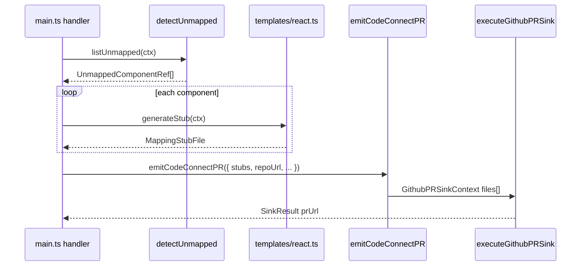

# Plan — WO-040: React Code Connect stub generator

## Approach

Replace the WO-039 **`ReactMappingTemplateStub`** with a production **`ReactMappingTemplate`** that generates valid **`*.figma.tsx`** Code Connect stub files using `@figma/code-connect` **`figma.connect()`**, detects Figma components missing mappings in the consumer repo, and opens **one GitHub PR** containing the entire batch via **`executeGithubPRSink`** (WO-018). The plugin **never** runs `figma connect publish` (FR-CC-4) — PR body educates engineers that consumer CI publishes after merge.

**Pipeline (locked from research):**



**Strategy:**

1. Implement **`mapFigmaPropsToCodeConnect.ts`** first — pure string builder from `UnmappedComponentRef.componentProperties` (WO-039 D3).
2. **`templates/react.ts`** — implements `MappingTemplate`; no Figma API inside template (testable off-thread).
3. **`detectUnmapped.ts`** — async diff: GitHub tree `**/*.figma.tsx` vs Figma canvas candidates; inject deps for Vitest.
4. **`emitCodeConnectPR.ts`** — batch cap 25, org gate, branch `fighub/code-connect-stubs-{date}`, `contractKind: 'code-connect-stubs'`.
5. Thin **`main.ts`** handler `codeconnect/emit-pr` delegates to emit module (UI wiring deferred to WO-044).

**In scope (ticket verbatim):**

- `src/core/codeconnect/templates/react.ts` — full `MappingTemplate` (replaces WO-039 stub)
- `src/core/codeconnect/detectUnmapped.ts` — canvas/repo diff for components without `.figma.tsx`
- `src/core/codeconnect/emitCodeConnectPR.ts` — batch stub generation + `executeGithubPRSink` (WO-018)
- Stub output: `@figma/code-connect` `figma.connect()` with node URL, prop metadata, placeholder `example`
- Branch pattern: `fighub/code-connect-stubs-{date}`; one PR for entire batch (FR-CC-3)

**Out of scope (ticket verbatim):**

- Other frameworks (WO-045+)
- Auto-implementation-reference filling (engineer's job)
- Components tab UI affordances (WO-044)
- `figma connect publish` in plugin (FR-CC-4)

**Lift reference (conventions only — no bundle port):**

- `DesignOps-plugin/skills/create-component/conventions/05-code-connect.md` — naming, `figma.connect` shape, CI publish flow

---

## Acceptance criteria traceability

| Ticket AC / requirement | Plan steps |
| ----------------------- | ---------- |
| R1 `templates/react.ts` full `MappingTemplate` | Steps 4–6, 8 |
| R2 `detectUnmapped.ts` canvas/repo diff | Steps 2–3, 9 |
| R3 `emitCodeConnectPR.ts` + WO-018 sink | Steps 10–11 |
| R4 Stub: `figma.connect()` node URL + props + example | Steps 4–6, 13 |
| R5 Branch `fighub/code-connect-stubs-{date}`, single PR | Step 10 |
| AC 5 unmapped → 5 stubs → 1 PR | Step 15 |
| AC stubs pass `npx figma connect validate` | Step 1 (SPK-040-1), Step 16 |
| Testing: Vitest unit + integration | Steps 9, 13–16, 18 |
| Telemetry: `console.debug` per major event | Step 17 |

---

## Module tree (create / modify in WO-040)

```
src/core/codeconnect/
  detectUnmapped.ts              # Step 2–3
  emitCodeConnectPR.ts           # Step 10–11
  mapFigmaPropsToCodeConnect.ts  # Step 4
  buildFigmaNodeUrl.ts           # Step 5
  resolveStubPath.ts             # Step 6
  prBodyCodeConnect.ts           # Step 10 (Code Connect PR body extension)
  templates/
    react.ts                     # Step 8 — replaces reactStub.ts
  __fixtures__/
    unmapped-button-ref.json     # Step 4 fixture

src/io/messages/
  codeconnect.ts                 # Step 12 — UI ↔ main contract

src/main/
  codeconnectHandlers.ts         # Step 13 — thin delegate

tests/fixtures/code-connect-consumer/
  package.json                   # Step 1 — SPK-040-1 validate fixture
  figma.config.json
  src/components/button/button.tsx
  src/components/button/Button.figma.tsx  # generated by test

tests/unit/core/codeconnect/
  mapFigmaPropsToCodeConnect.test.ts
  buildFigmaNodeUrl.test.ts
  resolveStubPath.test.ts
  reactStubGenerator.test.ts     # snapshot stub string
  detectUnmapped.test.ts
  emitCodeConnectPR.test.ts
  emitCodeConnectPR.integration.test.ts

tests/mocks/
  codeconnectFigma.ts            # mock ComponentNode property defs
  codeconnectGithubTree.ts       # mock repo tree paths
```

**WO-039 files to replace / update:**

| WO-039 path | WO-040 action |
| ----------- | ------------- |
| `templates/reactStub.ts` | Delete after `templates/react.ts` lands |
| `registry.ts` | Import `ReactMappingTemplate` from `./templates/react` |
| `index.ts` | Export `detectUnmapped`, `emitCodeConnectPR` helpers |

---

## Steps

- [x] **Step 1** — **SPK-040-1:** Scaffold `tests/fixtures/code-connect-consumer/` for `figma connect validate`:

```json
// tests/fixtures/code-connect-consumer/package.json
{
  "name": "fighub-code-connect-consumer-fixture",
  "private": true,
  "devDependencies": {
    "@figma/code-connect": "^1.0.0",
    "react": "^18.0.0",
    "typescript": "^5.0.0"
  }
}
```

```json
// tests/fixtures/code-connect-consumer/figma.config.json
{
  "codeConnect": {
    "include": ["src/**/*.figma.tsx"]
  }
}
```

- Add minimal `src/components/button/button.tsx` exporting `Button`.
- Manually craft one canonical `Button.figma.tsx` matching locked stub shape (research §2) — used as golden reference until Step 16 generates it in-test.
- Run from repo root:

```bash
cd tests/fixtures/code-connect-consumer && npm install && npx figma connect validate
```

- **Done when:** SPK-040-1 exit code 0; document command in Step 18 CI gate.

- [x] **Step 2** — Implement `src/core/codeconnect/detectUnmapped.ts` types + deps interface:

```typescript
import type { UnmappedComponentRef } from './types';

export interface DetectUnmappedContext {
  repoUrl: string;
  specsPath: string;
  figmaFileKey: string;
  /** Optional — when set, only scan these node ids; else scan current page */
  selectedNodeIds?: readonly string[];
  framework: 'react';
}

export interface DetectUnmappedDeps {
  /** Returns normalized repo-relative paths (forward slashes) */
  listRepoPaths(repoUrl: string): Promise<readonly string[]>;
  /** Read Figma component candidates from canvas */
  listFigmaComponents(ctx: DetectUnmappedContext): Promise<readonly UnmappedComponentRef[]>;
}

export interface DetectUnmappedResult {
  unmapped: UnmappedComponentRef[];
  skippedMapped: number;
  skippedNoProps: number;
}

export async function detectUnmapped(
  ctx: DetectUnmappedContext,
  deps: DetectUnmappedDeps,
): Promise<DetectUnmappedResult>;
```

- **Algorithm (research §4):**
  1. `listRepoPaths` → filter paths matching `**/*.figma.tsx` (case-sensitive).
  2. `listFigmaComponents` → walk selection or current page for `COMPONENT` / `COMPONENT_SET`; populate `componentProperties` from `componentPropertyDefinitions`.
  3. For each candidate, compute stub path via `resolveStubPath` (Step 6); if path exists in repo tree → increment `skippedMapped`, exclude.
  4. Return remaining as `unmapped[]`.
- **Done when:** file compiles; no Figma API calls at module top level.

- [x] **Step 3** — Implement Figma-side dep adapter `src/core/codeconnect/figmaComponentReader.ts` (main-thread only — called from handler):

```typescript
import type { UnmappedComponentRef } from './types';

export function readComponentPropertyDefinitions(
  node: ComponentNode | ComponentSetNode,
): Record<string, { type: string; defaultValue?: string | boolean }>;

export function collectUnmappedCandidates(
  selectedNodeIds: readonly string[] | undefined,
): UnmappedComponentRef[];
```

- **Behavior:**
  - `nodeId`: use `node.id` (`"1:2"` format).
  - `componentKey`: `node.key` for `COMPONENT`; for `COMPONENT_SET`, use set key.
  - `name`: `node.name`.
  - `fileKey`: from `figma.fileKey` (caller passes into ref).
  - Map Plugin API types: `VARIANT` → `'VARIANT'`, `BOOLEAN` → `'BOOLEAN'`, `TEXT` → `'TEXT'`, `INSTANCE_SWAP` → `'INSTANCE_SWAP'`.
- **Done when:** SPK-040-3 manual check — Button set returns non-empty `componentProperties`; unit test uses `tests/mocks/codeconnectFigma.ts`.

- [x] **Step 4** — Implement `src/core/codeconnect/mapFigmaPropsToCodeConnect.ts`:

```typescript
export interface FigmaPropDefinition {
  type: string;
  defaultValue?: string | boolean;
  variantOptions?: readonly string[];
}

export interface MapPropsResult {
  /** Lines inside `props: { ... }` block — indented, trailing commas */
  propLines: string[];
  /** TS-safe prop names for example spread */
  examplePropNames: string[];
}

export function mapFigmaPropsToCodeConnect(
  componentProperties: Record<string, FigmaPropDefinition>,
): MapPropsResult;
```

- **Mapping table (research §3):**

| Figma type | Generated line |
| ---------- | -------------- |
| `VARIANT` | `{camelName}: figma.enum('{OriginalName}', { OptionA: 'option-a', ... })` |
| `BOOLEAN` | `{camelName}: figma.boolean('{OriginalName}')` |
| `TEXT` | `{camelName}: figma.string('{OriginalName}')` |
| `INSTANCE_SWAP` | `{camelName}: figma.instance('{OriginalName}')` — include in Sprint 8 |

- **Naming:** Figma property name → PascalCase in `figma.*('Property Name')`; camelCase for TS object key via `toCamelCase(name)`.
- **Sanitize enum keys:** spaces/special chars → safe JS identifier keys; values kebab-case from option label.
- Load golden input from `src/core/codeconnect/__fixtures__/unmapped-button-ref.json` (Button variant matrix from `component-spec-button-canonical.json` Figma-side mirror).
- **Done when:** `tests/unit/core/codeconnect/mapFigmaPropsToCodeConnect.test.ts` snapshot `propLines`.

- [x] **Step 5** — Implement `src/core/codeconnect/buildFigmaNodeUrl.ts`:

```typescript
export function buildFigmaNodeUrl(input: {
  fileKey: string;
  fileSlug: string;
  nodeId: string;
}): string;
```

- **Encoding:** `nodeId` `"1:2"` → URL query `node-id=1-2` (hyphens, not colons).
- URL shape: `https://www.figma.com/design/{fileKey}/{encodeURIComponent(fileSlug)}?node-id={encodedNodeId}`
- `fileSlug` defaults to `'file'` when name unknown — caller passes `figma.root.name`.
- **Done when:** `buildFigmaNodeUrl.test.ts` asserts `1:2` → `node-id=1-2`.

- [x] **Step 6** — Implement `src/core/codeconnect/resolveStubPath.ts`:

```typescript
export function resolveStubPath(input: {
  specsPath: string;
  componentKey: string;
  componentName: string;
}): { relativePath: string; implementationImportPath: string };
```

- **Locked path (research D3, OQ resolved):** `{specsPath}/{kebab(componentKey)}/{PascalCase(componentName)}.figma.tsx`
  - Example: `design/components/button/Button.figma.tsx`
  - `implementationImportPath`: `'./' + kebab(componentKey)` — engineer fixes post-merge (research D2).
- **Done when:** `resolveStubPath.test.ts` — key `button`, name `Button` → expected paths.

- [x] **Step 7** — Implement `src/core/codeconnect/prBodyCodeConnect.ts`:

```typescript
export function buildCodeConnectPrBody(input: {
  stubPaths: readonly string[];
  figmaFileUrl: string;
  pluginVersion: string;
}): string;
```

- **Template (research D5, FR-CC-4):**
  - Title line: `FigHub Code Connect stubs`
  - Bulleted list of `{relativePath}` files
  - Section **After merge:** run `npx figma connect publish` in CI
  - Footer: plugin version + Figma file link (reuse pattern from `src/io/github/prBody.ts`)
- **Done when:** snapshot test; consumed by Step 10.

- [x] **Step 8** — Implement `src/core/codeconnect/templates/react.ts`:

```typescript
import type { MappingTemplate, MappingTemplateContext, MappingStubFile } from '../types';

export class ReactMappingTemplate implements MappingTemplate {
  readonly framework = 'react' as const;

  generateStub(ctx: MappingTemplateContext): MappingStubFile;
}
```

- **Locked output shape (research §2):**

```tsx
import figma from '@figma/code-connect';
import { Button } from './button';

/**
 * FigHub-generated Code Connect stub — review props + example before merge.
 * CI: figma connect publish (after merge)
 */
figma.connect(
  Button,
  'https://www.figma.com/design/{fileKey}/{fileSlug}?node-id={nodeIdUrlEncoded}',
  {
    props: {
      variant: figma.enum('Variant', {
        Default: 'default',
        Destructive: 'destructive',
      }),
      disabled: figma.boolean('Disabled'),
      label: figma.string('Label'),
    },
    example: (props) => <Button {...props} />,
  },
);
```

- Derive `ComponentName` from `ctx.component.name` → PascalCase for import + `figma.connect` first arg.
- Use `buildFigmaNodeUrl`, `mapFigmaPropsToCodeConnect`, `resolveStubPath` internally.
- `example` line: `(props) => <{ComponentName} {...props} />` — placeholder until engineer refines.
- **Done when:** `reactStubGenerator.test.ts` snapshot matches golden; no `reactStub.ts` placeholder content.

- [x] **Step 9** — Vitest `tests/unit/core/codeconnect/detectUnmapped.test.ts`:

| Case | Assert |
| ---- | ------ |
| Repo has `design/components/button/Button.figma.tsx`, Figma lists Button | `unmapped.length === 0`, `skippedMapped === 1` |
| Repo missing stub for 5 components | `unmapped.length === 5` |
| Selection mode with 2 ids, 1 mapped | `unmapped.length === 1` |
| Empty repo tree | all Figma candidates unmapped |

- Inject `DetectUnmappedDeps` via mocks in `tests/mocks/codeconnectGithubTree.ts`.
- **Done when:** file green.

- [x] **Step 10** — Implement `src/core/codeconnect/emitCodeConnectPR.ts`:

```typescript
import type { MappingStubFile, UnmappedComponentRef } from './types';
import type { SinkResult } from '@/io/sinks/types';

export interface EmitCodeConnectPRContext {
  repoUrl: string;
  specsPath: string;
  figmaFileKey: string;
  figmaFileName: string;
  defaultBranch: string;
  owner: string;
  repo: string;
  framework: 'react';
  components: readonly UnmappedComponentRef[];
}

export const CODE_CONNECT_BATCH_CAP = 25;

export interface EmitCodeConnectPRResult {
  sink: SinkResult;
  stubs: MappingStubFile[];
  truncated: boolean;
}

export async function emitCodeConnectPR(ctx: EmitCodeConnectPRContext): Promise<EmitCodeConnectPRResult>;
```

- **Flow:**
  1. Org gate: `flags.codeConnectPR && isGithubPREnabled()` — else `{ ok: false, code: 'unavailable', message: 'Code Connect PR requires Org build + GitHub connection.' }`
  2. Cap batch at `CODE_CONNECT_BATCH_CAP`; set `truncated: true` if over (UI warning in WO-044).
  3. `getMappingTemplate('react')` → loop `generateStub` for each component.
  4. Call `executeGithubPRSink` (WO-018):

```typescript
await executeGithubPRSink({
  files: stubs.map(function (s) {
    return { path: s.relativePath, content: s.content };
  }),
  contractKind: 'code-connect-stubs',
  repoUrl: ctx.repoUrl,
  options: {
    owner: ctx.owner,
    repo: ctx.repo,
    baseBranch: ctx.defaultBranch,
    commitMessage: 'fighub: add Code Connect stubs',
    branchPattern: 'fighub/code-connect-stubs-{date}',
    prTitle: 'fighub: Code Connect stubs',
  },
  figmaFileKey: ctx.figmaFileKey,
  figmaFileName: ctx.figmaFileName,
});
```

  5. Pass custom PR body from `buildCodeConnectPrBody` — extend `createPullRequestFromSinkContext` call site or add optional `prBodyOverride` to sink ctx if WO-018 `buildPrBody` insufficient (prefer override param on `GithubPRSinkContext` if not present — add optional field, default to existing builder).
- Branch collision: rely on WO-018 `withCollisionSuffix` (`branchName.ts`).
- **Done when:** `emitCodeConnectPR.test.ts` mocks sink; asserts single call with `files.length === N`.

- [x] **Step 11** — Extend `src/io/sinks/types.ts` if needed:

```typescript
export interface GithubPRSinkContext {
  // existing fields...
  prBodyOverride?: string;
}
```

- Wire override in `executeGithubPRSink` — when set, skip `buildPrBody` default.
- **Done when:** existing `githubPR.test.ts` still green; override path tested in `emitCodeConnectPR.test.ts`.

- [x] **Step 12** — Message contract `src/io/messages/codeconnect.ts`:

```typescript
export type CodeConnectEmitPRRequest = {
  type: 'codeconnect/emit-pr';
  repoUrl: string;
  specsPath: string;
  owner: string;
  repo: string;
  defaultBranch: string;
  framework: 'react';
  selectedNodeIds?: string[];
};

export type CodeConnectEmitPRResult = {
  type: 'codeconnect/emit-pr-result';
  ok: boolean;
  prUrl?: string;
  stubCount?: number;
  truncated?: boolean;
  code?: string;
  message?: string;
};

export function isCodeConnectEmitPRRequest(msg: unknown): msg is CodeConnectEmitPRRequest;
```

- **Done when:** `tests/unit/io/messages/codeconnect.test.ts` guards pass.

- [x] **Step 13** — Main handler `src/main/codeconnectHandlers.ts`:

```typescript
export async function handleCodeConnectEmitPR(
  req: CodeConnectEmitPRRequest,
): Promise<CodeConnectEmitPRResult>;
```

- **Orchestration:**
  1. `detectUnmapped` with live deps: GitHub tree lister (reuse WO-056 tree walker or minimal Trees API client), Figma reader from Step 3.
  2. If `unmapped.length === 0` → `{ ok: false, message: 'All selected components already have Code Connect stubs.' }`
  3. `emitCodeConnectPR` → map `SinkResult` to `CodeConnectEmitPRResult`.
  4. `pluginLog('codeconnect:emit-pr', { stubCount, prUrl })` — no file contents, no tokens.
- Register in `src/main.ts` message switch.
- **Done when:** handler unit test mocks detect + emit; ES2017 compliant.

- [x] **Step 14** — Update `src/core/codeconnect/registry.ts`:

```typescript
import { ReactMappingTemplate } from './templates/react';

const REACT_TEMPLATE = new ReactMappingTemplate();

export function getMappingTemplate(framework: ComponentFramework): MappingTemplate | null {
  if (framework === 'react') {
    return REACT_TEMPLATE;
  }
  return null;
}
```

- Delete `templates/reactStub.ts`.
- Update `registry.test.ts` — stub suffix test now expects real `figma.connect` in content.
- **Done when:** `reactStub.ts` removed; registry tests green.

- [x] **Step 15** — Integration test `tests/unit/core/codeconnect/emitCodeConnectPR.integration.test.ts`:

- Mock `executeGithubPRSink` to capture `ctx.files`.
- Input: 5 `UnmappedComponentRef` fixtures (unique keys).
- Assert:
  - `executeGithubPRSink` called **once**
  - `ctx.files.length === 5`
  - every path ends with `.figma.tsx`
  - every content includes `figma.connect(` and `@figma/code-connect`
  - `ctx.options.branchPattern === 'fighub/code-connect-stubs-{date}'`
  - `ctx.contractKind === 'code-connect-stubs'`
- **Done when:** ticket AC "5 unmapped → 5 stubs → 1 PR" satisfied.

- [x] **Step 16** — Integration test `tests/unit/core/codeconnect/figmaConnectValidate.test.ts`:

- Use `ReactMappingTemplate.generateStub` with `unmapped-button-ref.json` fixture.
- Write output to temp dir under `tests/fixtures/code-connect-consumer/src/components/button/Button.figma.tsx`.
- Shell out: `npx figma connect validate` (skip in CI if `@figma/code-connect` install fails — mark test `it.skipIf(!process.env.FIGMA_CONNECT_VALIDATE)`).
- **Done when:** SPK-040-1 procedure automated; exit 0 locally.

- [x] **Step 17** — Telemetry `console.debug` (ticket Testing §Telemetry):

| Location | Message |
| -------- | ------- |
| `detectUnmapped` | `[codeconnect] detectUnmapped`, `{ candidate, unmapped, skippedMapped }` |
| `emitCodeConnectPR` | `[codeconnect] emitPR`, `{ stubCount, truncated }` |
| `templates/react.ts` `generateStub` | `[codeconnect] generateStub`, `{ componentKey, relativePath }` |

- Main handler uses `pluginLog` only — no token/file content.
- **Done when:** grep confirms debug lines.

- [x] **Step 18** — CI gate:

```bash
npm run lint && npm run typecheck
npm run test -- tests/unit/core/codeconnect tests/unit/io/messages/codeconnect.test.ts tests/unit/main/codeconnectHandlers.test.ts
npm run build
```

- Optional local: `cd tests/fixtures/code-connect-consumer && npx figma connect validate`
- **Done when:** all green; `dist/code.js` includes new modules.

- [x] **Step 19** — Update barrel `src/core/codeconnect/index.ts`:

```typescript
export { detectUnmapped } from './detectUnmapped';
export type { DetectUnmappedContext, DetectUnmappedResult, DetectUnmappedDeps } from './detectUnmapped';
export { emitCodeConnectPR, CODE_CONNECT_BATCH_CAP } from './emitCodeConnectPR';
export type { EmitCodeConnectPRContext, EmitCodeConnectPRResult } from './emitCodeConnectPR';
// existing registry + type exports
```

- **Done when:** WO-044 can import orchestration helpers without deep paths.

---

## Build Agents

### Phase 1 (parallel) — pure generators (no GitHub/Figma IO)

- `code-build` — **Steps 4–8**: `mapFigmaPropsToCodeConnect`, `buildFigmaNodeUrl`, `resolveStubPath`, `prBodyCodeConnect`, `templates/react.ts`

### Phase 2 (parallel, after Phase 1)

- `code-build` — **Steps 1, 16**: SPK-040-1 consumer fixture + validate integration test
- `code-build` — **Steps 2–3**: `detectUnmapped` + `figmaComponentReader` + mocks

### Phase 3 (sequential — needs Phase 1–2)

- `code-build` — **Steps 9–11**: detect tests, `emitCodeConnectPR`, sink `prBodyOverride` extension

### Phase 4 (parallel, after Phase 3)

- `code-build` — **Steps 12–13**: message contract + main handler
- `code-build` — **Steps 14–15**: registry swap + 5-stub integration test

### Phase 5 (after Phase 4)

- `code-build` — **Steps 17–19**: telemetry, CI gate, barrel exports

**Hard dependencies:**

| Ticket | Must be merged |
| ------ | -------------- |
| WO-039 | `MappingTemplate`, `UnmappedComponentRef`, registry |
| WO-018 | `executeGithubPRSink`, `GithubPRSinkContext`, branch collision |

---

## Dependencies & Tools

| Dependency | Role |
| ---------- | ---- |
| WO-039 | `MappingTemplate`, `MappingTemplateContext`, `UnmappedComponentRef`, `MappingStubFile` in `src/core/codeconnect/types.ts`; registry pattern |
| WO-018 | `executeGithubPRSink`, `isGithubPREnabled`, `createPullRequestFlow`, `branchName.ts` collision suffix |
| WO-016 | GitHub relay proxy + token storage (transitive via WO-018) |
| WO-056 (optional) | Repo tree walker — reuse if merged; else minimal Trees API in detect deps |
| `@figma/code-connect` | Dev dependency in validate fixture only — not bundled in plugin |
| `src/config/flags.ts` | `codeConnectPR: true` org gate |
| `src/io/sinks/types.ts` | `GithubPRSinkContext`, `SinkResult` |
| Figma Plugin API | `ComponentNode.componentPropertyDefinitions`, `figma.fileKey` |
| Vitest | Unit + integration under `tests/unit/core/codeconnect/` |
| `npx figma connect validate` | SPK-040-1 / Step 16 acceptance |

**WO-018 sink reference (reuse verbatim):**

```typescript
// src/io/sinks/githubPR.ts
export function isGithubPREnabled(): boolean;
export async function executeGithubPRSink(ctx: GithubPRSinkContext): Promise<SinkResult>;
```

**WO-039 interface reference (implement, do not redefine):**

```typescript
// src/core/codeconnect/types.ts (WO-039 Step 8)
export interface MappingTemplate {
  readonly framework: ComponentFramework;
  generateStub(ctx: MappingTemplateContext): MappingStubFile;
}
```

---

## Open Questions

| # | Question | Resolution |
| - | -------- | ---------- |
| OQ-40-1 | Default stub directory when only `specsPath` set | **RESOLVED:** `{specsPath}/{kebab(key)}/{PascalName}.figma.tsx` via `resolveStubPath` |
| OQ-40-2 | `INSTANCE_SWAP` in generated stubs | **RESOLVED:** include `figma.instance()` in Sprint 8 |
| OQ-40-3 | Custom PR body vs drift template | **RESOLVED:** `prBodyOverride` on sink ctx + `buildCodeConnectPrBody` |
| OQ-40-4 | `getCodeConnectMap` fallback | **RESOLVED:** repo tree diff primary; optional cross-check deferred if API unavailable in plugin |
| OQ-40-5 | Batch cap | **RESOLVED:** 25 stubs/PR (research D1) |

---

## Notes

### ES2017 sandbox

All code under `src/core/codeconnect/` and `src/main/codeconnectHandlers.ts` must avoid optional chaining (`?.`), nullish coalescing (`??`), and other post-ES2017 syntax. Use explicit `if` checks.

### Wrong vs correct

| Wrong | Correct |
| ----- | ------- |
| Port DesignOps MCP bundles for stub text | Pure string builder in `templates/react.ts` |
| One PR per component | Single PR batch via `executeGithubPRSink` (FR-CC-3) |
| Plugin runs `figma connect publish` | PR body instructs CI publish (FR-CC-4) |
| Contents API PUT per stub | WO-018 Git Data API single commit |
| Redefine `MappingTemplate` types | Import from WO-039 `types.ts` |

### Pre-plan spikes

| Spike ID | Procedure | Pass | Owner step |
| -------- | --------- | ---- | ---------- |
| SPK-040-1 | Generate Button stub; `npx figma connect validate` in consumer fixture | exit 0 | Steps 1, 16 |
| SPK-040-2 | Org sandbox: emit 2-stub PR to test repo | PR URL + 2 files | Manual / WO-044 VQA |
| SPK-040-3 | Figma desktop: read `componentPropertyDefinitions` on Button set | Non-empty props | Step 3 |

### Risk mitigations

| Risk | Mitigation |
| ---- | ---------- |
| Figma prop names with spaces/special chars | `mapFigmaPropsToCodeConnect` sanitize + snapshot test |
| Component key ≠ repo folder name | Placeholder import path; WO-044 manual override |
| Branch name collision | WO-018 `withCollisionSuffix` |
| Huge PRs | `CODE_CONNECT_BATCH_CAP = 25`, `truncated` flag |

### Downstream

| Ticket | Consumes |
| ------ | -------- |
| WO-041 | Generated `.figma.tsx` as `mergeFigmaMapping` input |
| WO-044 | `codeconnect/emit-pr` message + Components tab UI |
| WO-045+ | Additional `MappingTemplate` implementations |

### Bibliography

- `ticket.md`
- `research/react-code-connect-stub-generator.md`
- `.github/Sprint 8/WO-039-mapping-template-and-import-template-interfaces/plan.md`
- `.github/Sprint 4/WO-018-github-pr-output-sink/plan.md`
- `Docs/PRD.md` §6.7 FR-CC-1..5
- [Figma Code Connect docs](https://www.figma.com/code-connect/docs/)
