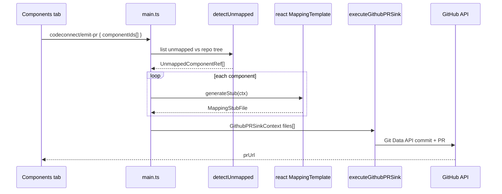

# React Code Connect stub generator (WO-040)

> **Status:** ✅ Research expanded for `/plan` (2026-05-29)
> **PRD:** §6.7 FR-CC-1..4, §13.1 Org gating
> **Dependencies:** WO-039, WO-018, WO-016

---

## Summary

WO-040 replaces the WO-039 React `MappingTemplate` stub with a **production generator** that writes **`*.figma.tsx`** files using `@figma/code-connect` APIs, then opens **one GitHub PR** containing all stubs (FR-CC-3). The plugin **never publishes** mappings (FR-CC-4) — consumer CI runs `figma connect publish` after merge.

**Locked recommendation:** Pipeline = **`detectUnmapped`** → **`generateStub` (per component)** → **`emitCodeConnectPR`** → `executeGithubPRSink`. Stub path: `{specsPath or components/}{componentFolder}/{ComponentName}.figma.tsx`. Map Figma **component properties** to `figma.enum` / `figma.boolean` / `figma.string` in generated `props` block.

---

## Requirement traceability

| FR / AC | Plan step target |
| ------- | ---------------- |
| FR-CC-1 Detect unmapped | `detectUnmapped.ts` + Figma selection / registry diff |
| FR-CC-2 Stub per framework | `templates/react.ts` `MappingTemplate` |
| FR-CC-3 Single PR | `emitCodeConnectPR.ts` batches all files |
| FR-CC-4 No publish in plugin | Document in PR body template only |
| AC 5 unmapped → 5 stubs → 1 PR | Integration test with mocked sink |
| AC `figma connect validate` | SPK-040-1 in consumer fixture repo |

---

## Key findings

### 1. End-to-end orchestration



### 2. Stub template (locked output shape)

```tsx
import figma from '@figma/code-connect';
import { Button } from './button';

/**
 * FigHub-generated Code Connect stub — review props + example before merge.
 * CI: figma connect publish (after merge)
 */
figma.connect(
  Button,
  'https://www.figma.com/design/{fileKey}/{fileSlug}?node-id={nodeIdUrlEncoded}',
  {
    props: {
      variant: figma.enum('Variant', {
        Default: 'default',
        Destructive: 'destructive',
      }),
      disabled: figma.boolean('Disabled'),
      label: figma.string('Label'),
    },
    example: (props) => <Button {...props} />,
  },
);
```

**Node ID encoding:** Figma URL uses `node-id=1-2` format (hyphens) from `nodeId` `1:2`.

### 3. Figma → Code Connect prop mapping

| Figma `componentPropertyDefinitions` | Generated Code Connect |
| ------------------------------------ | ---------------------- |
| `VARIANT` | `figma.enum('PropertyName', { ... })` |
| `BOOLEAN` | `figma.boolean('PropertyName')` |
| `TEXT` | `figma.string('PropertyName')` |
| `INSTANCE_SWAP` | `figma.instance('PropertyName')` — optional Sprint 8 if subcomponents mapped |

Read properties via **`ComponentNode.componentPropertyDefinitions`** (Plugin API) when building `UnmappedComponentRef` (WO-039 D3).

### 4. Unmapped detection algorithm

**Inputs:** `repoUrl`, `specsPath`, optional `selectedNodeIds[]`, `figmaFileKey`

**Steps:**

1. Load repo file paths via GitHub **Trees API** (recursive) or reuse WO-056 tree walker — filter `**/*.figma.tsx`.
2. Collect candidate Figma components:
   - **Selection mode:** walk selected nodes for `COMPONENT` / `COMPONENT_SET`.
   - **Scan mode:** all local components on Components page / file (bounded to current page for MVP).
3. For each candidate, check if `{implementationPath}.figma.tsx` exists in repo tree.
4. Optionally cross-check Figma **`figma.getCodeConnectMap`** if available in plugin API context.
5. Return `UnmappedComponentRef[]` with `componentProperties` populated.

**Mapped skip:** If stub path exists in repo at same relative path → exclude from batch.

### 5. PR emission (reuse WO-018)

```typescript
await executeGithubPRSink({
  files: stubs.map(s => ({ path: s.relativePath, content: s.content })),
  contractKind: 'code-connect-stubs',
  repoUrl,
  options: {
    owner, repo,
    baseBranch: syncState.defaultBranch,
    commitMessage: 'fighub: add Code Connect stubs',
    branchPattern: 'fighub/code-connect-stubs-{date}',
    prTitle: 'fighub: Code Connect stubs',
  },
  figmaFileKey,
  figmaFileName,
});
```

Branch collision: `createPullRequestFlow` already retries `-2`, `-3` suffix (`src/io/github/branchName.ts`).

### 6. Org gate

```typescript
if (!flags.codeConnectPR || !isGithubPREnabled()) {
  return { ok: false, code: 'unavailable', message: 'Code Connect PR requires Org build + GitHub connection.' };
}
```

---

## Validated evidence

| Path | Evidence |
| ---- | -------- |
| `src/io/sinks/githubPR.ts:9-11` | `isGithubPREnabled()` |
| `src/io/github/createPullRequestFlow.ts:17-38` | Multi-file PR types |
| `src/config/flags.ts` | `codeConnectPR: true` |
| WO-018 research | Git Data API sequence, branch naming |

**Official docs:** [Figma Code Connect](https://www.figma.com/code-connect/docs/) — `figma.connect`, `figma.enum`, `figma.boolean` (retrieved 2026-05-29)

---

## Module tree (create in WO-040)

```
src/core/codeconnect/
  detectUnmapped.ts
  emitCodeConnectPR.ts
  mapFigmaPropsToCodeConnect.ts
  templates/
    react.ts                 # replaces reactStub.ts
  __fixtures__/
    unmapped-button-ref.json

tests/unit/core/codeconnect/
  reactStubGenerator.test.ts   # snapshot stub string
  detectUnmapped.test.ts       # mock repo tree
  emitCodeConnectPR.test.ts    # mock executeGithubPRSink
```

---

## Decision log

| ID | Decision | Rationale |
| -- | -------- | --------- |
| D1 | Batch cap 25 stubs/PR | Avoid huge PRs; UI warns if over |
| D2 | Placeholder `import { X } from './kebab-name'` | Engineer fixes path post-merge |
| D3 | Use `specsPath` parent for stub directory | Aligns with `resolveComponentSpec` |
| D4 | No `.figma.tsx` content from existing mappings | Create-only on fresh branch |
| D5 | PR body lists stub paths + CI instruction | FR-CC-4 education |

---

## Pre-plan spikes

| Spike ID | Procedure | Pass | Status |
| -------- | --------- | ---- | ------ |
| SPK-040-1 | Generate Button stub; `npx figma connect validate` in `tests/fixtures/code-connect-consumer/` | exit 0 | ☐ |
| SPK-040-2 | Org sandbox: emit 2-stub PR to test repo | PR URL + 2 files | ☐ |
| SPK-040-3 | Figma desktop: read `componentPropertyDefinitions` on Button set | Non-empty props object | ☐ |

---

## Risk register

| Risk | Mitigation |
| ---- | ---------- |
| Figma prop names with spaces/special chars | Sanitize or quote in enum keys; snapshot test |
| Component key ≠ repo folder name | Use registry `key` from designer sync; allow manual path override in WO-044 |
| `getCodeConnectMap` unavailable in plugin | Fall back to repo tree diff only |

---

## Recommendations for `/plan`

1. Implement **`mapFigmaPropsToCodeConnect.ts`** first with unit tests from fixture JSON.
2. **`templates/react.ts`** pure string builder (no Figma API inside template).
3. **`detectUnmapped.ts`** async — needs GitHub tree + Figma read; inject dependencies for tests.
4. **`main.ts`** handler `codeconnect/emit-pr` — thin delegate to `emitCodeConnectPR`.
5. Integration test mocks `executeGithubPRSink`; assert `files.length === 5`.

---

## Open questions

| Q | Status |
| - | ------ |
| Default stub path when only `specsPath` set | **RESOLVED:** `{specsPath}/{kebab(key)}/{PascalName}.figma.tsx` — confirm in plan |
| INSTANCE_SWAP in stubs | **DEFERRED:** optional prop in stub if FR-IMP-8 subcomponent mapped |

---

## References

- WO-039 interfaces research
- WO-018 github-pr-sink-flow.md
- Figma Plugin API: ComponentPropertyDefinitions
