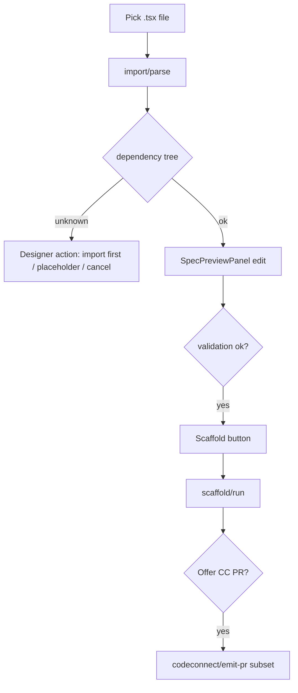

# Components tab — Import + Code Connect PR UI (WO-044)

> **Status:** ✅ Research expanded for `/plan` (2026-05-29)
> **PRD:** §6.3, §6.7, §12 Phase 4a, §13.1 Org gating
> **Dependencies:** WO-040..043, WO-056 (layout), WO-027 tab shell

---

## Summary

WO-044 is the **Phase 4a designer surface** on **`src/ui/tabs/Components.tsx`**: import React components from GitHub (file pick → dependency tree → spec preview → scaffold → optional Code Connect PR) and emit **Code Connect stub PRs** for unmapped canvas components. All imports require **preview edit** before `scaffold/run` (FR-IMP-7). Framework picker shows **React enabled**; Vue/WC/SwiftUI/Compose disabled with tooltip.

**Locked recommendation:** New **`src/io/messages/import.ts`** + **`src/io/messages/codeconnect.ts`** message guards; **`main.ts`** handlers orchestrate core modules; UI split into **`ImportFromRepoSection.tsx`**, **`CodeConnectSection.tsx`**, **`DependencyTreePanel.tsx`**. Section order coordinated with WO-056 (see below).

---

## Components tab layout (locked with WO-056)

| # | Section | Owner | Lines ref |
| - | ------- | ----- | --------- |
| 1 | Paste or load spec | WO-027 | `Components.tsx` ~282 |
| 2 | **Browse repo components** | WO-056 | new `CatalogPanel.tsx` |
| 3 | **Import from repo** | WO-044 | new `ImportFromRepoSection.tsx` |
| 4 | **Code Connect** | WO-044 | new `CodeConnectSection.tsx` |
| 5 | Re-scaffold from linked components | WO-027 | ~302 |
| 6 | Spec preview + scaffold | shared | ~400+ |

Empty-state copy already references WO-056 at line 285-286.

---

## Message protocol — Import

### UI → Main

```typescript
// src/io/messages/import.ts

/** List .tsx files under components path */
export interface ImportListFilesMessage {
  type: 'import/list-files';
  requestId: string;
  repoUrl: string;
  /** default: specsPath or 'components/' */
  rootPath?: string;
  extension?: '.tsx'; // Phase 4a
}

export interface ImportParseMessage {
  type: 'import/parse';
  requestId: string;
  repoUrl: string;
  sourcePath: string;
  /** optional sibling mapping */
  figmaMappingPath?: string;
}
```

### Main → UI

```typescript
export interface ImportListFilesResultMessage {
  type: 'import/list-files/result';
  requestId: string;
  files: { path: string; name: string }[];
}

export interface ImportParseResultMessage {
  type: 'import/parse/result';
  requestId: string;
  ok: boolean;
  spec?: ComponentSpecV1;
  dependencyTree?: DependencyTree;
  issues?: ImportParseIssue[];
  error?: string;
}
```

**Main handler flow (`import/parse`):**

1. `loadFromGitHub(repoUrl, sourcePath)` → source text
2. Optional mapping file load
3. `createTokenResolver({ repoUrl })` (WO-042)
4. Merge registry keys from snapshot + repo registry file
5. `getImportTemplate('react').parse(ctx)`
6. Post `import/parse/result`

---

## Message protocol — Code Connect

```typescript
// src/io/messages/codeconnect.ts

export interface CodeConnectDetectMessage {
  type: 'codeconnect/detect';
  requestId: string;
  repoUrl: string;
  /** empty = current selection */
  nodeIds?: string[];
}

export interface CodeConnectEmitPrMessage {
  type: 'codeconnect/emit-pr';
  requestId: string;
  repoUrl: string;
  componentIds: string[]; // node ids to stub
  commitMessage?: string;
}

export interface CodeConnectDetectResultMessage {
  type: 'codeconnect/detect/result';
  requestId: string;
  unmapped: UnmappedComponentRef[];
}

export interface CodeConnectEmitPrResultMessage {
  type: 'codeconnect/emit-pr/result';
  requestId: string;
  ok: boolean;
  prUrl?: string;
  error?: string;
  code?: SinkFailureCode;
}
```

Handlers delegate to **`detectUnmapped`** + **`emitCodeConnectPR`** (WO-040).

---

## UI flow — Import from repo



**Reuse existing components:**

- `SpecPreviewPanel` — already wired for paste flow
- `validateComponentSpecDraft` — same validation gate as `canScaffold`
- `ScaffoldStepList` — progress display

**New:** `DependencyTreePanel` — renders `DependencyTree` with action buttons.

---

## UI flow — Code Connect section

1. Button **Scan for unmapped** → `codeconnect/detect`
2. Checklist of unmapped components (name + node id)
3. Button **Emit Code Connect PR** (disabled if none selected)
4. On success: show PR link (pattern from `RepoSyncCard` drift push)

**Org gate:** hide section when `!flags.codeConnectPR || !github.connected`.

---

## Requirement traceability

| AC | UI / handler |
| -- | ------------ |
| E2E import pick → preview → scaffold | Import section + existing scaffold |
| E2E CC PR 5 components | CodeConnect section + batch detect |
| Phase 4a React only | Framework `<select>` with disabled options |
| FR-IMP-7 preview | Disable scaffold until user edits + validation ok |
| FR-IMP-9 optional CC after import | Checkbox post-scaffold success |

---

## Validated evidence

| Path | Pattern to mirror |
| ---- | ----------------- |
| `src/io/messages/scaffold.ts` | Message guards + step labels |
| `src/io/github/githubUiBridge.ts` | `postContentsFetch` async pattern |
| `src/ui/components/RepoSyncCard.tsx` | PR URL display after push |
| `src/ui/tabs/Components.tsx` | Section styling `SECTION_BORDER` |
| `src/main.ts` | `scaffold/run` handler ~1714 |

---

## Module tree

```
src/io/messages/
  import.ts
  codeconnect.ts
src/ui/components/import/
  ImportFromRepoSection.tsx
  DependencyTreePanel.tsx
  FileBrowserList.tsx
src/ui/components/codeconnect/
  CodeConnectSection.tsx
  FrameworkPicker.tsx
src/ui/hooks/
  useImportParse.ts
  useCodeConnectDetect.ts

tests/unit/io/messages/
  import.test.ts
  codeconnect.test.ts
```

**main.ts additions:**

- `handleImportListFiles`
- `handleImportParse`
- `handleCodeConnectDetect`
- `handleCodeConnectEmitPr`

---

## Decision log

| ID | Decision | Rationale |
| -- | -------- | --------- |
| D1 | requestId on all async messages | Match github bridge pattern |
| D2 | File list server-side in main | Token access main-thread only |
| D3 | Reuse SpecPreviewPanel | FR-IMP-7 single preview UX |
| D4 | FR-IMP-9 as checkbox default off | Avoid surprise PR |
| D5 | Import section above sync registry | User flow: new work before re-scaffold |

---

## Pre-plan spikes

| Spike ID | Procedure | Pass | Status |
| -------- | --------- | ---- | ------ |
| SPK-044-1 | Manual E2E on Org build | Full AC path | ☐ VQA |
| SPK-044-2 | Fill Figma VQA checklist node ids | ticket.md table | ☐ plan |

---

## Risk register

| Risk | Mitigation |
| ---- | ---------- |
| Tab too long | Collapsible `<details>` per section |
| Parallel WO-056 merge | Land WO-056 catalog section first or same PR with file ownership split |

---

## Recommendations for `/plan`

1. Define **message guards first** (TDD) — enables UI/main parallel work.
2. Plan **Build Agents:** Phase 1 messages + main handlers; Phase 2 UI sections; Phase 3 E2E.
3. Document **Figma VQA** frame scope: Import section + Code Connect section only.
4. AC traceability table in plan.md mapping to manual test script.

---

## Open questions

| Q | Status |
| - | ------ |
| Figma design file node for VQA | **OPEN** — fill in plan from design file |
| `componentsPath` in fighub.json | **OPEN** — may reuse `specsPath` parent for file list root |

---

## References

- WO-040, WO-041, WO-043 research
- WO-056 catalog layout
- [component-catalog-roadmap](../../Sprint%205/research/component-catalog-roadmap.md)
