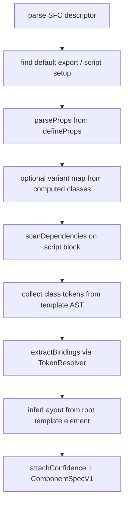

# Vue SFC parser + Code Connect + ImportTemplate (WO-045)

> **Status:** ✅ Research expanded for `/plan` (2026-05-30)
> **PRD:** §12 Phase 4b, §6.3 FR-IMP-*, §6.7 FR-CC-*
> **Dependencies:** WO-039, WO-040, WO-041, WO-042 (Sprint 8 — Completed)

---

## Summary

WO-045 adds **Vue Single File Component** support to the Phase 4 import pipeline: parse `.vue` files into `ComponentSpecV1`, generate **Code Connect HTML stubs** (`.figma.ts`), and register a `VueImportTemplate` / `VueMappingTemplate` pair. Parsing uses **`@vue/compiler-sfc`** for descriptor extraction and **`@vue/compiler-dom`** for template AST class-token collection; script-setup props are read via the existing **`tsAst.ts`** helpers (WO-043).

**Locked recommendation:** Mirror the React pipeline (`parseReactComponent.ts`) with a Vue-specific folder `src/core/import/templates/vue/` — same pass order (find export → props → variants → dependencies → class tokens → bindings → layout → confidence). Code Connect stubs use **`@figma/code-connect/html`** with **`html` tagged templates** and `<script setup>` inside the example (per Figma docs). Extend **`runImportParseExec`** and **`ImportParseExecMessage`** with a `framework` field; enable **`vue`** in `FrameworkPicker`.

**Out of scope (confirmed):** exotic Composition API patterns (async setup, macros beyond `defineProps`/`defineEmits`), auto-generating CEM, native platform parsers.

---

## Requirement traceability

| Req / AC | Research finding | Plan target |
| -------- | ---------------- | ----------- |
| R1 `templates/vue.ts` ImportTemplate | Greenfield; mirror `react.ts` | `VueImportTemplate` class |
| R2 `codeconnect/templates/vue.ts` | HTML parser, not React JSX | `VueMappingTemplate` |
| R3 `@vue/compiler-sfc` AST | Official parse API validated | `parseVueSfc.ts` |
| R4 Framework picker Vue enabled | Extend `PHASE_4A_ENABLED` → Phase 4b list | `FrameworkPicker.tsx` |
| AC parse Button.vue → spec | Fixture + Vitest | `tests/fixtures/vue/Button.vue` |
| AC CC stub validates | SPK-045-2 consumer fixture | `Button.figma.ts` + validate |
| AC E2E import + CC PR | Reuse WO-040 emit path | Integration test mocked sink |

---

## Key findings

### 1. Repo inventory — exists today

| Path | Role |
| ---- | ---- |
| `src/core/import/registry.ts` | Returns `null` for `vue` — extend |
| `src/core/codeconnect/registry.ts` | Returns `null` for `vue` — extend |
| `src/core/import/shared/importSourceExtensions.ts` | Already lists `.vue` for `vue` framework |
| `src/core/import/templates/react/*` | **Pattern to mirror** — 12-file pipeline |
| `src/core/codeconnect/templates/react.ts` | JSX `@figma/code-connect` — Vue differs |
| `src/core/codeconnect/resolveStubPath.ts` | Hardcodes `.figma.tsx` — needs framework param |
| `src/ui/import/runImportParseExec.ts` | Hardcodes `getImportTemplate('react')` |
| `src/ui/components/codeconnect/FrameworkPicker.tsx` | Vue option disabled |
| `tests/unit/core/import/registry.test.ts` | Expects `vue` null — update |
| `tests/fixtures/sandbox-import/design/components/alert-banner.component-spec.v1.json` | Existing `framework: "vue"` spec for browse path |

### 2. Repo inventory — greenfield

| Path | Role |
| ---- | ---- |
| `src/core/import/templates/vue.ts` | ImportTemplate entry |
| `src/core/import/templates/vue/parseVueComponent.ts` | Main orchestrator |
| `src/core/import/templates/vue/parseSfcDescriptor.ts` | `@vue/compiler-sfc` wrapper |
| `src/core/import/templates/vue/collectClassTokensFromTemplate.ts` | Template AST walker |
| `src/core/import/templates/vue/parseScriptSetupProps.ts` | `defineProps` generic + runtime |
| `src/core/codeconnect/templates/vue.ts` | HTML Code Connect generator |
| `tests/fixtures/vue/Button.vue` | Canonical shadcn-style Vue button |
| `tests/unit/core/import/templates/vue/*.test.ts` | Unit coverage |

### 3. Parse pipeline (mirror React)



**Pass logging:** reuse `pluginLog('[import:vue:pass]', …)` pattern from React.

### 4. `@vue/compiler-sfc` API (validated)

Official package: `@vue/compiler-sfc` (peer: `vue` 3.x). Retrieved 2026-05-30 from Vue 3 docs.

```typescript
import { parse as parseSfc, compileTemplate } from '@vue/compiler-sfc';

const { descriptor, errors } = parseSfc(source, {
  filename: sourcePath,
  sourceMap: false,
});

// descriptor.template?.content — raw template HTML
// descriptor.scriptSetup?.content — script setup TS
// descriptor.styles — array of style blocks (scoped flag per block)
```

**Template AST:** use `compileTemplate({ source, filename, id: scopeId })` only when class collection needs scoped id; for MVP class tokens, walk template with `@vue/compiler-dom` `parse` + simple visitor on `class` / `:class` static segments.

**Dependencies to add (package.json):**

```json
{
  "dependencies": {
    "@vue/compiler-sfc": "^3.5.0",
    "@vue/compiler-dom": "^3.5.0"
  }
}
```

**Bundle impact (SPK-045-1):** compilers ship in **UI iframe bundle only** (same as React TS usage). Expect +150–250 KB minified — acceptable for Org import feature; monitor `dist/ui.html` size post-build.

### 5. Props and variants (MVP)

| Pattern | Support | Notes |
| ------- | ------- | ----- |
| `defineProps<{ variant?: 'default' \| 'destructive' }>()` | ✅ | Parse via `tsAst` + type literal |
| `withDefaults(defineProps<…>(), …)` | ✅ | Read defaults for variant matrix |
| Runtime `defineProps(['size', 'disabled'])` | ✅ | String array form |
| CVA / class-variance-authority port | ⚠️ partial | If `cva(` call found in script (same as React `findCvaVariantMap`), reuse logic |
| `defineModel`, generic macros | ❌ out of scope | Document in Open Questions |

**Variant matrix:** same rule as WO-041 — variant axes become `variantMatrix` keys; boolean/disabled not a Figma variant axis (opacity overlay at scaffold time).

### 6. Bindings and token resolver

Vue templates typically use `:class="cn('bg-primary', …)"` or static `class="bg-primary text-primary-foreground"`.

**MVP class token sources:**

1. Static `class="…"` on root element
2. String literals inside `:class="'bg-primary …'"` 
3. `cn()` / `clsx()` first-arg string literals (reuse React `collectClassTokens` approach adapted for Vue AST)

Pass collected tokens to **shared** `extractBindings` (move to `src/core/import/shared/extractBindings.ts` during WO-045 or defer to WO-047 — see cross-ticket note).

**Scoped styles:** template class names remain unprefixed in source; Vue adds `data-v-*` at runtime. Tailwind resolver maps `bg-primary` without scoped hash — **no WO-047 dependency for MVP bindings**. WO-047 adds CSS-block `var(--*)` resolution from `<style scoped>`.

### 7. Code Connect stub shape (locked)

Figma documents Vue via **HTML parser** — not `@figma/code-connect` React API.

Source: https://developers.figma.com/docs/code-connect/html/ (retrieved 2026-05-30)

```typescript
import figma, { html } from '@figma/code-connect/html';
import { mapFigmaPropsToCodeConnect } from '../mapFigmaPropsToCodeConnect';

// Generated stub (conceptual)
figma.connect(
  'https://www.figma.com/design/{fileKey}/{slug}?node-id={nodeId}',
  {
    props: {
      variant: figma.enum('Variant', { Default: 'default', Destructive: 'destructive' }),
      disabled: figma.boolean('Disabled'),
      label: figma.string('Label'),
    },
    example: (props) => html`
      <script setup>
      function onClick() { /* stub */ }
      </script>
      <Button
        variant=${props.variant}
        :disabled=${props.disabled}
        @click="onClick"
      >
        ${props.label}
      </Button>`,
    imports: ["import Button from './Button.vue'"],
  },
);
```

**File naming:** `{ComponentName}.figma.ts` under `{specsPath}/{kebab-key}/`.

**PR body note:** consumer `figma.config.json` must set `"parser": "html"` and `"include": ["**/*.figma.ts"]`.

**Validation (SPK-045-2):** run `npx figma connect validate` in fixture repo during build — not plugin runtime.

### 8. Protocol change — ImportParseExecMessage

Current message lacks `framework` — hardcoded React in UI exec.

```typescript
export interface ImportParseExecMessage {
  // …existing fields…
  framework: ComponentFramework; // required for Phase 4b
}
```

`runImportParseExec` → `getImportTemplate(message.framework)`.

### 9. Dependency scanner

Reuse `scanDependencies` on **script block text** (imports in `<script setup>`). Vue SFC `<script setup>` uses ESM imports — compatible with WO-043 TS parser.

---

## Validated evidence

### Official API facts

| API | Fact | Source |
| --- | ---- | ------ |
| Code Connect Vue | HTML parser + `<script setup>` inside `html` template | Figma docs §Vue example |
| Code Connect files | Not executed — snippets are strings; no dynamic for-loops | Figma docs HTML guide |
| `@vue/compiler-sfc` | `parse()` returns descriptor with template/script/styles | Vue 3 SFC spec |
| CEM | N/A for Vue ticket | — |

### Cross-ticket matrix

| Ticket | Interface | WO-045 consumes / produces |
| ------ | --------- | --------------------------- |
| WO-039 | `ImportTemplate`, `MappingTemplate` | Implements both for `vue` |
| WO-042 | `TokenResolver` | Consumes in parse context |
| WO-043 | `scanDependencies` | Consumes for sub-components |
| WO-040 | `emitCodeConnectPR` | Produces stubs consumed by existing emitter |
| WO-047 | `webTokenResolver` | Optional enhancement post-MVP bindings |

---

## Decision log

| ID | Decision | Rationale | Alternatives rejected |
| -- | -------- | --------- | --------------------- |
| D1 | `@vue/compiler-sfc` for SFC parse | Official, maintained, matches ticket req | Regex split of `<template>` blocks |
| D2 | Code Connect HTML parser for Vue | Figma-supported path for Vue | React `figma.connect(Component, …)` JSX |
| D3 | Stub extension `.figma.ts` | HTML parser convention | `.figma.tsx` (React-only) |
| D4 | Parse in UI iframe | Matches React; keeps main thread small | Main-thread parse (QuickJS limits) |
| D5 | MVP bindings from template classes only | Unblocks AC without WO-047 | Block on scoped CSS resolver |
| D6 | Single `Button.vue` canonical fixture | Parity with React button spec | Port full shadcn-vue catalog |

---

## Pre-plan spikes

| Spike ID | Procedure | Pass criteria | Status |
| -------- | --------- | ------------- | ------ |
| SPK-045-1 | `npm run build` after adding `@vue/compiler-sfc` | UI bundle builds; note KB delta | ☐ pending (build phase) |
| SPK-045-2 | Fixture repo: `Button.figma.ts` + `figma connect validate` | Exit 0 | ☐ pending (build phase) |
| SPK-045-3 | Vitest: parse `tests/fixtures/vue/Button.vue` | Spec matches AC fields | ☐ pending (build phase) |

**Research-complete:** API choices validated from docs; runtime spikes deferred to build with explicit plan steps.

---

## Risk register

| Risk | Sev | Likelihood | Mitigation |
| ---- | --- | ---------- | ---------- |
| UI bundle size growth from Vue compiler | M | H | UI-only; document in plan; optional lazy import if >300 KB |
| `:class` dynamic object bindings unresolved | M | M | MVP warns in `issues[]`; document limitation |
| `figma connect validate` HTML parser config | L | M | Document `figma.config.json` in PR template |
| `extractBindings` duplication React/Vue | L | L | Extract shared module in WO-045 or WO-047 |

---

## Recommendations

1. **Plan WO-045 first** alongside WO-046 — no shared file conflicts except registries and `FrameworkPicker`.
2. Add **`framework` to ImportParseExecMessage** in WO-045 Phase 1 — WO-046 reuses same protocol change.
3. Extend **`resolveStubPath({ framework })`** → `.figma.ts` for `vue` | `wc`, `.figma.tsx` for `react`.
4. Create **`tests/fixtures/vue/Button.vue`** aligned with canonical button variants (default/destructive/outline × sm/default/lg).
5. Move **`extractBindings`** to `shared/` if WO-046 also needs it — coordinate in plans.
6. Update **`listSupportedImportFrameworks`** / **`listSupportedMappingFrameworks`** to include `vue`.
7. PR template footer: remind consumers to set Code Connect **`parser: "html"`**.

---

## Open questions

| Q | Status | Owner |
| - | ------ | ----- |
| Extract `extractBindings` in WO-045 vs WO-047? | **RESOLVED** — extract in WO-045 if WO-046 needs it; else WO-047 | Planner |
| Support `@apply` in Vue scoped styles for bindings? | **RESOLVED** — defer to WO-047 | WO-047 |
| shadcn-vue vs custom fixture shape? | **RESOLVED** — canonical `Button.vue` with defineProps + tailwind classes | WO-045 |

---

## References

- PRD §12 Phase 4b — `Docs/PRD.md`
- Figma Code Connect HTML — https://developers.figma.com/docs/code-connect/html/ (2026-05-30)
- Vue SFC spec — https://vuejs.org/api/sfc-spec.html
- Sprint 8 React parser research — `.github/Sprint 8/WO-041-…/research/react-importfromcode-parser-ts-ast.md`
- Sprint 9 index — [sprint-9-research-index.md](../../research/sprint-9-research-index.md)
